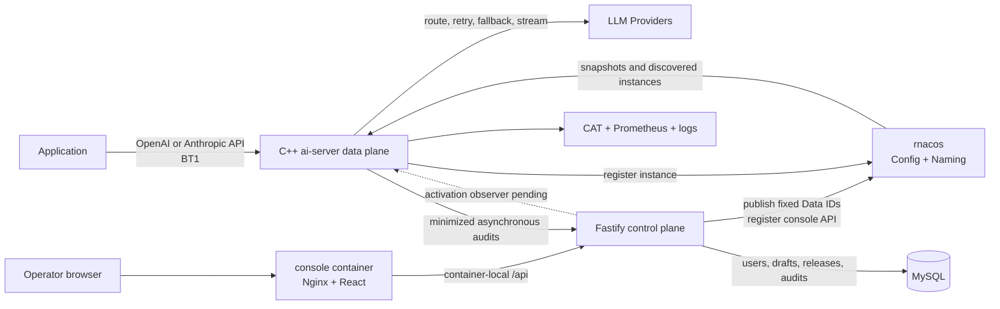

# AI Gateway

English | [简体中文](README.zh-CN.md)

AI Gateway is a complete LLM gateway system with a C++ data plane, a web management control plane,
dynamic configuration and service discovery, release workflows, auditing, and observability. The
repository owns both `ai-server` and its console; it is no longer only a management console for an
external `fiber-gateway-cpp/apps/ai-server` application.

The product is intended for platform administrators, application developers, and operators. It
proxies application LLM traffic but is not an end-user chat interface.

## Capabilities

The data plane in `native/ai-server/` provides:

- OpenAI Chat Completions and Anthropic Messages compatible endpoints.
- BT1 authentication, model authorization, deterministic Provider and token selection, routing,
  retry, fallback, circuit breaking, and SSE streaming.
- rnacos-backed dynamic configuration, `service://` discovery, instance registration, and
  immutable runtime snapshots.
- Cluster token rate limiting with owner selection and check/settle coordination.
- Prometheus metrics, CAT tracing, structured logs, and compile-time `HTTP` or `FILE` audit
  delivery.

The control plane in `web/` and `server/` provides:

- User administration, BT1 token issuance, environment switching, and personal call history.
- Structured Provider, model, access-group, and BT1 Key Ring management with write-only secrets.
- Draft validation, immutable releases, fixed-Data-ID rnacos publication, CAS protection, MD5
  readback, access requests, and publication evidence.
- A registered console API service that receives bounded asynchronous audit batches discovered by
  `ai-server` through rnacos NamingService.

The system already runs end to end. Per-instance configuration activation collection, release
approval/rejection/cancel actions, and operator-driven rollback remain control-plane roadmap items;
until typed instance evidence exists, activation is deliberately reported as `UNKNOWN`.

## Architecture



- `native/ai-server/`: The repository-owned C++23 LLM proxy and data plane. It is built against a
  pinned set of Fiber runtime, HTTP, Nacos, CAT, and Prometheus modules through CMake.
- `web/`: The React, TypeScript, and Vite control-plane frontend. In development, it proxies `/api`
  to the local backend.
- `server/`: The Fastify control-plane API. MySQL mode enables persistent domain stores, rnacos
  publication, console service registration, and audit ingestion. Memory mode is for isolated UI
  and API development and does not publish to rnacos.
- MySQL: Stores environment metadata, users and sessions, normalized configuration, drafts,
  immutable release records, access requests, and audit data.
- rnacos: Carries the fixed `LLM-SERVER` configuration Data IDs and NamingService registrations for
  `ai-server`, Provider discovery, rate-limit membership, and the console audit endpoint.
- Observability: CAT records request and Provider-attempt traces, Prometheus exposes stable metrics,
  and the audit pipeline feeds the per-user call-history projection.

Dynamic configuration always uses the rnacos group `LLM-SERVER`. Its primary Data IDs are:

- `ploto.ai-llm.auth.bt1.keys`
- `ploto.ai-llm.models`
- `ploto.ai-llm.provider.<provider-name>`
- `ploto.ai-llm.user-group.<group-name>`

A successful rnacos write proves only that content was published. It does not prove that every
`ai-server` instance activated the configuration. The release center reports draft state and
rnacos write results separately and keeps activation `UNKNOWN` until instance evidence exists.

## Project Structure

```text
.
├── web/                    # React management console
│   ├── src/
│   ├── index.html
│   ├── package.json
│   └── vite.config.ts
├── server/                 # Node.js + TypeScript API
│   ├── src/
│   │   ├── config/         # Environment variable parsing
│   │   ├── database/       # MySQL connection and deterministic migrations
│   │   ├── modules/        # Users, marketplace, access, rnacos, and call audits
│   │   ├── app.ts          # Fastify application and route registration
│   │   └── index.ts        # Process entry point
│   └── .env.example
├── native/                 # C++ data plane and pinned Fiber integration
│   ├── CMakeLists.txt      # Top-level native build and audit transport selection
│   └── ai-server/          # Repository-owned gateway runtime, docs, and tests
├── deploy/                 # Nginx, ai-server, MySQL/CAT image inputs
├── scripts/                # Local demo credential initialization
├── compose.yaml            # Reproducible end-to-end demonstration stack
├── .temp/fiber-gateway-cpp # Local upstream checkout used only for source research
└── package.json            # npm workspaces and repository-wide commands
```

`.temp/` and all `dist/` directories are ignored. Application code must not import from them, and
they must not be committed.

## Control-plane Development

Node.js 20 or later is required. Install dependencies and create a local environment file:

```bash
npm install
cp server/.env.example server/.env
```

The default `APP_DATA_MODE=memory` supports local evaluation without external services. Its data is
cleared when the process exits. Sign in with the initial administrator account, `admin`. Start the
frontend and backend together:

```bash
npm run dev
```

- Frontend: `http://localhost:5173`
- Backend: `http://localhost:3000`

You can also start each workspace separately:

```bash
npm run dev:web
npm run dev:server
```

Check local connectivity through the health endpoint:

```bash
curl http://localhost:3000/api/hello
```

Response:

```json
{
  "message": "Hello World!",
  "service": "ai-server-console-api"
}
```

This endpoint does not require MySQL, rnacos, or `ai-server`, so it can be used to verify the local
frontend-to-backend path. These commands start the control plane only; use the native build commands
below or the Compose stack for the complete gateway.

## End-to-End Docker Deployment

Docker Compose starts a complete runnable gateway: MySQL, rnacos, CAT, the combined console,
`ai-server`, a deterministic OpenAI-compatible test Provider, and a one-shot configuration
bootstrap. The first `ai-server` image build compiles the repository-owned C++ data plane against
pinned Fiber modules and can take several minutes.

Generate untracked credentials, then build and start the stack. Services are loopback-only by
default. To access them from a trusted LAN, provide the shared bind address and this machine's LAN
address while generating the environment file:

```bash
DEMO_BIND_ADDRESS=0.0.0.0 CONSOLE_PUBLIC_HOST=172.23.222.82 ./scripts/init-demo-env.sh
docker compose --env-file .env.docker up --build
```

Open:

- Console: `http://172.23.222.82:5173`; sign in as `admin`.
- `ai-server`: `http://172.23.222.82:8080`; `/ready` becomes successful after it accepts the rnacos
  snapshot.
- Demo Provider: `http://172.23.222.82:8081/health`.
- CAT: `http://172.23.222.82:8082/cat/r`.
- rnacos API: `http://172.23.222.82:8848`.
- rnacos console: `http://172.23.222.82:10848/rnacos/`; its generated login is stored only in
  `.env.docker`.

The bootstrap publishes the BT1 Key Ring and a `fiber-demo` model routed to the local Provider.
Create a BT1 token in the console, then call the real proxy:

```bash
curl http://172.23.222.82:8080/v1/chat/completions \
  -H 'Content-Type: application/json' \
  -H 'Authorization: Bearer <BT1 token>' \
  -d '{"model":"fiber-demo","messages":[{"role":"user","content":"hello"}]}'
```

The call appears in CAT and in the signed-in user's call history after `ai-server` submits the
minimized audit record. A healthy `/ready` endpoint is runtime evidence for this demo instance, but
the console deliberately keeps Release activation `UNKNOWN` until a typed per-instance activation
observer is implemented.

LAN publishing exposes the console, `ai-server`, demo Provider, CAT, and rnacos. MySQL always
remains bound to loopback. The demo includes passwordless development authentication and testing
endpoints, so it must be exposed only on a trusted network. Use production authentication and a
firewall on shared or untrusted networks.

Stop the stack with `docker compose --env-file .env.docker down`. Add `--volumes` only when you
intend to delete all demo MySQL, rnacos, and audit data. The generated environment file is mode
`0600` and ignored by Git; do not reuse these demonstration credentials in a shared deployment.

### Using MySQL

Create the database and a least-privilege account, then configure `server/.env`:

```dotenv
APP_DATA_MODE=mysql
MYSQL_HOST=127.0.0.1
MYSQL_USER=ai_server_console
MYSQL_PASSWORD=change-me
MYSQL_DATABASE=ai_server_console
```

At startup, the backend automatically applies pending migrations from
`server/src/database/migrations/`. Production mode (`NODE_ENV=production`) requires MySQL and an
explicit, randomly generated `APP_ENCRYPTION_KEY`.

## Configuration

After copying `server/.env.example`, configure these connections and settings as needed:

- `MYSQL_*`: Console database settings.
- `RNACOS_*`: rnacos address, bound environment, namespace, tenant, credentials, fixed
  configuration group, and optional console API service registration.
- `AI_SERVER_BASE_URL`: Reserved target address for a future `ai-server` status client. It is
  validated at startup but the current backend does not call it.
- `AUDIT_INGEST_TOKEN` and `AUDIT_INGEST_BODY_LIMIT_BYTES`: Optional Bearer credential and body
  limit for the console's internal call-audit ingest endpoint. An empty token disables ingestion;
  Compose supplies the same generated value to `ai-server`.
- `AUTH_MODE` and `OIDC_*`: Local development authentication or enterprise OIDC with PKCE.
- `APP_ENCRYPTION_KEY`: Encryption key for short-lived token delivery and local secret wrapping.
- `BOOTSTRAP_*`: Initial administrator, environment, and BT1 signing key settings.
- `APP_HOST`, `APP_PORT`, and `APP_PUBLIC_URL`: Console listener and browser-facing URL settings.

Do not commit `server/.env`. MySQL passwords, rnacos passwords, provider tokens, BT1 secrets, and
the audit-ingest token must never be exposed in logs, API responses, or audit diffs. See
[`docs/llm-call-audit-requirements.md`](docs/llm-call-audit-requirements.md) for the minimized
per-user call-history contract.

## Validation and Build

Run these commands from the repository root:

```bash
npm run typecheck
npm test
npm run format:check
npm run build
npm run configure:native
npm run build:native
npm run test:native
```

Build output is generated in `web/dist/` and `server/dist/`. The root `Dockerfile` provides
`server`, `tools`, and `console` targets; the console target runs Nginx and Fastify together.
Native builds default to `-DAI_SERVER_AUDIT_TRANSPORT=HTTP`; configure with `FILE` to retain
NDJSON audit files instead of HTTP delivery.

## Fiber Dependency and Provenance

`native/ai-server/` is owned and built by this repository. Its migration provenance is recorded in
[`native/ai-server/UPSTREAM.md`](native/ai-server/UPSTREAM.md). The build fetches a pinned
`fiber-gateway-cpp` revision only for its reusable runtime and infrastructure modules; it does not
build or import the upstream `apps/ai-server` source. The integration uses Fiber's supported
`FIBER_BUILD_NACOS`, `FIBER_BUILD_CAT`, and `FIBER_BUILD_PROMETHEUS` component options; no local
compatibility patch is currently required.

The ignored checkout remains available for source research:

```bash
git -C .temp/fiber-gateway-cpp pull --ff-only
```

Upstream repository: <https://github.com/fiber-net-gateway/fiber-gateway-cpp>
