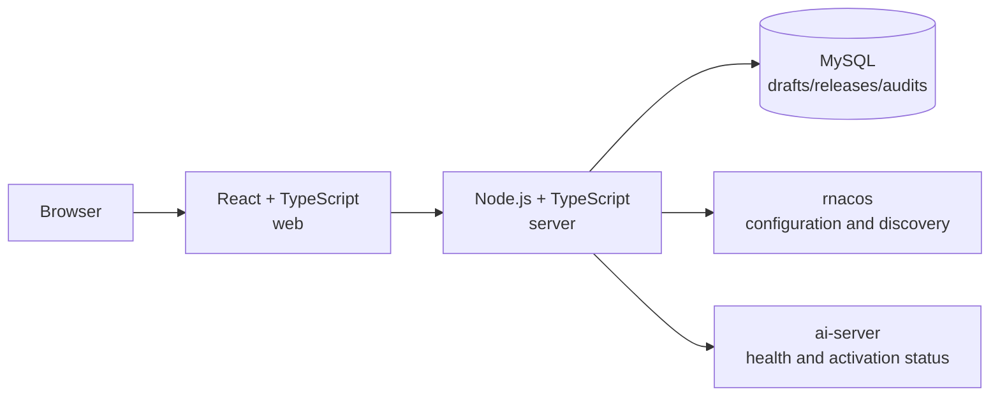

# Fiber AI Server Console

English | [简体中文](README.zh-CN.md)

This repository contains the management console for `ai-server` in
[`fiber-gateway-cpp`](https://github.com/fiber-net-gateway/fiber-gateway-cpp). It is designed for
platform administrators and operators, not as an end-user LLM chat interface.

The console is intended to provide:

- Documentation for `ai-server` capabilities, protocols, routing, and configuration models.
- Structured configuration for models, providers, user groups, and BT1 keys.
- Draft, validation, approval, release, rollback, and audit workflows.
- Separate visibility into rnacos write status and configuration activation on `ai-server`
  instances.
- Bootstrap configuration templates, instance health, service discovery, and configuration
  snapshot status.

The console currently implements user and token management, separate Provider and model
maintenance, model-owned access groups, immutable environment releases, and recoverable
Provider-to-models publication to rnacos. Release details retain per-Data-ID write and readback
evidence. Instance-level activation evidence and rollback execution remain future work and are
therefore reported as unknown or unavailable.

## Architecture



- `web/`: A React, TypeScript, and Vite frontend. In development, it proxies `/api` to the local
  backend.
- `server/`: A Fastify API. It uses `mysql2` for MySQL and environment-based configuration for
  rnacos and `ai-server` connections.
- MySQL: Stores environment metadata, normalized configuration, drafts, immutable release records,
  and audit data.
- rnacos: Provides Nacos-compatible configuration and naming services for dynamic `ai-server`
  configuration.
- `ai-server`: The service managed by the console. It provides LLM proxying, health probes, and,
  in future modules, evidence that released configuration is active.

Dynamic configuration always uses the rnacos group `LLM-SERVER`. Its primary Data IDs are:

- `ploto.ai-llm.auth.bt1.keys`
- `ploto.ai-llm.models`
- `ploto.ai-llm.provider.<provider-name>`
- `ploto.ai-llm.user-group.<group-name>`

A successful rnacos write proves only that content was published. It does not prove that every
`ai-server` instance activated the configuration. The release center reports draft state and
rnacos write results separately and keeps activation `UNKNOWN` until instance evidence exists.

## Project Structure

```text
.
├── web/                    # React user and token management console
│   ├── src/
│   ├── index.html
│   ├── package.json
│   └── vite.config.ts
├── server/                 # Node.js + TypeScript API
│   ├── src/
│   │   ├── config/         # Environment variable parsing
│   │   ├── database/       # MySQL connection and deterministic migrations
│   │   ├── modules/        # Users, sessions, BT1 tokens, and OIDC
│   │   ├── app.ts          # Fastify application and route registration
│   │   └── index.ts        # Process entry point
│   └── .env.example
├── .temp/fiber-gateway-cpp # Local upstream checkout used only for source research
└── package.json            # npm workspaces and repository-wide commands
```

`.temp/` and all `dist/` directories are ignored. Application code must not import from them, and
they must not be committed.

## Local Development

Node.js 20 or later is required. Install dependencies and create a local environment file:

```bash
npm install
cp server/.env.example server/.env
```

The default `APP_DATA_MODE=memory` supports local evaluation without external services. Its data is
cleared when the process exits. Sign in with the initial administrator account, `admin`. Start the
frontend and backend together:

```bash
npm run dev
```

- Frontend: `http://localhost:5173`
- Backend: `http://localhost:3000`

You can also start each workspace separately:

```bash
npm run dev:web
npm run dev:server
```

Check local connectivity through the health endpoint:

```bash
curl http://localhost:3000/api/hello
```

Response:

```json
{
  "message": "Hello World!",
  "service": "ai-server-console-api"
}
```

This endpoint does not require MySQL, rnacos, or `ai-server`, so it can be used to verify the local
frontend-to-backend path.

### Using MySQL

Create the database and a least-privilege account, then configure `server/.env`:

```dotenv
APP_DATA_MODE=mysql
MYSQL_HOST=127.0.0.1
MYSQL_USER=ai_server_console
MYSQL_PASSWORD=change-me
MYSQL_DATABASE=ai_server_console
```

At startup, the backend automatically applies pending migrations from
`server/src/database/migrations/`. Production mode (`NODE_ENV=production`) requires MySQL and an
explicit, randomly generated `APP_ENCRYPTION_KEY`.

## Configuration

After copying `server/.env.example`, configure these connections and settings as needed:

- `MYSQL_*`: Console database settings.
- `RNACOS_*`: rnacos address, bound environment, namespace, tenant, credentials, and fixed
  configuration group.
- `AI_SERVER_BASE_URL`: Address of the target `ai-server` management endpoint.
- `AUDIT_INGEST_TOKEN` and `AUDIT_INGEST_BODY_LIMIT_BYTES`: Optional Bearer credential and body
  limit for the internal ai-server call-audit ingest endpoint. An empty token disables ingestion.
- `AUTH_MODE` and `OIDC_*`: Local development authentication or enterprise OIDC with PKCE.
- `APP_ENCRYPTION_KEY`: Encryption key for short-lived token delivery and local secret wrapping.
- `BOOTSTRAP_*`: Initial administrator, environment, and BT1 signing key settings.
- `APP_HOST`, `APP_PORT`, and `APP_PUBLIC_URL`: Console listener and browser-facing URL settings.

Do not commit `server/.env`. MySQL passwords, rnacos passwords, provider tokens, BT1 secrets, and
the audit-ingest token must never be exposed in logs, API responses, or audit diffs. See
[`docs/llm-call-audit-requirements.md`](docs/llm-call-audit-requirements.md) for the minimized
per-user call-history contract.

## Validation and Build

Run these commands from the repository root:

```bash
npm run typecheck
npm test
npm run format:check
npm run build
```

Build output is generated in `web/dist/` and `server/dist/`. A production deployment should serve
the frontend static assets from a single entry point and reverse-proxy `/api` to the backend.

## Upstream References

The console domain model follows the current implementation in
`fiber-gateway-cpp/apps/ai-server`, together with `docs/product-requirements.md` and
`docs/user-module-design.md`. Update the local research checkout with:

```bash
git -C .temp/fiber-gateway-cpp pull --ff-only
```

Upstream repository: <https://github.com/fiber-net-gateway/fiber-gateway-cpp>
