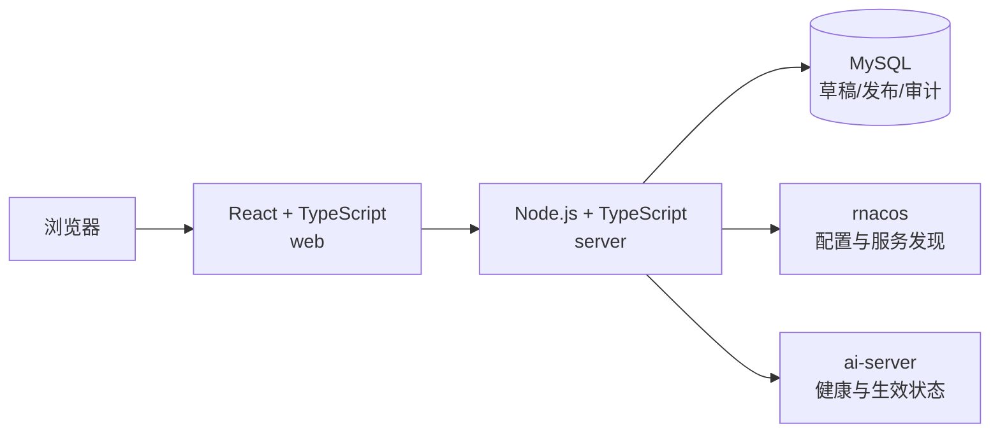

# Fiber AI Server Console

本项目是
[`fiber-gateway-cpp`](https://github.com/fiber-net-gateway/fiber-gateway-cpp) 中
`ai-server` 的管理控制台。它面向平台管理员和运维人员，而不是终端用户使用的 LLM
聊天页面。

控制台的目标是同时提供：

- `ai-server` 的能力、协议、路由和配置模型介绍；
- 模型、Provider、用户组和 BT1 密钥的结构化配置；
- 草稿、校验、审批、发布、回滚和审计；
- rnacos 写入状态与 `ai-server` 实例实际生效状态的分开展示；
- 启动配置模板、实例健康、服务发现和配置快照状态。

项目目前处于骨架阶段：原有 React 介绍站已迁移到 `web/`，后端已经提供可运行、可测试
的 Hello World 接口，并预留了 MySQL、rnacos 和 `ai-server` 的连接配置。配置管理接口、
数据库迁移和控制台页面将在此基础上继续实现。

## 技术架构



- `web/`：React、TypeScript 和 Vite 前端；开发时将 `/api` 代理到本地后端。
- `server/`：Fastify API；MySQL 使用 `mysql2`，rnacos 和 `ai-server` 通过环境配置接入。
- MySQL：保存环境元数据、规范化配置、草稿、不可变发布记录和审计数据。
- rnacos：作为 Nacos 兼容的配置中心与 NamingService，承载 `ai-server` 动态配置。
- `ai-server`：控制台管理的目标服务；提供代理能力、健康探针和后续的配置生效证据。

动态配置固定使用 rnacos group `LLM-SERVER`，主要 Data ID 为：

- `ploto.ai-llm.auth.bt1.keys`
- `ploto.ai-llm.models`
- `ploto.ai-llm.provider.<provider-name>`
- `ploto.ai-llm.user-group.<group-name>`

rnacos 的写入成功只表示“已发布”，不能直接表示所有 `ai-server` 实例“已生效”。后续
发布中心必须分别展示草稿、rnacos 写入和实例接受配置的状态。

## 项目结构

```text
.
├── web/                    # React 控制台和现有介绍页面
│   ├── src/
│   ├── index.html
│   ├── package.json
│   └── vite.config.ts
├── server/                 # Node.js + TypeScript API
│   ├── src/
│   │   ├── config/         # 环境变量解析
│   │   ├── database/       # MySQL 连接工厂
│   │   ├── app.ts          # Fastify 应用与路由注册
│   │   └── index.ts        # 进程入口
│   └── .env.example
├── .temp/fiber-gateway-cpp # 仅用于源码研究的上游本地副本
└── package.json            # npm workspaces 与全仓库命令
```

`.temp/` 和所有 `dist/` 都是忽略目录，不能被业务代码导入或提交。

## 本地开发

要求 Node.js 20 或更高版本。首次安装依赖：

```bash
npm install
cp server/.env.example server/.env
```

同时启动前端和后端：

```bash
npm run dev
```

- 前端默认地址：`http://localhost:5173`
- 后端默认地址：`http://localhost:3000`

也可以分别启动：

```bash
npm run dev:web
npm run dev:server
```

Hello World 接口：

```bash
curl http://localhost:3000/api/hello
```

返回：

```json
{
  "message": "Hello World!",
  "service": "ai-server-console-api"
}
```

该接口不依赖 MySQL、rnacos 或 `ai-server` 在线，因此可用于确认 API 进程和本地开发
链路已经正常启动。

## 配置

复制 `server/.env.example` 后可配置以下连接：

- `MYSQL_*`：控制台数据库；
- `RNACOS_*`：rnacos 地址、namespace、tenant、认证信息和配置 group；
- `AI_SERVER_BASE_URL`：目标 `ai-server` 管理地址；
- `APP_HOST`、`APP_PORT`：控制台 API 监听地址。

不要提交 `server/.env`，也不要在日志、API 响应或审计差异中返回 MySQL 密码、rnacos
密码、Provider token 或 BT1 secret。

## 校验与构建

在仓库根目录运行：

```bash
npm run typecheck
npm test
npm run format:check
npm run build
```

构建结果分别生成在 `web/dist/` 和 `server/dist/`。生产部署应由同一入口提供前端静态
资源，并把 `/api` 反向代理到后端。

## 上游依据

控制台领域设计以 `fiber-gateway-cpp/apps/ai-server` 的当前实现和
`docs/config-console-requirements.md` 为基线。本地研究副本可更新为：

```bash
git -C .temp/fiber-gateway-cpp pull --ff-only
```

上游仓库：<https://github.com/fiber-net-gateway/fiber-gateway-cpp>
