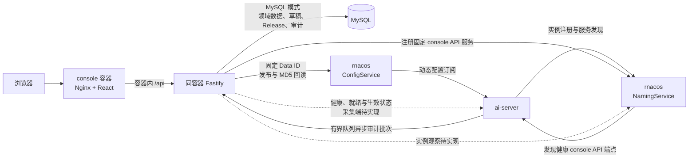

# Fiber AI Server Console

[English](README.md) | 简体中文

本项目是
[`fiber-gateway-cpp`](https://github.com/fiber-net-gateway/fiber-gateway-cpp) 中
`ai-server` 的管理控制台。它面向平台管理员和运维人员，而不是终端用户使用的 LLM
聊天页面。

控制台的目标是同时提供：

- `ai-server` 的能力、协议、路由和配置模型介绍；
- 模型、Provider、用户组和 BT1 密钥的结构化配置；
- 草稿、校验、审批、发布、回滚和审计；
- rnacos 写入状态与 `ai-server` 实例实际生效状态的分开展示；
- 启动配置模板、实例健康、服务发现和配置快照状态。

当前已实现用户与 Token 管理、独立的 Provider 与模型维护、模型专属授权组及审批、不可变
环境级 Release、可恢复的 Provider → models 发布编排、BT1 Key Ring 发布、rnacos MD5 回读、
环境切换、LLM 调用审计接收接口和个人调用记录。Docker 演示栈还提供 `ai-server` 直接异步
提交的最小化审计，以及可重复的 Provider、模型和 Release 初始化。实例健康与生效状态采集、NamingService
观察、Release 审批/驳回/取消和人工回滚仍是后续能力，因此当前生效状态保持未知。

## 技术架构



- `web/`：React、TypeScript 和 Vite 前端；开发时将 `/api` 代理到本地后端。
- `server/`：Fastify API；MySQL 模式使用 `mysql2`，并启用 rnacos 配置发布器；默认 memory
  模式使用进程内 Store，不向 rnacos 发布。
- MySQL：保存环境元数据、用户与会话、规范化配置、草稿、不可变发布记录、访问申请和审计
  数据。
- rnacos ConfigService：只接收控制台发布的固定 `LLM-SERVER` Data ID，`ai-server` 从中订阅
  动态配置。
- rnacos NamingService：承载实例注册和服务发现；console API 注册固定服务
  `AI-GATEWAY@@ai-server-console-api`，HTTP 审计模式的 `ai-server` 订阅该服务。实例状态采集仍待实现。
- `ai-server`：继续承担 LLM 代理；当前提供健康与就绪探针，但尚不能向控制台证明某个 Release
  或指定 Data ID MD5 已生效。
- 调用审计：控制台接收接口和个人白名单投影已经实现。默认 `HTTP` 构建只生成最小投影，
  通过后台有界队列提交；`FILE` 构建保留原有完整 NDJSON 审计行为。

实线表示控制台当前已实现的集成或现有运行时关系；虚线表示虽然可能已经存在接收契约或配置，
但端到端运行链路尚未完成的集成。

动态配置固定使用 rnacos group `LLM-SERVER`，主要 Data ID 为：

- `ploto.ai-llm.auth.bt1.keys`
- `ploto.ai-llm.models`
- `ploto.ai-llm.provider.<provider-name>`
- `ploto.ai-llm.user-group.<group-name>`

rnacos 的写入成功只表示“已发布”，不能直接表示所有 `ai-server` 实例“已生效”。发布中心
分别展示草稿和 rnacos 写入状态，并在缺少实例证据时保持 `UNKNOWN`。

## 项目结构

```text
.
├── web/                    # React 管理控制台
│   ├── src/
│   ├── index.html
│   ├── package.json
│   └── vite.config.ts
├── server/                 # Node.js + TypeScript API
│   ├── src/
│   │   ├── config/         # 环境变量解析
│   │   ├── database/       # MySQL 连接、确定性迁移
│   │   ├── modules/        # 用户、模型广场、访问审批、rnacos 与调用审计
│   │   ├── app.ts          # Fastify 应用与路由注册
│   │   └── index.ts        # 进程入口
│   └── .env.example
├── native/                 # 本仓库维护的 ai-server 源码与固定 CMake 依赖
├── deploy/                 # Nginx、ai-server、MySQL/CAT 镜像输入
├── scripts/                # 本地演示凭据初始化
├── compose.yaml            # 可重复的端到端演示栈
├── .temp/fiber-gateway-cpp # 仅用于源码研究的上游本地副本
└── package.json            # npm workspaces 与全仓库命令
```

`.temp/` 和所有 `dist/` 都是忽略目录，不能被业务代码导入或提交。

## 本地开发

要求 Node.js 20 或更高版本。首次安装依赖：

```bash
npm install
cp server/.env.example server/.env
```

默认 `APP_DATA_MODE=memory`，无需外部服务即可预览；数据会在进程退出后清空。使用初始
管理员 `admin` 登录。启动前端和后端：

```bash
npm run dev
```

- 前端默认地址：`http://localhost:5173`
- 后端默认地址：`http://localhost:3000`

也可以分别启动：

```bash
npm run dev:web
npm run dev:server
```

健康连通接口：

```bash
curl http://localhost:3000/api/hello
```

返回：

```json
{
  "message": "Hello World!",
  "service": "ai-server-console-api"
}
```

该接口不依赖 MySQL、rnacos 或 `ai-server` 在线，因此可用于确认本地链路。

## Docker 演示

Docker Compose 会同时启动 MySQL、rnacos、CAT、合并后的控制台容器、`ai-server`、本地
OpenAI-compatible 演示 Provider和一次性配置初始化器。第一次构建 `ai-server`
镜像会用固定版本的 Fiber 模块编译仓库内 C++ 源码，可能需要数分钟。

先生成不纳入版本控制的凭据，再构建并启动。默认只允许本机访问各服务；如需从可信
局域网访问，生成环境文件时同时指定统一监听地址和本机局域网地址：

```bash
DEMO_BIND_ADDRESS=0.0.0.0 CONSOLE_PUBLIC_HOST=172.23.222.82 ./scripts/init-demo-env.sh
docker compose --env-file .env.docker up --build
```

可访问：

- 控制台：`http://172.23.222.82:5173`，使用 `admin` 登录；
- `ai-server`：`http://172.23.222.82:8080`，接受 rnacos 快照后 `/ready` 返回成功；
- 演示 Provider：`http://172.23.222.82:8081/health`；
- CAT：`http://172.23.222.82:8082/cat/r`；
- rnacos API：`http://172.23.222.82:8848`；
- rnacos 控制台：`http://172.23.222.82:10848/rnacos/`，随机登录信息只保存在
  `.env.docker`。

初始化器会发布 BT1 Key Ring，并创建指向本地 Provider 的 `fiber-demo` 模型。在控制台签发
BT1 Token 后，即可调用真实代理：

```bash
curl http://localhost:8080/v1/chat/completions \
  -H 'Content-Type: application/json' \
  -H 'Authorization: Bearer <BT1 token>' \
  -d '{"model":"fiber-demo","messages":[{"role":"user","content":"hello"}]}'
```

调用会显示在 CAT 中；`ai-server` 直接提交最小化审计记录后，也会进入当前用户的调用记录。
`/ready` 健康是本演示实例的运行时证据，但控制台仍会把 Release 生效状态保持为 `UNKNOWN`，
直到实现带类型的逐实例生效观察器。

局域网发布会开放控制台、`ai-server`、演示 Provider、CAT 和 rnacos；MySQL 始终保持仅本机
监听。演示环境包含无密码开发认证和测试端点，只应暴露在可信网络；共享或不可信网络必须
改用生产认证并配置防火墙。

使用 `docker compose --env-file .env.docker down` 停止。只有在确认要删除全部演示 MySQL、
rnacos 和审计数据时才添加 `--volumes`。生成的环境文件权限为 `0600` 且被 Git 忽略；不要在
共享部署中复用演示凭据。

### 使用 MySQL

先创建数据库和最小权限账号，然后在 `server/.env` 中设置：

```dotenv
APP_DATA_MODE=mysql
MYSQL_HOST=127.0.0.1
MYSQL_USER=ai_server_console
MYSQL_PASSWORD=change-me
MYSQL_DATABASE=ai_server_console
```

后端启动时会自动执行 `server/src/database/migrations/` 下尚未应用的迁移。生产环境设置
`NODE_ENV=production` 后必须使用 MySQL，并显式提供随机的 `APP_ENCRYPTION_KEY`。

## 配置

复制 `server/.env.example` 后可配置以下连接：

- `MYSQL_*`：控制台数据库；
- `RNACOS_*`：rnacos 地址、绑定环境、namespace、tenant、认证信息、固定配置 group 与可选的
  console API 服务注册；
- `AI_SERVER_BASE_URL`：为后续 `ai-server` 状态客户端预留的目标地址；启动时会校验，但当前后端
  不会调用该地址；
- `AUDIT_INGEST_TOKEN`、`AUDIT_INGEST_BODY_LIMIT_BYTES`：控制台内部调用审计接收接口的可选
  Bearer 凭据与请求体上限；token 为空时关闭入口；Compose 会把同一随机值提供给 `ai-server`；
- `AUTH_MODE`、`OIDC_*`：本地开发认证或企业 OIDC + PKCE；
- `APP_ENCRYPTION_KEY`：Token 短期交付与本地 secret 封装密钥；
- `BOOTSTRAP_*`：初始管理员、环境和 BT1 签名 key；
- `APP_HOST`、`APP_PORT`、`APP_PUBLIC_URL`：控制台监听和浏览器地址。

不要提交 `server/.env`，也不要在日志、API 响应或审计差异中返回 MySQL 密码、rnacos
密码、Provider token、BT1 secret 或审计上报 token。每用户调用记录的最小化契约见
[`docs/llm-call-audit-requirements.md`](docs/llm-call-audit-requirements.md)。

## 校验与构建

在仓库根目录运行：

```bash
npm run typecheck
npm test
npm run format:check
npm run build
npm run configure:native
npm run build:native
npm run test:native
```

构建结果分别生成在 `web/dist/` 和 `server/dist/`。根 `Dockerfile` 提供 `server`、`tools`
和 `console` 三个 target；console target 在同一个容器内运行 Nginx 与 Fastify。原生构建默认使用
`-DAI_SERVER_AUDIT_TRANSPORT=HTTP`；改为 `FILE` 可保留 NDJSON 文件审计。

## 上游依据

控制台领域设计以 `fiber-gateway-cpp/apps/ai-server` 的当前实现和
`docs/product-requirements.md` 与 `docs/user-module-design.md` 为基线。本地研究副本可更新为：

```bash
git -C .temp/fiber-gateway-cpp pull --ff-only
```

上游仓库：<https://github.com/fiber-net-gateway/fiber-gateway-cpp>
