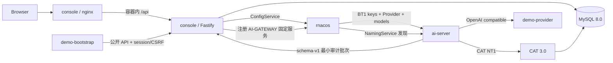

# 可演示闭环详细设计

## 1. 组件与启动顺序



MySQL 先达到健康状态，console-api 再运行迁移和 bootstrap。初始化器等待 console-api，
先发布 Key Ring，再创建/发布演示模型。ai-server 等初始化器成功后启动，因此第一次订阅就能
获得完整的 keys、Provider 和 models 图。CAT 不参与业务就绪判断；CAT 不可用不能阻断
ai-server 的代理请求。

rnacos、CAT 与 ai-server 使用 Compose 网络 `172.28.0.0/24` 内的固定 IPv4。原因是
ai-server 的 Nacos/CAT 启动契约只接受 IP literal，不在这些字段中解析 DNS。需要更换子网时，
必须同步修改 `compose.yaml`、ai-server 环境变量和 `deploy/cat/client.xml`，避免地址证据失配。

## 2. 控制台镜像

根 `Dockerfile` 使用多阶段构建并提供三个 target：

- `server`：Node.js production 依赖与 `server/dist`；
- `console`：同一容器内由 Nginx 提供 `web/dist`，并把 `/api` 反向代理到本机 Fastify 3000；
- `tools`：与 server 相同，供 demo bootstrap 和 Provider 使用。

构建阶段运行 workspaces build；运行阶段不包含 TypeScript 编译器和源码。API 以非 root
`node` 用户运行，Nginx master 负责 80 端口，worker 使用其发行版低权限用户。

`scripts/init-demo-env.sh` 以 `umask 077` 生成 `.env.docker`。Compose 对 MySQL、rnacos、
BT1、应用加密和审计凭据全部使用 required interpolation，不提供仓库内默认 secret；管理端口
也只绑定宿主机 `127.0.0.1`。

## 3. BT1 Key Ring

### 3.1 内部数据访问

`UserStore.listSigningKeys(environmentId)` 返回内部 `SigningKeyRecord` 副本。MySQL Store
分别读取 `bt1_signing_keys` 和 `managed_secrets`，符合单表 SQL 规则；secret 通过现有
`ValueCipher` 解封。调用方必须在渲染后清零 Buffer。

`UserStore.markSigningKeysPublished()` 只把 `PUBLISHED_UNVERIFIED` 更新为 `ACTIVE`，不改变
已 ACTIVE/RETIRING key，也不返回 secret。

### 3.2 渲染与发布

Key Ring 内容固定为：

```json
{
  "version": 1,
  "data": {
    "clockSkewSec": 60,
    "keys": [{ "kid": "dev-key", "secret": "base64:..." }]
  }
}
```

只包含 `ACTIVE`、`PUBLISHED_UNVERIFIED`、`RETIRING` 且未到退役时间的 key。key 按 `kid`
UTF-8 字节序排序；所有 key 必须使用同一个 `clockSkewSec`，否则发布失败，避免 ai-server
全局 skew 契约被隐式覆盖。

GET API 每次通过 rnacos 回读计算 `NOT_PUBLISHED`、`PUBLISHED` 或 `DRIFTED`。POST API 读取
旧 MD5，使用当前旧 MD5 作为 CAS 前提发布，随后精确回读。API 只返回 target MD5、readback
MD5、字节数和安全 key 视图。

## 4. 环境选择

`App` 持有 `selectedEnvironmentId`，以授权环境数组为唯一合法集合。`ConsoleLayout` 接收完整
环境列表并渲染原生 `select`。所有依赖环境的 route page 从同一个 selected access 取 ID；
切换时保持当前功能区，但各页面现有 effect 因 `environmentId` 变化而重新加载。

## 5. 初始化器

初始化器维护一个最小 cookie jar，并执行：

1. `POST /api/auth/development-login`；
2. `GET /api/me/environments` 取得环境；
3. `POST /api/environments/:env/bt1-key-ring/publish`；
4. 查询 Provider；不存在 `Fiber Demo Provider` 时，以当前 ETag 创建无凭据 Provider；若已存在但
   缺少 OpenAI 或 Anthropic 协议映射，则原地更新；
5. 查询模型；不存在逻辑模型 `fiber-demo` 时，以新 ETag 创建模型；
6. 若演示资源发生变化或还没有已发布版本，则 validate、submit、execute；
7. 轮询 Release，直到 `COMPLETED/PUBLISHED` 或失败/超时。

每一步都重新读取 ETag，不复用可能过期的 revision。初始化器日志只输出阶段和资源安全 ID。

## 6. 审计传输

`AI_SERVER_AUDIT_TRANSPORT` 是 CMake cache 变量，只允许 `FILE` 或 `HTTP`：

- `FILE`：保留上游 schema-v5 完整 NDJSON、文件轮转和文件 appender 指标；
- `HTTP`：不创建审计文件，只生成控制台白名单所需的最小字段；
- HTTP sender 使用按字节限制的内存队列、最多 100 条的批次和后台线程；无健康端点、网络失败、
  队列满或进程关闭时都不能阻塞 LLM 请求线程；
- console API 以固定 service/group/cluster 注册到 rnacos，ai-server 从 NamingService 快照选择
  healthy/enabled 的 IP literal 与端口；
- 只有 202 才从队列确认，临时失败指数退避，认证/校验/过大等永久错误丢弃该批并计数。

`occurredAt` 在 ai-server 生成记录时取墙钟时间。请求/响应正文、网络地址、Provider token、
BT1 secret 和 rnacos 凭据都不会进入 HTTP 投影。

## 7. MySQL 与 CAT

定制 MySQL 镜像基于固定的 `mysql:8.0.36`：

- 官方入口创建 `ai_server_console` schema 和最小权限控制台账号；
- init SQL 创建 `cat` schema；
- CAT 官方 `CatApplication.sql` 在镜像构建时从固定 commit 下载，并校验 SHA-256；
- MySQL 使用 `mysql_native_password` 兼容 CAT 3.0.1 内置旧 JDBC 驱动。

CAT 使用官方 `meituaninc/cat:3.0.1`，只在演示网络内接收 2280/TCP，并映射 Web UI。CAT
与控制台共享 MySQL 进程但不共享 schema 或业务账号。

## 8. 故障语义

- 初始化失败：任务非零退出，ai-server 不启动；console、MySQL、rnacos 和 CAT 保持可诊断；
- rnacos 发布/回读失败：Key Ring 或 Release 明确失败，不能推进为已发布；
- ai-server 未就绪：Compose healthcheck 失败，但不修改控制台 activation 状态；
- CAT 不可用：CAT 客户端重试/丢弃观测，LLM 业务响应不受影响；
- console API 或 rnacos NamingService 不可用：HTTP 审计在容量内排队并重试，容量耗尽后丢弃并
  计数；代理请求不受影响。
