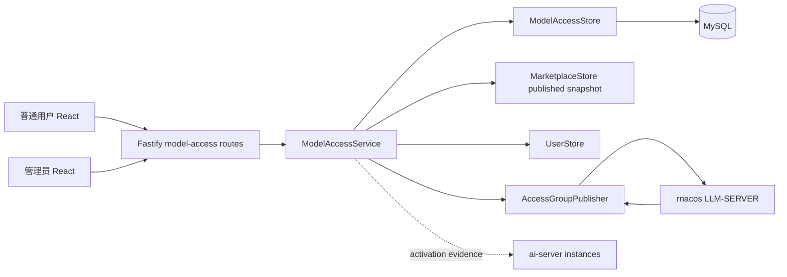

# 模型调用权限申请详细设计

## 1. 文档信息

| 项目           | 内容                                                                  |
| -------------- | --------------------------------------------------------------------- |
| 需求文档       | `docs/model-access-request-requirements.md`                           |
| 上位设计       | `docs/model-marketplace-design.md`                                    |
| 模块           | `model-access`                                                        |
| 文档状态       | 详细设计基线                                                          |
| 编写日期       | 2026-08-03                                                            |
| ai-server 基线 | `fiber-gateway-cpp` commit `fb48494dfbf99d77806674fc182007e22e19b081` |
| 数据库         | MySQL 8.0+、InnoDB、`utf8mb4`                                         |

本文给出前端、后端、数据库、API、发布器、状态、安全和测试设计。实现必须以需求文档的状态
边界为准。

## 2. 设计结论

1. 申请目标是逻辑模型；Provider 只托管申请授权组，不形成运行时 Provider 级 ACL。
2. `APPROVAL_REQUIRED` 模型只绑定一个控制台管理组，组由首次启用时排序最靠前的主
   Provider 托管，之后保持稳定。
3. 组 identity 和成员是 MySQL 事实；发布记录保存不可变完整 JSON，rnacos 只是发布目标。
4. 批准事务先落 MySQL，再在事务外发布。外部失败不会反向改写审批历史。
5. 普通用户的 `accessible=true` 只在组的已校验 rnacos 发布内容包含本人时成立；实例缺少
   版本证据仍显示 `activationState=UNKNOWN`。
6. Route 只做身份、环境访问、schema、CSRF、ETag 和角色校验；业务规则在 service。
7. Repository 每条 SQL 只访问一张表；关系由 service 通过 typed maps 组装。
8. Fastify 构造默认使用内存 store 和 deferred publisher，不连接外部服务；`index.ts` 在
   MySQL 模式显式创建 rnacos publisher。

## 3. 总体架构



### 3.1 模块目录

```text
server/src/modules/model-access/
├── types.ts
├── schemas.ts
├── routes.ts
├── service.ts
├── memory-store.ts
├── mysql-store.ts
├── group-name.ts
├── renderer.ts
├── rnacos-publisher.ts
└── model-access.test.ts

web/src/
├── api/model-access.ts
├── components/model-access/AccessRequestDialog.tsx
└── pages/AccessRequestsPage.tsx
```

模型编辑器和模型广场只引用该模块的公开 API 类型，不直接读成员表或调用 rnacos。

## 4. 领域模型

```ts
export type ModelAccessRequestStatus = 'PENDING' | 'APPROVED' | 'REJECTED' | 'CANCELLED'
export type AccessPublicationState = 'NOT_STARTED' | 'PENDING' | 'PUBLISHED' | 'FAILED'
export type AccessActivationState = 'UNKNOWN' | 'PENDING' | 'EFFECTIVE' | 'PARTIAL' | 'REJECTED'

export interface ProviderAccessGroupRecord {
  id: string
  environmentId: string
  providerId: string
  providerName: string
  groupName: string
  revision: number
  createdBy: string
  createdAt: string
  updatedAt: string
}

export interface ModelAccessRequestRecord {
  id: string
  environmentId: string
  applicantUserId: string
  applicantUsername: string
  applicantDisplayName: string
  modelId: string
  logicalModelName: string
  modelDisplayName: string
  groupId: string
  groupName: string
  providerId: string
  providerName: string
  reason: string
  status: ModelAccessRequestStatus
  publicationState: AccessPublicationState
  activationState: AccessActivationState
  decisionReason: string | null
  decidedBy: string | null
  decidedAt: string | null
  latestPublicationId: string | null
  revision: number
  createdAt: string
  updatedAt: string
}
```

申请记录冗余保存当时的安全显示快照，使历史列表不依赖模型或 Provider 后续改名；安全决定
仍使用不可变 ID 和审批时重新读取的当前关系。

### 4.1 不变量

- 一个环境内 `providerId` 最多一个 access group，`groupName` 永久唯一。
- 一个 group 对一个 `userId` 最多一个有效成员；成员保存精确 `username` 快照。
- 同一 applicant/environment/model 最多一个 `PENDING` 申请。
- `APPROVED` 必须有 `decidedBy`、`decidedAt` 和 `latestPublicationId`。
- `REJECTED` 必须有非空 `decisionReason`，且没有成员或发布副作用。
- `CANCELLED` 只能由申请人从 `PENDING` 转入。
- publication 内容一经创建不可更新；重试创建新的 attempt，目标 group revision 和内容不变。
- 模型只把 `provider_access_groups.id/name` 冻结到 `marketplace_model_user_groups`；成员不进入
  models release 版本。

## 5. Provider 授权组

### 5.1 名称生成

```text
pa_<provider-name-prefix>_<sha256(environment-id + "\n" + provider-id)[0..9]>
```

- 前缀只保留 `[A-Za-z0-9_-]`，总字节数不超过 64。
- digest 防止截断冲突；最终仍通过与 ai-server 相同的字符和长度校验。
- 名称由服务端生成，identity 创建后不重算。

### 5.2 模型保存集成

`ModelMutationInput` 增加：

```ts
accessMode: 'ALL_AUTHENTICATED' | 'APPROVAL_REQUIRED'
```

保存算法：

1. 先完成 Provider 字段校验并构造稳定 provider IDs。
2. `ALL_AUTHENTICATED` 输出空 `allowUserGroups`。
3. `APPROVAL_REQUIRED` 且旧模型已有单个托管组时，验证托管 Provider 仍绑定该模型并复用。
4. 首次启用时选择 `routeRole=PRIMARY`、`sortOrder` 最小、Provider 名最小的 Provider。
5. 调用 `ensureGroupForProvider` 幂等创建 identity，把 `{id,name}` 写入模型草稿。
6. 没有主 Provider 时返回 `ACCESS_GROUP_PRIMARY_PROVIDER_REQUIRED`。

创建 release 时按“用户组 → Provider → models”生成逐资源计划；申请授权组 Data ID 必须先于
引用它的 models Data ID 发布。只创建 release 不代表资源已经写入 rnacos。

Access group identity 与 marketplace 分属两个 store。首次启用可能在 marketplace 草稿并发冲突
前创建一个未引用空组；它不包含成员、不会发布，不形成授权，后续相同 Provider 会复用。

## 6. 数据库设计

迁移文件：`server/src/database/migrations/003-model-access.ts`。

### 6.1 `provider_access_groups`

```sql
CREATE TABLE provider_access_groups (
  id BINARY(16) NOT NULL,
  environment_id BINARY(16) NOT NULL,
  provider_id BINARY(16) NOT NULL,
  provider_name VARCHAR(128) CHARACTER SET ascii COLLATE ascii_bin NOT NULL,
  group_name VARCHAR(64) CHARACTER SET ascii COLLATE ascii_bin NOT NULL,
  revision BIGINT UNSIGNED NOT NULL DEFAULT 0,
  published_revision BIGINT UNSIGNED NOT NULL DEFAULT 0,
  created_by BINARY(16) NOT NULL,
  created_at DATETIME(6) NOT NULL,
  updated_at DATETIME(6) NOT NULL,
  PRIMARY KEY (id),
  UNIQUE KEY uq_provider_access_group_provider (environment_id, provider_id),
  UNIQUE KEY uq_provider_access_group_name (environment_id, group_name),
  KEY idx_provider_access_groups_environment (environment_id, updated_at, id)
) ENGINE = InnoDB DEFAULT CHARSET = utf8mb4;
```

不声明到 marketplace provider 的物理外键，避免新模型首次保存前的模块事务耦合；service 在
每次启用和审批时校验 provider ID、名称和环境。

### 6.2 `provider_access_group_members`

```sql
CREATE TABLE provider_access_group_members (
  group_id BINARY(16) NOT NULL,
  user_id BINARY(16) NOT NULL,
  username VARCHAR(64) CHARACTER SET utf8mb4 COLLATE utf8mb4_0900_bin NOT NULL,
  source_request_id BINARY(16) NOT NULL,
  added_revision BIGINT UNSIGNED NOT NULL,
  added_by BINARY(16) NOT NULL,
  added_at DATETIME(6) NOT NULL,
  PRIMARY KEY (group_id, user_id),
  KEY idx_access_group_members_user (user_id, group_id)
) ENGINE = InnoDB DEFAULT CHARSET = utf8mb4;
```

username 是 ai-server 授权 principal，使用大小写敏感排序；不从 display name 推导。

### 6.3 `model_access_requests`

```sql
CREATE TABLE model_access_requests (
  id BINARY(16) NOT NULL,
  environment_id BINARY(16) NOT NULL,
  applicant_user_id BINARY(16) NOT NULL,
  applicant_username VARCHAR(64) NOT NULL,
  applicant_display_name VARCHAR(128) NOT NULL,
  model_id BINARY(16) NOT NULL,
  logical_model_name VARCHAR(128) CHARACTER SET ascii COLLATE ascii_bin NOT NULL,
  model_display_name VARCHAR(100) NOT NULL,
  group_id BINARY(16) NOT NULL,
  group_name VARCHAR(64) CHARACTER SET ascii COLLATE ascii_bin NOT NULL,
  provider_id BINARY(16) NOT NULL,
  provider_name VARCHAR(128) CHARACTER SET ascii COLLATE ascii_bin NOT NULL,
  reason VARCHAR(500) NOT NULL,
  request_status VARCHAR(16) CHARACTER SET ascii COLLATE ascii_bin NOT NULL,
  publication_state VARCHAR(16) CHARACTER SET ascii COLLATE ascii_bin NOT NULL,
  activation_state VARCHAR(16) CHARACTER SET ascii COLLATE ascii_bin NOT NULL,
  decision_reason VARCHAR(500) NULL,
  decided_by BINARY(16) NULL,
  decided_at DATETIME(6) NULL,
  latest_publication_id BINARY(16) NULL,
  grant_revision BIGINT UNSIGNED NULL,
  revision BIGINT UNSIGNED NOT NULL DEFAULT 1,
  idempotency_key_hash CHAR(64) CHARACTER SET ascii COLLATE ascii_bin NOT NULL,
  request_hash CHAR(64) CHARACTER SET ascii COLLATE ascii_bin NOT NULL,
  created_at DATETIME(6) NOT NULL,
  updated_at DATETIME(6) NOT NULL,
  pending_slot TINYINT GENERATED ALWAYS AS (
    CASE WHEN request_status = 'PENDING' THEN 1 ELSE NULL END
  ) STORED,
  PRIMARY KEY (id),
  UNIQUE KEY uq_model_access_pending
    (environment_id, applicant_user_id, model_id, pending_slot),
  UNIQUE KEY uq_model_access_idempotency
    (applicant_user_id, idempotency_key_hash),
  KEY idx_model_access_admin_page
    (environment_id, request_status, created_at, id),
  KEY idx_model_access_applicant_page
    (applicant_user_id, environment_id, created_at, id)
) ENGINE = InnoDB DEFAULT CHARSET = utf8mb4;
```

### 6.4 `access_group_publications`

```sql
CREATE TABLE access_group_publications (
  id BINARY(16) NOT NULL,
  request_id BINARY(16) NOT NULL,
  environment_id BINARY(16) NOT NULL,
  group_id BINARY(16) NOT NULL,
  group_revision BIGINT UNSIGNED NOT NULL,
  group_name VARCHAR(64) CHARACTER SET ascii COLLATE ascii_bin NOT NULL,
  data_id VARCHAR(256) CHARACTER SET ascii COLLATE ascii_bin NOT NULL,
  target_content LONGTEXT NOT NULL,
  target_md5 CHAR(32) CHARACTER SET ascii COLLATE ascii_bin NOT NULL,
  attempt_number SMALLINT UNSIGNED NOT NULL,
  publication_state VARCHAR(16) CHARACTER SET ascii COLLATE ascii_bin NOT NULL,
  readback_md5 CHAR(32) CHARACTER SET ascii COLLATE ascii_bin NULL,
  safe_error_code VARCHAR(64) CHARACTER SET ascii COLLATE ascii_bin NULL,
  safe_error_message VARCHAR(500) NULL,
  created_by BINARY(16) NOT NULL,
  created_at DATETIME(6) NOT NULL,
  started_at DATETIME(6) NULL,
  finished_at DATETIME(6) NULL,
  PRIMARY KEY (id),
  UNIQUE KEY uq_access_publication_attempt (request_id, attempt_number),
  KEY idx_access_publication_group (group_id, group_revision, created_at, id),
  CONSTRAINT chk_access_publication_content CHECK (JSON_VALID(target_content))
) ENGINE = InnoDB DEFAULT CHARSET = utf8mb4;
```

`target_content` 以原始 UTF-8 JSON 文本保存并用 `JSON_VALID` CHECK 约束，避免 MySQL JSON
规范化改变 MD5；它只含 group name 和 usernames，不含任何 secret，仍只对管理员开放。

## 7. Store 接口与 SQL 约束

```ts
export interface ModelAccessStore {
  acquirePublicationLock(groupId: string): Promise<() => Promise<void>>
  ensureGroupForProvider(input: EnsureGroupInput): Promise<ProviderAccessGroupRecord>
  getGroupsByIds(ids: string[]): Promise<ProviderAccessGroupRecord[]>
  getPublishedMembershipGroupIds(groupIds: string[], userId: string): Promise<string[]>
  isPublishedMember(groupIds: string[], userId: string): Promise<boolean>
  createRequest(input: CreateRequestInput): Promise<ModelAccessRequestRecord>
  listForApplicant(query: ApplicantRequestQuery): Promise<ModelAccessRequestRecord[]>
  listForAdmin(query: AdminRequestQuery): Promise<ModelAccessRequestRecord[]>
  cancel(input: CancelRequestInput): Promise<ModelAccessRequestRecord>
  approve(input: ApproveRequestInput): Promise<ApprovalCommitResult>
  reject(input: RejectRequestInput): Promise<ModelAccessRequestRecord>
  createPublicationRetry(input: RetryPublicationInput): Promise<AccessGroupPublicationRecord>
  markPublicationResult(input: PublicationResultInput): Promise<ModelAccessRequestRecord>
}
```

MySQL `approve` 使用一个事务和稳定的单表语句序列：request `SELECT FOR UPDATE`、group
`SELECT FOR UPDATE`、group `UPDATE`、member `INSERT`、member `SELECT`、publication `INSERT`、
request `UPDATE`。
任何语句都不含 JOIN、子查询、CTE、UNION、窗口函数或多表 UPDATE。

## 8. Service 流程

### 8.1 创建申请

1. 校验 reason 和 Idempotency-Key。
2. 读取 actor，确认 `ACTIVE` 和环境访问。
3. 读取 marketplace `publishedVersion`，按 model ID 找到未归档模型。
4. 空 `allowUserGroups` 返回 `MODEL_ACCESS_OPEN_TO_ALL`。
5. 只接受恰好一个、且可在 `provider_access_groups` 解析的托管组；否则返回
   `MODEL_ACCESS_REQUEST_UNAVAILABLE`。
6. `isPublishedMember` 为 true 时返回 `MODEL_ACCESS_ALREADY_GRANTED`。
7. 创建申请并写 `model_access.request.created` 审计。

幂等键在 store 中作为独立字段和 request hash 持久化，不能只保存在进程 Map；内存 store
实现相同语义。

### 8.2 批准

`approve` 的关系校验在获取 group 锁前和执行批准事务前各执行一次。同一
group 的锁覆盖“成员修订与 publication 落库→rnacos 写入与回读→结果落库”完整链路。
publication 落库后调用：

```ts
export interface AccessGroupPublisher {
  publish(input: {
    group: 'LLM-SERVER'
    dataId: string
    content: string
    expectedMd5: string
  }): Promise<{ readbackMd5: string }>
}
```

publisher 失败被归一化为稳定安全错误：

- `RNACOS_AUTH_FAILED`
- `RNACOS_WRITE_REJECTED`
- `RNACOS_READ_FAILED`
- `RNACOS_READBACK_MISMATCH`
- `RNACOS_TIMEOUT`
- `RNACOS_UNAVAILABLE`

Service 捕获后调用 `markPublicationResult` 写 `FAILED`，仍以 200 返回已批准申请及失败状态。

### 8.3 重试

只有 `APPROVED + FAILED` 可重试。Store 读取最近 publication 的 immutable content，创建
`attemptNumber + 1` 新行；不能根据当前成员集合重新渲染，否则重试会改变审批目标。当 group
已产生更新 revision 时，旧 publication 返回 `PUBLICATION_SUPERSEDED`，必须处理最新修订，
不允许旧内容回写覆盖新成员集合。

并发批准和发布按同一 group 串行化。同步首版同时使用 service 进程内 group 队列和 MySQL
`GET_LOCK` 分布式锁；锁从批准事务开始前保持到发布结果落库，释放连接前必须执行
`RELEASE_LOCK`。命名锁单独占用一个连接，因此 MySQL 连接池下限为 2。

## 9. 确定性渲染

```ts
export function renderAccessGroup(
  group: ProviderAccessGroupRecord,
  usernames: string[],
): { dataId: string; content: string; md5: string }
```

规则：

- username 精确字符串去重，按 UTF-8 byte order 排序；
- JSON 无空白，字段顺序固定为 `version`、`data.name`、`data.users`；
- `version` 使用 group revision 的 JSON 整数，HTTP 中不经 JavaScript number 精度转换；
- MD5 对最终 UTF-8 content 字节计算；
- Data ID 固定为 `ploto.ai-llm.user-group.${group.groupName}`。

## 10. rnacos Publisher

`RnacosAccessGroupPublisher` 使用配置中的固定 base URL、tenant/namespace 和
`LLM-SERVER`。请求流程：

1. username/password 同为空时跳过登录；只配置一项在配置加载阶段报错。
2. 有凭据时 POST `/nacos/v1/auth/users/login`，缓存 `accessToken` 到安全内存并在 TTL 前刷新。
3. POST `/nacos/v1/cs/configs`，form 字段只允许固定 `dataId`、`group`、`content`、`tenant`、
   `type=json` 和 access token。
4. 响应必须为 HTTP 200 且 body 为 `true`。
5. GET 同一 `/nacos/v1/cs/configs`，计算原始响应 UTF-8 MD5。
6. 与 expected MD5 常量时间比较，一致才返回成功。

每次 fetch 使用 `AbortSignal.timeout(10_000)`。日志只记录 dataId、HTTP status、安全错误码和
correlation ID；不记录 form、content、密码或 access token。

## 11. API 设计

### 11.1 创建申请

```http
POST /api/environments/:env/models/:modelId/access-requests
Idempotency-Key: <opaque>
X-CSRF-Token: <csrf>
Content-Type: application/json

{"reason":"用于团队内部知识库问答和文档摘要"}
```

响应返回普通用户安全视图：

```json
{
  "id": "uuid",
  "environmentId": "uuid",
  "modelId": "uuid",
  "logicalModelName": "chat-pro",
  "modelDisplayName": "通用对话模型",
  "reason": "用于团队内部知识库问答和文档摘要",
  "status": "PENDING",
  "publicationState": "NOT_STARTED",
  "activationState": "UNKNOWN",
  "decisionReason": null,
  "revision": 1,
  "createdAt": "2026-08-03T08:00:00.000Z",
  "updatedAt": "2026-08-03T08:00:00.000Z"
}
```

### 11.2 管理员批准

```http
POST /api/admin/model-access-requests/:requestId/approve
If-Match: "1"

{"reason":"业务用途合理"}
```

响应另含 `providerName`、`groupName`、`affectedModels` 和 publication 安全视图；不返回完整
成员集合或 target content。

### 11.3 Cursor

Cursor payload 为 `{createdAt,id}`，以 HMAC-SHA256 签名。分页顺序固定 `createdAt DESC,
id DESC`，查询 `LIMIT pageSize + 1`。伪造、过期结构或签名错误返回 `CURSOR_INVALID`。

## 12. 前端设计

### 12.1 模型编辑器

“访问与流量策略”步骤增加访问模式单选：

- 所有已认证用户；
- 需要管理员审批。

选择审批后展示只读说明：“系统将为主 Provider 托管一个授权组；获得模型权限不代表固定
命中该 Provider。”编辑已有模型时显示组名和托管 Provider。切换为全部用户时弹出扩大访问
范围确认。

### 12.2 普通用户

`ModelMarketplacePage` 同时读取模型列表和 `GET /api/me/model-access-requests`，按 model ID
合并本人最新状态。卡片只显示摘要；申请操作位于详情页，避免误触。

`AccessRequestDialog`：

- 使用原生 `<dialog>` 语义或现有 `Modal` 组件；
- 展示模型名、权限范围说明、用途 textarea、10/500 计数；
- 提交后清理输入，不写 localStorage/sessionStorage/URL；
- 请求期间禁用重复提交；错误聚焦并关联 `aria-describedby`。

详情页状态文案严格映射三层事实，并提供“查看我的申请”。

### 12.3 管理员审批页

导航新增“权限审批”。页面包含状态筛选、搜索、桌面表格/移动卡片和详情区。批准按钮显示
影响模型清单；拒绝要求输入原因。操作后局部刷新，不乐观把 publication 置为成功。

状态组件按顺序展示：

```text
审批 APPROVED → rnacos FAILED → ai-server UNKNOWN
```

## 13. 安全设计

- 普通用户 API 只按 actor user ID 查询，不能接受任意 user ID。
- 申请模型信息来自服务端 published snapshot；忽略客户端提供的名称或 group。
- reason 去除首尾空白、拒绝控制字符，日志不打印 body。
- 审批前再次确认 applicant username 与当前用户记录一致，防止身份漂移。
- rnacos 凭据和 access token 只保存在 publisher 私有内存，不进入 DomainError details。
- Group content 含用户名，视为内部配置；普通用户响应不返回 content 或成员。
- ETag 防止双审批；数据库行锁是最终并发保护。
- CSP、CSRF、同源 cookie 和通用错误处理复用用户模块。

## 14. 审计和可观测性

Service 使用 `UserStore.appendAudit`，事件字段遵循需求文档。安全指标建议：

- `model_access_requests_total{result}`
- `model_access_decisions_total{decision}`
- `model_access_publications_total{result,error_code}`
- `model_access_publication_duration_seconds`
- `model_access_pending_requests`

不得使用 username、model ID、group ID 作为 Prometheus label；详细身份进入审计记录。

## 15. 测试设计

### 15.1 单元与 API 测试

- 开放模型不能申请；受限模型可以申请。
- reason 边界、控制字符和稳定错误字段。
- 普通用户只能查看/取消本人申请。
- 重复 pending、幂等重放和幂等冲突。
- 非管理员审批返回 403；申请人自批返回 409。
- approve 增加一次成员、重复用户名去重并生成确定性 JSON。
- reject/cancel 不产生 member/publication。
- fake publisher 成功后 publication 为 `PUBLISHED`、activation 仍 `UNKNOWN`。
- fake publisher 失败后 request 仍 `APPROVED`，重试使用同一 content。
- 普通模型响应不泄漏 group name、成员或 Provider 安全字段。
- Provider 共享组时 affected models 完整。
- renderer 与 ai-server codec fixture 对齐。

### 15.2 MySQL 静态测试

- 迁移包含唯一约束和状态 CHECK。
- `mysql-store.ts` SQL 不含 JOIN、子查询、CTE、UNION、窗口函数。
- 所有 UUID 使用 `UUID_TO_BIN`/`BIN_TO_UUID`，所有变量参数化。

### 15.3 前端手工验证

- 桌面和移动布局、键盘顺序、Modal 焦点和错误关联。
- 申请中/批准待发布/发布失败/生效未知状态不只靠颜色。
- 刷新后从服务端恢复申请状态；reason 不进入 URL 或浏览器持久化。
- 普通用户不能进入管理员审批页；直接 API 调用仍被后端拒绝。

## 16. 实施顺序

1. 增加迁移、领域类型、renderer 和 memory/mysql stores。
2. 实现 service、publisher、routes 和 API 测试。
3. 把模型 `accessMode` 与 Provider 托管组接入 marketplace service、editor 和 renderer。
4. 实现普通用户申请弹窗、我的状态和管理员审批页。
5. 执行 typecheck、全部 Node tests、format check、build 和 `git diff --check`。
