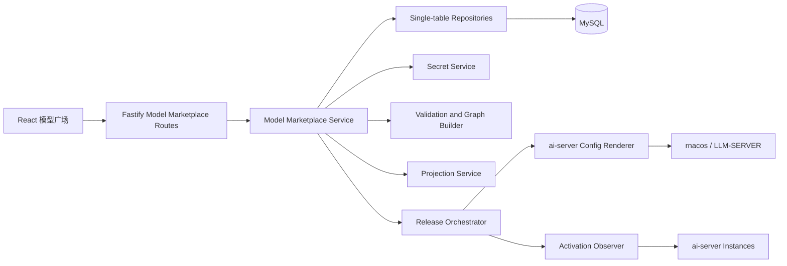
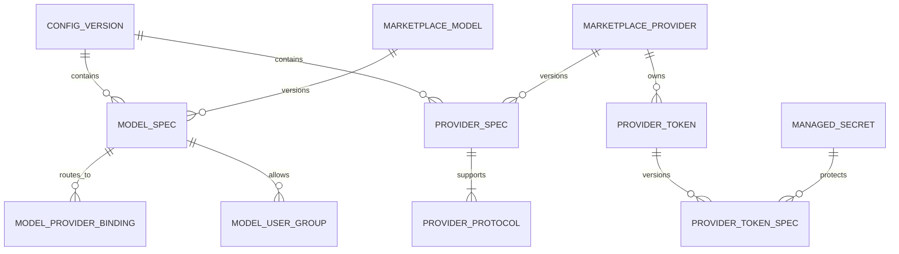
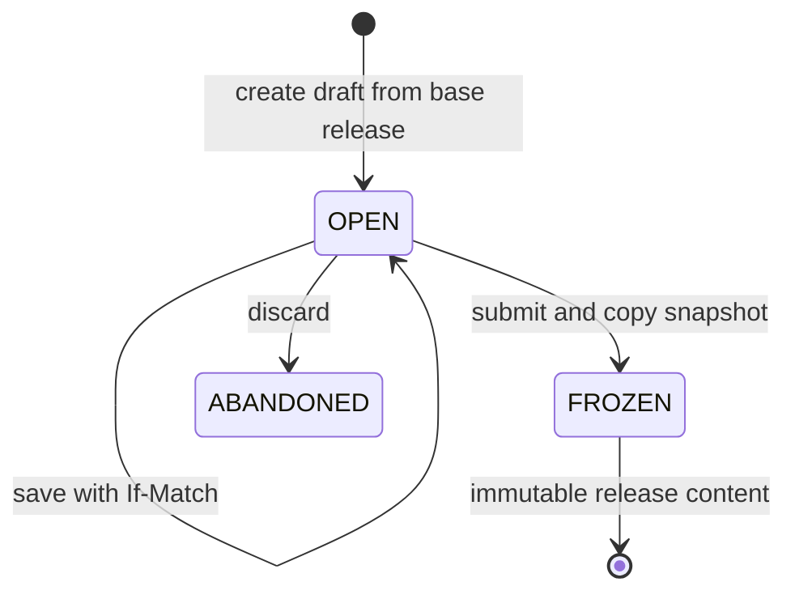
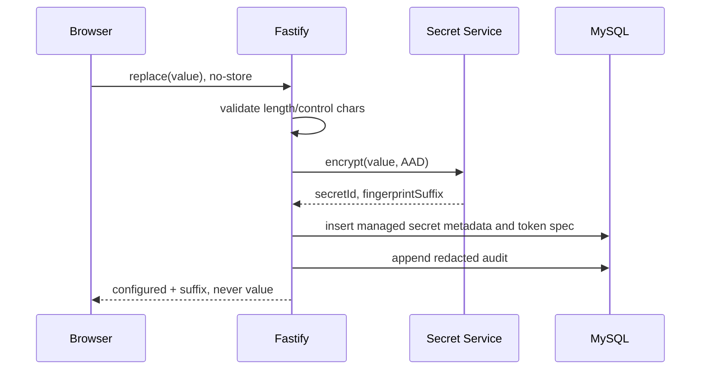
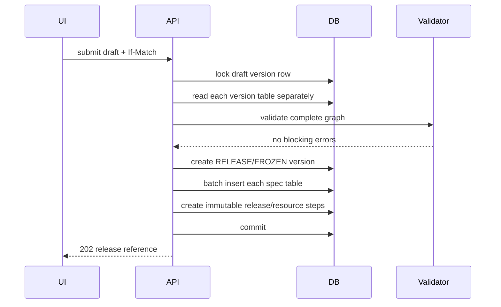
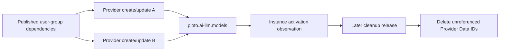

# 模型广场详细设计

## 1. 文档信息

| 项目           | 内容                                                                  |
| -------------- | --------------------------------------------------------------------- |
| 所属产品       | Fiber AI Server Console                                               |
| 需求文档       | `docs/model-marketplace-requirements.md`                              |
| 上位需求       | `docs/product-requirements.md`                                        |
| 关联模块       | 用户与权限、用户组、草稿与发布、运行状态、审计                        |
| 文档状态       | 详细设计基线                                                          |
| 编写日期       | 2026-08-02                                                            |
| ai-server 基线 | `fiber-gateway-cpp` commit `fdd8f122394757231713416e3d9a281dd1e14def` |
| 数据库         | MySQL 8.0+、InnoDB、`utf8mb4`                                         |

本文给出模型广场的前端、后端、领域模型、数据库、API、配置渲染、发布和测试设计。它描述
目标实现，不代表这些表和接口已经存在。

## 2. 上游依据与设计结论

### 2.1 ai-server 源码依据

| 契约                                          | 上游路径                                             |
| --------------------------------------------- | ---------------------------------------------------- |
| 固定 group、Data ID、模型和 Provider 内存结构 | `apps/ai-server/src/config/LlmConfigSnapshot.h`      |
| JSON 字段别名、名称、协议、URL 和模型校验     | `apps/ai-server/src/config/LlmConfigCodec.cpp`       |
| HTTP/HTTPS/service endpoint 解析规则          | `apps/ai-server/src/provider/ProviderEndpoint.cpp`   |
| 协议候选、主/Fallback、Token 选择和运行时过滤 | `apps/ai-server/src/provider/ExecutionPlan.cpp`      |
| 供应商请求头固定为 `Authorization: Bearer`    | `apps/ai-server/src/provider/ProviderHttpClient.cpp` |
| 请求体模型名改写为 Provider 协议项的 `model`  | `apps/ai-server/src/server/LlmRequestHandler.cpp`    |
| 两个入站路径与请求协议判定                    | `apps/ai-server/src/AiServer.cpp`                    |
| Provider/model 配置 golden cases              | `apps/ai-server/tests/LlmConfigCodecTest.cpp`        |

实现期间若上游基线变化，必须重新核对这些文件并更新兼容 fixtures，不能只根据本文猜测新
行为。

### 2.2 核心设计决策

1. **模型广场是控制台聚合，不是新的 rnacos schema。** 发布时仍生成标准 Provider Data ID
   和唯一的 models Data ID。
2. **逻辑模型和 Provider 分开建模、分开维护。** Provider 管理独立持有地址、协议和 Token；
   模型编辑器只保存对现有 Provider 的 PRIMARY/FALLBACK 绑定。
3. **协议映射按 Provider 保存。** 同一 Provider 最多一项 OpenAI 和一项 Anthropic，每项
   独立保存上游模型名与路径。
4. **不做协议转换。** OpenAI 请求只使用 OpenAI 映射，Anthropic 请求只使用 Anthropic
   映射。
5. **Token 属于 Provider。** Token 修改影响该 Provider 的所有引用模型，必须做影响分析。
6. **Token 永远只写。** 版本表只保存 `managed_secrets.id` 和安全指纹，不保存明文。
7. **配置版本是完整环境快照。** 开放版本可作为草稿编辑；提交后复制为冻结版本供 release
   引用。回滚从历史冻结版本复制，不修改旧版本。
8. **所有运行时 SQL 只操作一张表。** 不使用 JOIN、子查询、CTE、UNION 或数据库端复杂
   聚合；服务层按版本批量读取并用 TypeScript `Map` 组装。
9. **列表读投影。** 三层状态、协议覆盖和摘要写入单表投影，避免列表请求现场跨表计算。
10. **状态证据分层。** 草稿事实来自 MySQL，发布事实来自 release/资源结果，生效事实只能
    来自实例接受证据；缺证据时保持 `UNKNOWN`。
11. **发布是非原子的模型路由 Release。** Provider 和 models 在同一冻结版本中按依赖顺序
    发布并分别保存结果；用户组由模型访问模块独立发布，路由 Release 只校验其精确 MD5。
    BT1 Key Ring 接入前不得把该 Release 描述为完整 ai-server 环境发布。
12. **配置包络 `version` 是运行版本。** Provider 和 models 在同一 Release 使用
    相同的环境 Release 序号；用户组使用 `group.revision + 1`。固定 schema 版本
    不得写入每次动态配置的 `version`。

## 3. 总体架构



### 3.1 边界

- Route 只做身份、权限、schema、幂等键和 ETag 解析，不包含 SQL、rnacos 或 secret 细节。
- Domain Service 负责事务边界、跨表组装、权限、校验、影响分析和审计。
- Repository 每个方法只访问一张表，返回数据库行或写入结果。
- Secret Service 负责加密、解密、指纹和销毁策略；调用方不接触加密实现。
- Renderer 只接受冻结版本，生成确定性 JSON；它不知道 HTTP request 或数据库连接。
- Release Orchestrator 创建不可变 release 后才调用 rnacos，保存逐资源、逐实例结果。
- Activation Observer 只观察状态，不把 `/ready` 推断为接受本次 release。
- 控制台后端不提供通用 LLM proxy，也不使用供应商 Token 代用户发起聊天请求。

### 3.2 服务生命周期

`server/src/app.ts` 构造 Fastify 时注入接口或内存实现，不连接 MySQL、rnacos 或 ai-server。
`server/src/index.ts` 在显式启动阶段初始化连接和后台 worker，在 shutdown hook 中按
“停止接收请求 → 停止 worker → 关闭外部客户端 → 关闭数据库”顺序释放。

## 4. 领域模型

### 4.1 聚合关系



### 4.2 TypeScript 类型

```ts
export type ConfigVersionKind = 'DRAFT' | 'RELEASE'
export type ConfigVersionState = 'OPEN' | 'FROZEN' | 'ABANDONED'
export type ProviderRouteRole = 'PRIMARY' | 'FALLBACK'
export type ProviderProtocolType = 'OPENAI_CHAT_COMPLETIONS' | 'ANTHROPIC_MESSAGES'

export interface MarketplaceModelIdentity {
  id: string
  environmentId: string
  logicalModelName: string
  createdAt: string
  archivedAt: string | null
}

export interface ModelSpec {
  versionId: string
  modelId: string
  displayName: string
  description: string
  prefixMaxBytes: number
  maxPrimaryAttempts: number
  fallbackEnabled: boolean
  retryableStatuses: number[]
  rateLimit: null | {
    windowDurationMillis: string
    maxTokensPerWindow: string
  }
}

export interface ProviderIdentity {
  id: string
  environmentId: string
  providerName: string
}

export interface ProviderSpec {
  versionId: string
  providerId: string
  displayName: string
  baseUrl: string
}

export interface ProviderProtocolSpec {
  versionId: string
  providerId: string
  type: ProviderProtocolType
  path: string
  upstreamModelName: string
}

export interface ProviderTokenSafeView {
  id: string
  name: string
  configured: true
  fingerprintSuffix: string
  updatedAt: string
}

export interface ModelProviderBinding {
  providerId: string
  routeRole: ProviderRouteRole
  sortOrder: number
}
```

int64 配置在 HTTP JSON 中使用十进制字符串，防止 JavaScript `number` 超过安全整数范围。
窗口范围为 `1..9223372036854775807`，窗口 Token 上限范围为
`0..9223372036854775807`；领域层校验后再转换为数据库 `BIGINT` 字符串和 rnacos JSON
整数。控制台不得接受 ai-server codec 无法表示的 uint64 上半区。

### 4.3 领域不变量

- `MarketplaceModelIdentity.logicalModelName` 在环境内永久唯一，归档后不复用。
- `ProviderIdentity.providerName` 在环境内永久唯一，并与 Provider Data ID 后缀相同。
- Provider 是环境级独立 identity，可以被零个或多个模型绑定。
- 一个版本中，一个模型至少有一个 PRIMARY 或 FALLBACK 绑定。
- 一个版本中，一个模型最多一个 FALLBACK，且同一 Provider 不能同时是 PRIMARY/FALLBACK。
- 一个版本中，一个 Provider 至少有一项受支持协议；每种协议最多一项。
- 一个 Token identity 永久属于一个 Provider，Token 名在 Provider 内永久唯一。
- `ProviderTokenSpec.secretId` 必须指向未销毁的 `PROVIDER_TOKEN` secret。
- 版本内没有 Token spec 表示无凭据调用；必须伴随管理员显式确认，不使用空 secret 表示。
- RELEASE/FROZEN 版本任何 spec 行都不可更新或删除；修复只能产生新版本。
- 不同环境之间不能绑定模型、Provider、Token、用户组或 secret。

### 4.4 Provider 标识生成

Provider 标识由服务端生成，不依赖浏览器 `crypto.randomUUID`：

```text
mp_<logical-name-slug-prefix>_<12-char-random-suffix>
```

- slug 只保留 ASCII 字母、数字和下划线，前缀最长 40 字节。
- 随机后缀来自服务端 CSPRNG，使用小写十六进制或 Base32 安全字符。
- 总长度不超过 128，最终必须匹配 `[A-Za-z0-9_-]+`。
- 数据库唯一冲突时最多重试三次；仍冲突返回 `PROVIDER_NAME_CONFLICT`。
- 标识保存后不可因展示名称或逻辑模型名改变而重算。

## 5. 状态模型

### 5.1 配置版本



编辑使用一个 `DRAFT/OPEN` 完整版本。提交时服务层读取该版本的全部单表数据，在事务中写入
新的 `RELEASE/FROZEN` 版本；发布编排表引用这个冻结版本。原草稿可关闭或基于新 release
另开版本。

### 5.2 三层展示状态

投影中分别保存：

```ts
type DraftState = 'NONE' | 'MODIFIED' | 'INVALID' | 'CONFLICTED'
type PublicationState = 'NEVER' | 'PUBLISHED' | 'PARTIAL' | 'FAILED' | 'DRIFTED'
type ActivationState = 'UNKNOWN' | 'PENDING' | 'EFFECTIVE' | 'PARTIAL' | 'REJECTED'
```

状态更新来源：

- 草稿保存或校验完成时更新 `draftState`。
- release 资源回读结果更新 `publicationState`。
- 实例上报明确配置身份后更新 `activationState`。
- 投影 worker 不允许根据健康或 ready 状态写 `EFFECTIVE`。

## 6. 前端详细设计

### 6.1 目录规划

```text
web/src/
├── api/
│   └── model-marketplace.ts
├── components/model-marketplace/
│   ├── ModelCard.tsx
│   ├── ModelStateStrip.tsx
│   ├── ProtocolBadge.tsx
│   ├── ProtocolCoverageMatrix.tsx
│   ├── ProtocolEditor.tsx
│   ├── TokenPoolEditor.tsx
│   ├── SecretActionField.tsx
│   └── ValidationSummary.tsx
├── pages/
│   ├── ModelMarketplacePage.tsx
│   ├── ModelDetailPage.tsx
│   ├── ModelEditorPage.tsx
│   └── ProvidersPage.tsx
└── data/
    └── model-protocols.ts
```

重复卡片、状态条、协议徽标和 secret 动作控件必须抽成组件。协议选项和默认路径来自一个
只读常量表，不能在多个页面硬编码。

### 6.2 路由

管理员新增环境级发布路由：

```text
#/releases
#/releases/<release-id>
```

模型详情不再直接创建 release。模型广场页头提供“查看发布差异”，创建成功后导航到
release 详情。存在活动 release 时入口替换为“查看 Release #N”，避免重复冻结同一草稿。

| 前端路由                                             | 页面          |
| ---------------------------------------------------- | ------------- |
| `/environments/:env/models`                          | 广场列表      |
| `/environments/:env/models/:modelId`                 | 模型详情      |
| `/environments/:env/drafts/:draftId/models/new`      | 新增向导      |
| `/environments/:env/drafts/:draftId/models/:modelId` | 编辑模型      |
| `/environments/:env/providers`                       | Provider 管理 |

使用不透明 UUID 作为详情路由 ID；逻辑模型名只做显示和 API 响应字段，避免改名/编码问题扩散。

### 6.3 页面数据状态

- 服务端事实使用查询缓存；表单草稿使用本地 reducer，不直接修改缓存对象。
- API 返回的 `etag` 随表单初始值保存，PATCH 时发送 `If-Match`。
- 保存成功后用响应的新 ETag 重置 dirty baseline。
- `412` 不自动覆盖本地输入，展示服务器 revision 和“重新加载/复制本地 JSON”操作。
- Token 输入不进入 URL、localStorage、sessionStorage、查询缓存、全局 store 或错误上报。
- Token 保存成功后立即把 DOM input value 和组件 state 置空。
- 页面卸载时清理仍未提交的 secret state。

### 6.4 `TokenPoolEditor`

每行状态为以下联合类型之一：

```ts
type TokenDraftRow =
  | { kind: 'existing'; id: string; name: string; action: 'keep' }
  | { kind: 'existing'; id: string; name: string; action: 'replace'; value: string }
  | { kind: 'existing'; id: string; name: string; action: 'delete' }
  | { kind: 'new'; clientId: string; name: string; action: 'replace'; value: string }
```

前端不得用 `crypto.randomUUID()` 生成业务 ID 或幂等键。新增行的 `clientId` 只用于 React
key，可使用模块级递增序号；所有持久化 ID 和幂等键由后端生成或使用兼容的服务端能力。

现有行从 `keep` 切到 `replace` 时才显示新 secret 输入。切回 `keep` 必须清空输入。切到
`delete` 要求确认；撤销删除后回到 `keep`，不能恢复曾输入的新 secret。

### 6.5 可访问性

- 向导步骤使用有序列表和 `aria-current="step"`。
- 表单错误用 `aria-describedby` 关联，提交后聚焦错误摘要，再允许跳转到字段。
- 模型绑定的 Provider 排序同时提供“上移/下移”按钮和键盘操作。
- Token 显示/隐藏只作用于尚未提交的新输入，按钮有可读标签。
- 状态条使用文字、图标和辅助说明；窄屏按草稿、发布、生效顺序纵向排列。

## 7. 后端模块设计

### 7.1 目录规划

```text
server/src/modules/model-marketplace/
├── routes.ts
├── schemas.ts
├── types.ts
├── errors.ts
├── service.ts
├── validation.ts
├── graph-builder.ts
├── provider-name.ts
├── renderer.ts
├── projection-service.ts
├── repositories/
│   ├── config-version-repository.ts
│   ├── model-repository.ts
│   ├── provider-repository.ts
│   ├── protocol-repository.ts
│   ├── provider-token-repository.ts
│   ├── model-group-repository.ts
│   └── projection-repository.ts
└── *.test.ts
```

基础设施接口位于对应 domain 边界：

```ts
export interface MarketplaceSecretService {
  createProviderToken(input: {
    environmentId: string
    providerId: string
    tokenId: string
    value: Uint8Array
    actorId: string
  }): Promise<SecretMetadata>
  decryptForPublication(secretId: string): Promise<DisposableSecret>
  getMetadata(secretId: string): Promise<SecretMetadata | null>
}

export interface MarketplaceReleaseGateway {
  createRelease(input: FrozenMarketplaceVersion): Promise<ReleaseReference>
}
```

### 7.2 事务职责

`ModelMarketplaceService` 的写操作按以下模板执行：

1. 验证管理员、环境访问、幂等键和 ETag。
2. 在事务外完成不需要持锁的纯字段校验。
3. 加密新增/替换 secret，得到待写元数据；失败则不开始数据库事务。
4. 开启数据库事务并锁定目标 `configuration_versions` 单行。
5. 再次检查状态和 revision。
6. 用多条简单单表语句写 identity、spec、secret metadata 和审计。
7. 更新版本 revision，提交。
8. 发布投影更新事件；同步投影失败只告警，由 worker 重建。
9. 清理请求内 secret buffer。

若数据库提交失败，Secret Service 需要把尚未被引用的新 secret 标为孤立并异步清理。不能
因为清理失败把 secret 值写日志。

### 7.3 服务层组装

完整版本读取固定执行以下独立查询：

1. `configuration_versions WHERE id = ?`
2. `marketplace_models WHERE environment_id = ?`
3. `marketplace_model_specs WHERE version_id = ?`
4. `marketplace_providers WHERE environment_id = ?`
5. `marketplace_provider_specs WHERE version_id = ?`
6. `marketplace_model_provider_bindings WHERE version_id = ?`
7. `marketplace_provider_protocols WHERE version_id = ?`
8. `marketplace_provider_tokens WHERE environment_id = ?`
9. `marketplace_provider_token_specs WHERE version_id = ?`
10. `marketplace_model_user_groups WHERE version_id = ?`
11. `marketplace_model_tags WHERE version_id = ?`

随后以 `Map<id, object>` 建立索引并组装。任何孤立引用、跨环境引用或重复项都转为验证
错误，不能在组装时静默丢弃。

## 8. API 设计

### 8.1 通用约定

- 所有路由位于 `/api`。
- UUID 使用规范字符串；数据库转换在 repository 边界完成。
- 时间为 RFC 3339 UTC。
- 列表 cursor 是签名的不透明字符串，包含 sort key 和 ID；客户端不能构造 SQL。
- 响应返回 `ETag: "<revision>"`；修改要求 `If-Match`。
- 创建、复制、Token secret 动作要求 `Idempotency-Key`。
- secret 请求和响应始终返回 `Cache-Control: no-store`。
- Fastify schema 为请求和响应显式声明字段，响应 schema 不含 `value`、`token`、`secretId`。

### 8.2 普通用户目录

```text
GET /api/environments/:env/models?view=available&protocol=&access=&cursor=&limit=
GET /api/environments/:env/models/:modelId?view=available
```

普通用户响应示例：

```json
{
  "items": [
    {
      "id": "8ae73b79-2b5e-46d8-86e6-7903389f7ce4",
      "displayName": "通用对话模型",
      "logicalModelName": "chat-pro",
      "description": "适用于通用文本任务",
      "protocols": {
        "openai": "SUPPORTED",
        "anthropic": "SUPPORTED"
      },
      "accessible": true,
      "activationState": "UNKNOWN",
      "publishedAt": "2026-08-02T03:00:00.000Z"
    }
  ],
  "nextCursor": null
}
```

该响应不得包含 Provider、Base URL、Token 摘要、用户组成员或草稿字段。

### 8.3 管理员列表与详情

```text
GET /api/environments/:env/models?view=admin&draftId=&cursor=&limit=
GET /api/environments/:env/models/:modelId?view=admin&draftId=
GET /api/environments/:env/models/:modelId/impact?draftId=
GET /api/environments/:env/providers?draftId=
GET /api/environments/:env/providers/:providerId?draftId=
```

详情通过服务层组装，返回 `draft`、`published`、`activation` 三个独立对象。Token 安全视图：

```json
{
  "id": "217786a7-d927-47e0-af42-36dd921a7668",
  "name": "vendor-primary-2026-08",
  "configured": true,
  "fingerprintSuffix": "91a20f",
  "updatedAt": "2026-08-02T03:10:00.000Z"
}
```

### 8.4 模型写接口

```text
POST   /api/environments/:env/drafts/:draftId/models
PATCH  /api/environments/:env/drafts/:draftId/models/:modelId
POST   /api/environments/:env/drafts/:draftId/models/:modelId/copy
DELETE /api/environments/:env/drafts/:draftId/models/:modelId
POST   /api/environments/:env/drafts/:draftId/models/:modelId/validate
```

创建请求示例：

```json
{
  "displayName": "通用对话模型",
  "logicalModelName": "chat-pro",
  "description": "适用于通用文本任务",
  "tags": ["chat", "general"],
  "providers": [
    {
      "providerId": "217786a7-d927-47e0-af42-36dd921a7668",
      "routeRole": "PRIMARY",
      "sortOrder": 0
    }
  ],
  "accessMode": "ALL_AUTHENTICATED",
  "loadBalance": {
    "prefixMaxBytes": 2048,
    "maxPrimaryAttempts": 0,
    "fallbackEnabled": true,
    "retryableStatuses": [429, 502, 503, 504]
  },
  "rateLimit": null
}
```

成功响应返回模型详情和新 ETag。模型写接口不接受 Base URL、协议或 Token 字段。

### 8.5 Provider 与 Token 写接口

Provider 只能通过独立接口维护；模型写接口只保存 Provider ID、路由角色和顺序：

```text
POST  /api/environments/:env/drafts/:draftId/providers
PATCH /api/environments/:env/drafts/:draftId/providers/:providerId
DELETE /api/environments/:env/drafts/:draftId/providers/:providerId
POST  /api/environments/:env/drafts/:draftId/providers/:providerId/tokens
PATCH /api/environments/:env/drafts/:draftId/providers/:providerId/tokens/:tokenId
```

创建或更新 Provider 的请求包含 `displayName`、`baseUrl`、`protocols` 和 `authentication`；
新建时由后端生成稳定 `providerName`。归档前服务端检查完整草稿引用关系，仍被模型绑定时返回
`409 PROVIDER_IN_USE`，不执行部分写入。

新增 Token：

```json
{
  "name": "vendor-secondary-2026-08",
  "secretAction": "replace",
  "value": "write-only-value",
  "reason": "供应商凭据轮换"
}
```

修改现有 Token：

```json
{
  "secretAction": "replace",
  "value": "new-write-only-value",
  "reason": "同名紧急替换",
  "confirmProviderImpact": false
}
```

删除使用同一路径：

```json
{
  "secretAction": "delete",
  "reason": "旧凭据已下线",
  "confirmUnauthenticated": false,
  "confirmProviderImpact": false
}
```

`keep` 只允许出现在 Provider 保存中，且不能携带 `value`。`replace` 必须有非空
`value`。`delete` 不能有 `value`。多模型引用 Provider 或最后一个 Token 的确认字段缺失时返回
`409` 和影响摘要，不执行部分写入。

### 8.6 校验与发布集成

```text
POST /api/environments/:env/drafts/:draftId/validate
GET  /api/environments/:env/drafts/:draftId/diff
POST /api/environments/:env/drafts/:draftId/submit
GET  /api/environments/:env/releases
GET  /api/environments/:env/releases/:releaseId
POST /api/environments/:env/releases/:releaseId/execute
POST /api/environments/:env/releases/:releaseId/retry
```

沿用全局 release API。模型模块向发布模块提供冻结版本 ID、资源依赖图、规范渲染器和脱敏
diff，不自行绕过审批直接写 rnacos。

### 8.7 错误格式

```json
{
  "error": {
    "code": "UPSTREAM_MODEL_REQUIRED",
    "message": "供应商上游模型名不能为空",
    "field": "/providers/0/protocols/1/upstreamModelName",
    "severity": "ERROR",
    "correlationId": "01K1M6K4YKBCBPG4APQMV1NMC8",
    "details": {}
  }
}
```

Token 校验错误不能把收到的值放入 `message`、`details`、Fastify validation context 或日志。

## 9. 数据库详细设计

### 9.1 通用约定

- 主键由应用生成 UUID，存为 `BINARY(16)`；不依赖数据库自增业务 ID。
- 时间统一 `DATETIME(6)` UTC，由可注入 Clock 赋值。
- 文本身份字段使用 binary collation 保证大小写精确语义。
- 每个开放版本带 `revision BIGINT UNSIGNED`，使用 `If-Match` 乐观锁。
- 所有配置 spec 通过 `version_id` 隔离，不能查询“最新一行”推断当前版本。
- 历史模型、Provider、Token identity 和冻结版本不硬删除。
- 外键只保证局部引用存在；同环境、状态和业务唯一性仍由服务层校验。
- DDL 可以声明索引和外键，但业务运行 SQL 必须保持单表简单语句。
- 复用当前 `environments`、`users`、`managed_secrets` 和全局审计表。

### 9.2 `configuration_versions`

该表保存模型广场规范化内容的版本身份。全局 `drafts` 和 `releases` 分别一对一引用对应
`DRAFT`/`RELEASE` 版本，并保存工作流字段。

```sql
CREATE TABLE configuration_versions (
  id BINARY(16) NOT NULL,
  environment_id BINARY(16) NOT NULL,
  version_kind VARCHAR(16) CHARACTER SET ascii COLLATE ascii_bin NOT NULL,
  version_state VARCHAR(16) CHARACTER SET ascii COLLATE ascii_bin NOT NULL,
  base_release_version_id BINARY(16) NULL,
  schema_version INT UNSIGNED NOT NULL DEFAULT 1,
  revision BIGINT UNSIGNED NOT NULL DEFAULT 1,
  created_by BINARY(16) NOT NULL,
  created_at DATETIME(6) NOT NULL,
  updated_at DATETIME(6) NOT NULL,
  frozen_at DATETIME(6) NULL,
  abandoned_at DATETIME(6) NULL,
  PRIMARY KEY (id),
  KEY idx_config_versions_environment (environment_id, version_kind, version_state, updated_at),
  CONSTRAINT chk_config_version_kind CHECK (version_kind IN ('DRAFT', 'RELEASE')),
  CONSTRAINT chk_config_version_state CHECK (version_state IN ('OPEN', 'FROZEN', 'ABANDONED')),
  CONSTRAINT chk_config_version_freeze CHECK (
    (version_state = 'FROZEN' AND frozen_at IS NOT NULL)
    OR (version_state <> 'FROZEN' AND frozen_at IS NULL)
  ),
  CONSTRAINT fk_config_version_environment
    FOREIGN KEY (environment_id) REFERENCES environments (id),
  CONSTRAINT fk_config_version_base_release
    FOREIGN KEY (base_release_version_id) REFERENCES configuration_versions (id),
  CONSTRAINT fk_config_version_created_by FOREIGN KEY (created_by) REFERENCES users (id)
) ENGINE = InnoDB DEFAULT CHARSET = utf8mb4;
```

`version_kind = RELEASE` 必须同时为 `FROZEN`，`DRAFT` 不能直接充当 release，由服务层保证。

### 9.3 `marketplace_models`

```sql
CREATE TABLE marketplace_models (
  id BINARY(16) NOT NULL,
  environment_id BINARY(16) NOT NULL,
  logical_model_name VARCHAR(128) CHARACTER SET ascii COLLATE ascii_bin NOT NULL,
  created_by BINARY(16) NOT NULL,
  created_at DATETIME(6) NOT NULL,
  archived_by BINARY(16) NULL,
  archived_at DATETIME(6) NULL,
  PRIMARY KEY (id),
  UNIQUE KEY uq_marketplace_model_name (environment_id, logical_model_name),
  KEY idx_marketplace_models_environment (environment_id, archived_at, id),
  CONSTRAINT chk_marketplace_model_name_bytes CHECK (
    OCTET_LENGTH(logical_model_name) BETWEEN 1 AND 128
  ),
  CONSTRAINT fk_marketplace_model_environment
    FOREIGN KEY (environment_id) REFERENCES environments (id),
  CONSTRAINT fk_marketplace_model_created_by FOREIGN KEY (created_by) REFERENCES users (id),
  CONSTRAINT fk_marketplace_model_archived_by FOREIGN KEY (archived_by) REFERENCES users (id)
) ENGINE = InnoDB DEFAULT CHARSET = utf8mb4;
```

`[A-Za-z0-9_.-]` 正则在服务层执行。唯一索引不因归档释放，避免旧调用方误命中新模型。

### 9.4 `marketplace_model_specs`

```sql
CREATE TABLE marketplace_model_specs (
  version_id BINARY(16) NOT NULL,
  model_id BINARY(16) NOT NULL,
  display_name VARCHAR(100) NOT NULL,
  description VARCHAR(2000) NOT NULL DEFAULT '',
  prefix_max_bytes INT UNSIGNED NOT NULL DEFAULT 2048,
  max_primary_attempts INT UNSIGNED NOT NULL DEFAULT 0,
  fallback_enabled BOOLEAN NOT NULL DEFAULT TRUE,
  retryable_statuses JSON NOT NULL,
  rate_limit_enabled BOOLEAN NOT NULL DEFAULT FALSE,
  rate_limit_window_millis BIGINT UNSIGNED NULL,
  rate_limit_max_tokens BIGINT UNSIGNED NULL,
  updated_by BINARY(16) NOT NULL,
  updated_at DATETIME(6) NOT NULL,
  PRIMARY KEY (version_id, model_id),
  KEY idx_model_specs_model (model_id, version_id),
  CONSTRAINT chk_model_spec_prefix CHECK (prefix_max_bytes BETWEEN 1 AND 2147483647),
  CONSTRAINT chk_model_spec_attempts CHECK (max_primary_attempts <= 2147483647),
  CONSTRAINT chk_model_spec_rate_limit CHECK (
    (rate_limit_enabled = FALSE
      AND rate_limit_window_millis IS NULL
      AND rate_limit_max_tokens IS NULL)
    OR
    (rate_limit_enabled = TRUE
      AND rate_limit_window_millis > 0
      AND rate_limit_max_tokens IS NOT NULL)
  ),
  CONSTRAINT fk_model_spec_version FOREIGN KEY (version_id) REFERENCES configuration_versions (id),
  CONSTRAINT fk_model_spec_model FOREIGN KEY (model_id) REFERENCES marketplace_models (id),
  CONSTRAINT fk_model_spec_updated_by FOREIGN KEY (updated_by) REFERENCES users (id)
) ENGINE = InnoDB DEFAULT CHARSET = utf8mb4;
```

`retryable_statuses` 是标量数组，服务层限制整数 `100..599`、去重、升序。它不保存嵌套
领域对象；Provider、协议、Token 和用户组仍使用规范化表。

### 9.5 `marketplace_model_tags`

```sql
CREATE TABLE marketplace_model_tags (
  version_id BINARY(16) NOT NULL,
  model_id BINARY(16) NOT NULL,
  tag VARCHAR(32) NOT NULL,
  sort_order SMALLINT UNSIGNED NOT NULL,
  PRIMARY KEY (version_id, model_id, tag),
  UNIQUE KEY uq_model_tag_order (version_id, model_id, sort_order),
  CONSTRAINT fk_model_tag_version FOREIGN KEY (version_id) REFERENCES configuration_versions (id),
  CONSTRAINT fk_model_tag_model FOREIGN KEY (model_id) REFERENCES marketplace_models (id)
) ENGINE = InnoDB DEFAULT CHARSET = utf8mb4;
```

### 9.6 `marketplace_providers`

```sql
CREATE TABLE marketplace_providers (
  id BINARY(16) NOT NULL,
  environment_id BINARY(16) NOT NULL,
  provider_name VARCHAR(128) CHARACTER SET ascii COLLATE ascii_bin NOT NULL,
  ownership VARCHAR(16) CHARACTER SET ascii COLLATE ascii_bin NOT NULL,
  owner_model_id BINARY(16) NULL,
  created_by BINARY(16) NOT NULL,
  created_at DATETIME(6) NOT NULL,
  archived_by BINARY(16) NULL,
  archived_at DATETIME(6) NULL,
  PRIMARY KEY (id),
  UNIQUE KEY uq_marketplace_provider_name (environment_id, provider_name),
  KEY idx_marketplace_providers_environment (environment_id, archived_at, id),
  KEY idx_marketplace_provider_owner (owner_model_id, archived_at),
  CONSTRAINT chk_marketplace_provider_ownership CHECK (ownership IN ('DEDICATED', 'SHARED')),
  CONSTRAINT chk_marketplace_provider_owner CHECK (
    (ownership = 'DEDICATED' AND owner_model_id IS NOT NULL)
    OR (ownership = 'SHARED' AND owner_model_id IS NULL)
  ),
  CONSTRAINT chk_marketplace_provider_name_bytes CHECK (
    OCTET_LENGTH(provider_name) BETWEEN 1 AND 128
  ),
  CONSTRAINT fk_marketplace_provider_environment
    FOREIGN KEY (environment_id) REFERENCES environments (id),
  CONSTRAINT fk_marketplace_provider_owner
    FOREIGN KEY (owner_model_id) REFERENCES marketplace_models (id),
  CONSTRAINT fk_marketplace_provider_created_by FOREIGN KEY (created_by) REFERENCES users (id),
  CONSTRAINT fk_marketplace_provider_archived_by FOREIGN KEY (archived_by) REFERENCES users (id)
) ENGINE = InnoDB DEFAULT CHARSET = utf8mb4;
```

`ownership` 和 `owner_model_id` 是从旧“模型内专属 Provider”方案保留的兼容列。新建 Provider
统一写 `ownership='SHARED'`、`owner_model_id=NULL`，领域规则和 API 不再暴露专属所有权；后续
在确认没有旧数据依赖后可用独立迁移移除这两列及相关约束。

### 9.7 `marketplace_provider_specs`

```sql
CREATE TABLE marketplace_provider_specs (
  version_id BINARY(16) NOT NULL,
  provider_id BINARY(16) NOT NULL,
  display_name VARCHAR(100) NOT NULL,
  base_url VARCHAR(2048) CHARACTER SET utf8mb4 COLLATE utf8mb4_0900_bin NOT NULL,
  updated_by BINARY(16) NOT NULL,
  updated_at DATETIME(6) NOT NULL,
  PRIMARY KEY (version_id, provider_id),
  KEY idx_provider_specs_provider (provider_id, version_id),
  CONSTRAINT fk_provider_spec_version FOREIGN KEY (version_id) REFERENCES configuration_versions (id),
  CONSTRAINT fk_provider_spec_provider FOREIGN KEY (provider_id) REFERENCES marketplace_providers (id),
  CONSTRAINT fk_provider_spec_updated_by FOREIGN KEY (updated_by) REFERENCES users (id)
) ENGINE = InnoDB DEFAULT CHARSET = utf8mb4;
```

Base URL 规范化和 endpoint 解析规则在服务层完成，数据库长度只是控制台容量边界。

### 9.8 `marketplace_model_provider_bindings`

```sql
CREATE TABLE marketplace_model_provider_bindings (
  version_id BINARY(16) NOT NULL,
  model_id BINARY(16) NOT NULL,
  provider_id BINARY(16) NOT NULL,
  route_role VARCHAR(16) CHARACTER SET ascii COLLATE ascii_bin NOT NULL,
  sort_order SMALLINT UNSIGNED NOT NULL,
  fallback_slot TINYINT GENERATED ALWAYS AS (
    CASE WHEN route_role = 'FALLBACK' THEN 1 ELSE NULL END
  ) STORED,
  PRIMARY KEY (version_id, model_id, provider_id),
  UNIQUE KEY uq_model_provider_order (version_id, model_id, route_role, sort_order),
  UNIQUE KEY uq_model_single_fallback (version_id, model_id, fallback_slot),
  KEY idx_model_provider_provider (version_id, provider_id, model_id),
  CONSTRAINT chk_model_provider_role CHECK (route_role IN ('PRIMARY', 'FALLBACK')),
  CONSTRAINT chk_model_provider_fallback_order CHECK (
    route_role = 'PRIMARY' OR sort_order = 0
  ),
  CONSTRAINT fk_model_provider_version FOREIGN KEY (version_id) REFERENCES configuration_versions (id),
  CONSTRAINT fk_model_provider_model FOREIGN KEY (model_id) REFERENCES marketplace_models (id),
  CONSTRAINT fk_model_provider_provider FOREIGN KEY (provider_id) REFERENCES marketplace_providers (id)
) ENGINE = InnoDB DEFAULT CHARSET = utf8mb4;
```

PRIMARY 顺序用于生成 `providers` 数组。ai-server 最终使用 rendezvous score 决定候选顺序，
数组顺序只用于确定性输出和人工理解，不应宣传为严格流量权重。

### 9.9 `marketplace_provider_protocols`

```sql
CREATE TABLE marketplace_provider_protocols (
  version_id BINARY(16) NOT NULL,
  provider_id BINARY(16) NOT NULL,
  protocol_type VARCHAR(32) CHARACTER SET ascii COLLATE ascii_bin NOT NULL,
  request_path VARCHAR(2048) CHARACTER SET utf8mb4 COLLATE utf8mb4_0900_bin NOT NULL,
  upstream_model_name VARCHAR(512) CHARACTER SET utf8mb4 COLLATE utf8mb4_0900_bin NOT NULL,
  updated_by BINARY(16) NOT NULL,
  updated_at DATETIME(6) NOT NULL,
  PRIMARY KEY (version_id, provider_id, protocol_type),
  KEY idx_provider_protocol_provider (provider_id, version_id),
  CONSTRAINT chk_provider_protocol_type CHECK (
    protocol_type IN ('OPENAI_CHAT_COMPLETIONS', 'ANTHROPIC_MESSAGES')
  ),
  CONSTRAINT chk_provider_protocol_path CHECK (LEFT(request_path, 1) = '/'),
  CONSTRAINT chk_provider_protocol_model CHECK (OCTET_LENGTH(upstream_model_name) > 0),
  CONSTRAINT fk_provider_protocol_version FOREIGN KEY (version_id) REFERENCES configuration_versions (id),
  CONSTRAINT fk_provider_protocol_provider FOREIGN KEY (provider_id) REFERENCES marketplace_providers (id),
  CONSTRAINT fk_provider_protocol_updated_by FOREIGN KEY (updated_by) REFERENCES users (id)
) ENGINE = InnoDB DEFAULT CHARSET = utf8mb4;
```

### 9.10 `marketplace_provider_tokens`

Token identity 与 secret 版本分离。名称创建后不修改；轮换优先新增 identity。

```sql
CREATE TABLE marketplace_provider_tokens (
  id BINARY(16) NOT NULL,
  environment_id BINARY(16) NOT NULL,
  provider_id BINARY(16) NOT NULL,
  token_name VARCHAR(128) CHARACTER SET utf8mb4 COLLATE utf8mb4_0900_bin NOT NULL,
  created_by BINARY(16) NOT NULL,
  created_at DATETIME(6) NOT NULL,
  retired_by BINARY(16) NULL,
  retired_at DATETIME(6) NULL,
  PRIMARY KEY (id),
  UNIQUE KEY uq_provider_token_name (provider_id, token_name),
  KEY idx_provider_tokens_environment (environment_id, provider_id, retired_at),
  CONSTRAINT chk_provider_token_name CHECK (CHAR_LENGTH(token_name) BETWEEN 1 AND 128),
  CONSTRAINT fk_provider_token_environment FOREIGN KEY (environment_id) REFERENCES environments (id),
  CONSTRAINT fk_provider_token_provider FOREIGN KEY (provider_id) REFERENCES marketplace_providers (id),
  CONSTRAINT fk_provider_token_created_by FOREIGN KEY (created_by) REFERENCES users (id),
  CONSTRAINT fk_provider_token_retired_by FOREIGN KEY (retired_by) REFERENCES users (id)
) ENGINE = InnoDB DEFAULT CHARSET = utf8mb4;
```

上游只要求 Token 名非空；控制台额外禁止控制字符并设置 128 字符上限。Token 名会进入
ai-server 路由排序、运行时状态和审计，因此保持稳定。

### 9.11 `marketplace_provider_token_specs`

```sql
CREATE TABLE marketplace_provider_token_specs (
  version_id BINARY(16) NOT NULL,
  token_id BINARY(16) NOT NULL,
  provider_id BINARY(16) NOT NULL,
  secret_id BINARY(16) NOT NULL,
  fingerprint_suffix CHAR(6) CHARACTER SET ascii COLLATE ascii_bin NOT NULL,
  updated_by BINARY(16) NOT NULL,
  updated_at DATETIME(6) NOT NULL,
  PRIMARY KEY (version_id, token_id),
  KEY idx_token_specs_provider (version_id, provider_id, token_id),
  KEY idx_token_specs_secret (secret_id, version_id),
  CONSTRAINT fk_token_spec_version FOREIGN KEY (version_id) REFERENCES configuration_versions (id),
  CONSTRAINT fk_token_spec_token FOREIGN KEY (token_id) REFERENCES marketplace_provider_tokens (id),
  CONSTRAINT fk_token_spec_provider FOREIGN KEY (provider_id) REFERENCES marketplace_providers (id),
  CONSTRAINT fk_token_spec_secret FOREIGN KEY (secret_id) REFERENCES managed_secrets (id),
  CONSTRAINT fk_token_spec_updated_by FOREIGN KEY (updated_by) REFERENCES users (id)
) ENGINE = InnoDB DEFAULT CHARSET = utf8mb4;
```

`provider_id` 是为按版本单表加载后直接分组而保留的冗余字段。服务层必须验证它与 Token
identity 的 Provider 一致。指纹后缀是展示缓存，完整密钥化指纹只在 `managed_secrets`。

`managed_secrets.secret_kind` 使用现有 `PROVIDER_TOKEN`。AAD 至少绑定 environment ID、
provider ID、token ID 和 secret kind，防止密文被跨资源替换。

### 9.12 `marketplace_model_user_groups`

```sql
CREATE TABLE marketplace_model_user_groups (
  version_id BINARY(16) NOT NULL,
  model_id BINARY(16) NOT NULL,
  user_group_id BINARY(16) NOT NULL,
  user_group_name VARCHAR(64) CHARACTER SET ascii COLLATE ascii_bin NOT NULL,
  PRIMARY KEY (version_id, model_id, user_group_id),
  UNIQUE KEY uq_model_user_group_name (version_id, model_id, user_group_name),
  KEY idx_model_user_groups_group (version_id, user_group_id, model_id),
  CONSTRAINT fk_model_user_group_version FOREIGN KEY (version_id) REFERENCES configuration_versions (id),
  CONSTRAINT fk_model_user_group_model FOREIGN KEY (model_id) REFERENCES marketplace_models (id)
) ENGINE = InnoDB DEFAULT CHARSET = utf8mb4;
```

`user_group_id` 引用用户组模块身份。为避免模块迁移顺序耦合，首版可不声明物理外键，但服务
层必须通过单表读取验证身份和名称。冗余名称用于冻结版本稳定渲染；用户组重命名本身不允许。

### 9.13 `model_marketplace_projections`

```sql
CREATE TABLE model_marketplace_projections (
  environment_id BINARY(16) NOT NULL,
  view_kind VARCHAR(16) CHARACTER SET ascii COLLATE ascii_bin NOT NULL,
  model_id BINARY(16) NOT NULL,
  source_version_id BINARY(16) NOT NULL,
  source_revision BIGINT UNSIGNED NOT NULL,
  logical_model_name VARCHAR(128) CHARACTER SET ascii COLLATE ascii_bin NOT NULL,
  display_name VARCHAR(100) NOT NULL,
  description_excerpt VARCHAR(300) NOT NULL DEFAULT '',
  openai_coverage VARCHAR(16) CHARACTER SET ascii COLLATE ascii_bin NOT NULL,
  anthropic_coverage VARCHAR(16) CHARACTER SET ascii COLLATE ascii_bin NOT NULL,
  provider_count SMALLINT UNSIGNED NOT NULL DEFAULT 0,
  configured_token_count SMALLINT UNSIGNED NOT NULL DEFAULT 0,
  tokenless_provider_count SMALLINT UNSIGNED NOT NULL DEFAULT 0,
  access_mode VARCHAR(16) CHARACTER SET ascii COLLATE ascii_bin NOT NULL,
  draft_state VARCHAR(16) CHARACTER SET ascii COLLATE ascii_bin NOT NULL,
  publication_state VARCHAR(16) CHARACTER SET ascii COLLATE ascii_bin NOT NULL,
  activation_state VARCHAR(16) CHARACTER SET ascii COLLATE ascii_bin NOT NULL,
  latest_release_id BINARY(16) NULL,
  latest_release_at DATETIME(6) NULL,
  validation_error_count SMALLINT UNSIGNED NOT NULL DEFAULT 0,
  validation_warning_count SMALLINT UNSIGNED NOT NULL DEFAULT 0,
  updated_at DATETIME(6) NOT NULL,
  PRIMARY KEY (environment_id, view_kind, model_id),
  KEY idx_model_projection_page (environment_id, view_kind, updated_at, model_id),
  KEY idx_model_projection_name (environment_id, view_kind, logical_model_name, model_id),
  CONSTRAINT chk_model_projection_view CHECK (view_kind IN ('ADMIN_DRAFT', 'PUBLISHED')),
  CONSTRAINT chk_model_projection_coverage CHECK (
    openai_coverage IN ('SUPPORTED', 'UNSUPPORTED', 'INVALID')
    AND anthropic_coverage IN ('SUPPORTED', 'UNSUPPORTED', 'INVALID')
  ),
  CONSTRAINT chk_model_projection_access CHECK (access_mode IN ('ALL_AUTHENTICATED', 'GROUP_RESTRICTED')),
  CONSTRAINT fk_model_projection_environment FOREIGN KEY (environment_id) REFERENCES environments (id),
  CONSTRAINT fk_model_projection_model FOREIGN KEY (model_id) REFERENCES marketplace_models (id),
  CONSTRAINT fk_model_projection_version FOREIGN KEY (source_version_id) REFERENCES configuration_versions (id)
) ENGINE = InnoDB DEFAULT CHARSET = utf8mb4;
```

普通用户响应 presenter 不返回 Provider/Token 计数，即使投影行内存在。`PUBLISHED` 投影只在
release 内容冻结并进入已发布事实后更新，不能读取开放草稿。

### 9.14 数据库不能单独保证的规则

领域服务必须在版本行锁和事务中保证：

- identity、spec、Provider、Token 和用户组属于同一环境。
- 冻结版本不可变，release 只能引用冻结版本。
- Provider 绑定目标必须存在且未归档；多模型共享变更已确认完整影响范围。
- 每模型最多一个 Fallback，且至少存在一个路由绑定。
- 每 Provider 至少一种协议，路径与 Base URL 组合合法。
- Token spec 的 `provider_id` 与 Token identity 一致，secret kind 正确且未销毁。
- 用户组存在，模型访问组名称与其不可变身份一致。
- projection 的 source revision 不倒退；旧 worker 结果不能覆盖新投影。
- 归档不被误当成已从 rnacos 删除。

## 10. 简单 SQL 与 Repository 约束

### 10.1 允许和禁止

允许：

- 单表 `SELECT`，使用主键/索引条件、白名单排序和 `LIMIT`。
- 单表参数化 `INSERT`、`UPDATE`、`DELETE`。
- 单表 `SELECT ... FOR UPDATE` 作为事务锁。
- 一条语句批量插入多组 `VALUES`。

禁止：

- `JOIN`、相关或非相关子查询、CTE、`UNION`。
- 跨表 `INSERT ... SELECT`、视图、存储过程和触发器组装业务状态。
- 请求路径 `COUNT(*)`、`GROUP BY`、复杂聚合或数据库端 JSON 关系计算。
- 将客户端输入直接拼入表名、字段名、排序或 SQL 片段。

### 10.2 列表示例

```sql
SELECT
  model_id,
  source_version_id,
  source_revision,
  logical_model_name,
  display_name,
  description_excerpt,
  openai_coverage,
  anthropic_coverage,
  access_mode,
  draft_state,
  publication_state,
  activation_state,
  latest_release_at,
  updated_at
FROM model_marketplace_projections
WHERE environment_id = ?
  AND view_kind = ?
  AND (updated_at < ? OR (updated_at = ? AND model_id < ?))
ORDER BY updated_at DESC, model_id DESC
LIMIT ?;
```

最后一个参数为 `pageSize + 1`，由多出的一行判断 `nextCursor`，不运行 `COUNT(*)`。
搜索和筛选使用有限个预定义 query variant；不构造任意布尔表达式。

### 10.3 详情组装示例

```ts
const [models, modelSpecs, providers, providerSpecs] = await Promise.all([
  modelRepository.listByEnvironment(environmentId),
  modelSpecRepository.listByVersion(versionId),
  providerRepository.listByEnvironment(environmentId),
  providerSpecRepository.listByVersion(versionId),
])

const [bindings, protocols, tokenIdentities, tokenSpecs, groups, tags] = await Promise.all([
  bindingRepository.listByVersion(versionId),
  protocolRepository.listByVersion(versionId),
  tokenRepository.listByEnvironment(environmentId),
  tokenSpecRepository.listByVersion(versionId),
  modelGroupRepository.listByVersion(versionId),
  modelTagRepository.listByVersion(versionId),
])

return graphBuilder.build({
  version,
  models,
  modelSpecs,
  providers,
  providerSpecs,
  bindings,
  protocols,
  tokenIdentities,
  tokenSpecs,
  groups,
  tags,
})
```

这些查询分别只访问一张表，可并行读取；写事务仍按稳定顺序串行执行，减少死锁。

### 10.4 SQL 约束测试

Repository 的 SQL 常量集中定义并接受静态测试。测试去除注释和字符串字面量后拒绝：

- `JOIN`、`UNION`、`WITH`、`INTERSECT`、`EXCEPT`
- 括号内再次出现 `SELECT`
- `INSERT ... SELECT`
- 非投影列表查询中的 `COUNT`、`GROUP BY`、`HAVING`

静态测试不是安全边界；代码评审仍要检查动态 query builder 和迁移外的 SQL。

## 11. 校验设计

### 11.1 字段层

| 校验对象    | 核心规则                                           |
| ----------- | -------------------------------------------------- |
| 逻辑模型名  | 1..128 bytes，ASCII `[A-Za-z0-9_.-]`               |
| Provider 名 | 1..128 bytes，ASCII `[A-Za-z0-9_-]`                |
| Base URL    | 与 `ProviderEndpoint.cpp` 等价，移除多余尾部 `/`   |
| Token 名    | 1..128 字符、非空、无控制字符                      |
| Token 值    | 1..8192 bytes、禁止 CR/LF/NUL，不 trim             |
| 协议路径    | 1..2048 bytes，以 `/` 开头，无控制字符             |
| 上游模型名  | trim 后 1..512 bytes                               |
| 重试状态    | 每项 100..599，去重升序                            |
| int64 限流  | 十进制字符串；窗口 1..INT64_MAX，额度 0..INT64_MAX |

Base URL 校验器应通过共享 fixtures 对齐上游，而不是依赖通用 `new URL()` 后自行猜测，因为
`service://` 和 IPv6/基础路径规则属于 ai-server 特定契约。

### 11.2 关系层

算法：

1. 以 identity ID 建 Map，发现重复或缺失立即记录稳定错误。
2. 验证所有 spec/绑定的 environment 与版本环境一致。
3. 按 model ID 分组绑定，检查 Provider 存在性、PRIMARY/FALLBACK 和顺序。
4. 按 provider ID 分组协议，检查至少一项和类型唯一。
5. 按 provider ID 分组 Token，检查名称唯一、secret metadata 可用。
6. 验证用户组 identity 和冻结名称。

关系错误全部携带领域路径，例如
`/models/{modelId}/providers/{providerId}/protocols/ANTHROPIC_MESSAGES`。

### 11.3 环境图层

对每个模型、每个入站协议计算静态候选：

```ts
function candidates(
  model: ModelAggregate,
  providersById: Map<string, ProviderAggregate>,
  protocol: ProviderProtocolType,
): { primary: ProviderAggregate[]; fallback: ProviderAggregate | null } {
  const bound = model.providerBindings
    .map((binding) => ({ binding, provider: providersById.get(binding.providerId) }))
    .filter((item): item is ResolvedBinding => item.provider !== undefined)
  const primary = bound
    .filter((item) => item.binding.routeRole === 'PRIMARY')
    .map((item) => item.provider)
    .filter((provider) => provider.protocols.has(protocol))
  const fallback =
    bound
      .filter((item) => item.binding.routeRole === 'FALLBACK')
      .map((item) => item.provider)
      .find((provider) => provider.protocols.has(protocol)) ?? null
  return { primary, fallback }
}
```

- 某协议无候选则产生 warning 和 `UNSUPPORTED`。
- 两种协议都无候选产生 `PROTOCOL_COVERAGE_EMPTY` error。
- 引用 Provider 缺 spec、secret 已销毁、Data ID 冲突产生 error。
- Provider 修改列出所有受影响模型；多模型共享时未确认阻止保存高风险动作。
- 发布时再检查 draft base revision、rnacos MD5、release policy 和 secret 可解密。

运行时熔断、Token 暂停和服务实例过滤不加入静态发布校验；它们进入运行状态摘要。

### 11.4 与上游 codec 的一致性

维护以下 golden fixture 集：

- 双协议 Provider、空 Token Provider、多个 Token Provider。
- 非法 Provider 名、重复协议、空 path、path 不以 `/` 开头、空上游模型名。
- HTTP/HTTPS IPv4、IPv6、域名、基础路径和非法端口。
- `service://` 合法与非法服务名。
- 模型主/Fallback 重复、无路由、用户组重复、限流边界。

TypeScript renderer 输出先由本模块 schema 验证；CI 中可选使用固定版本 C++ codec fixture
或共享样例比对。任何差异需要明确选择兼容策略。

## 12. Secret 设计

### 12.1 保存



- Fastify 对相关路由禁用请求体日志。
- 指纹使用部署专用 pepper 的 HMAC-SHA256，不使用可离线枚举的普通 hash。
- 加密使用当前用户模块 `managed_secrets` 的封装；生产应接 KMS envelope encryption。
- `DisposableSecret` 暴露显式 `dispose()`，renderer 在 `finally` 中清除可变 buffer。
- JavaScript 无法保证不可变 string 清零，因此接收后尽快转为 `Uint8Array`，缩短存活范围，
  并禁止将其闭包到异步日志/错误对象。

### 12.2 keep/replace/delete

| 动作      | 版本表行为                                                 |
| --------- | ---------------------------------------------------------- |
| `keep`    | 新版本复用上一版本 `secret_id`，不解密、不更新 fingerprint |
| `replace` | 新建 secret，当前开放版本 Token spec 指向新 `secret_id`    |
| `delete`  | 从当前开放版本移除 Token spec，identity 保留               |

旧 release 继续引用旧 secret，确保审计和受控回滚。Secret 销毁任务必须遵循保留策略；销毁后，
引用该 secret 的历史 release 仍可查看脱敏内容，但不能直接重新发布，回滚要求提供替代 Token。

### 12.3 发布解密

Renderer 先完成所有非 secret 校验，再按 Provider 顺序逐个解析 secret。在内存中生成目标
Provider JSON 后立即调用 rnacos 写入，不把含明文内容写入 `release_resources`、队列、磁盘或
审计。持久化 release 只保存：

- 规范 spec 和 secret ID 引用；
- 脱敏 diff；
- 目标内容的 HMAC/MD5 和字节数；
- rnacos 写入/回读结果。

由于 rnacos 最终内容含明文，rnacos ACL 和网络边界属于安全前置条件。

## 13. rnacos 配置渲染

### 13.1 固定地址

| 资源     | group        | Data ID                                 |
| -------- | ------------ | --------------------------------------- |
| 模型集合 | `LLM-SERVER` | `ploto.ai-llm.models`                   |
| Provider | `LLM-SERVER` | `ploto.ai-llm.provider.<provider-name>` |

客户端不能传任意 group 或 Data ID。Route 请求只包含业务 ID，后端根据 identity 生成固定值。

### 13.2 Provider 输出

领域协议枚举映射：

| 领域枚举                  | rnacos type               |
| ------------------------- | ------------------------- |
| `OPENAI_CHAT_COMPLETIONS` | `openai-chat-completions` |
| `ANTHROPIC_MESSAGES`      | `anthropic-messages`      |

规范输出示例：

```json
{
  "version": 42,
  "data": {
    "provider": "mp_chat_pro_a12f08be91c2",
    "baseurl": "https://api.vendor.example",
    "api-tokens": [
      {
        "name": "vendor-primary-2026-08",
        "token": "resolved-only-during-publication"
      }
    ],
    "protocol": [
      {
        "type": "openai-chat-completions",
        "path": "/v1/chat/completions",
        "model": "vendor-chat-2026-07"
      },
      {
        "type": "anthropic-messages",
        "path": "/v1/messages",
        "model": "vendor-chat-2026-07"
      }
    ]
  }
}
```

确定性排序：Token 按 `token_name` byte order，协议固定 OpenAI 后 Anthropic。Base URL 移除
多余尾部 `/`。输出只使用 kebab-case 规范字段，不使用上游兼容别名。

### 13.3 Models 输出

```json
{
  "version": 42,
  "data": [
    {
      "model-name": "chat-pro",
      "providers": ["mp_chat_pro_a12f08be91c2"],
      "fallback-provider": "mp_chat_pro_f90b74d01ac4",
      "allow-user-groups": ["staff"],
      "load-balance": {
        "policy": "rendezvous-hash",
        "hash-source": "prompt-prefix",
        "prefix-max-bytes": 2048,
        "max-primary-attempts": 0,
        "fallback-enabled": true,
        "retryable-status": [429, 502, 503, 504]
      }
    }
  ]
}
```

模型按 `logical_model_name` byte order；主 Provider 按 `sort_order` 后 Provider 名排序；用户组
按名称排序；重试状态去重升序。限流关闭时不输出 `rate-limit`，访问组为空时可输出空数组，
语义为所有认证用户。

### 13.4 请求执行含义

发布后，客户端请求 `model: "chat-pro"`。ai-server：

1. 根据 BT1 principal 和 `allow-user-groups` 授权逻辑模型。
2. 根据入站端点确定 OpenAI 或 Anthropic wire protocol。
3. 只选择含对应 Provider 协议项的候选。
4. 基于 route key 对 Provider 和 Token 做确定性排序并应用运行时过滤。
5. 把请求体模型改写为所选协议项的 `model`。
6. 有 Token 时发送 `Authorization: Bearer <token>`，否则不发送该头。
7. 调用 `baseurl + path` 对应的上游端点。

这段语义应在管理详情帮助文本中展示，避免用户误以为两种协议会互转。

## 14. 发布与回滚设计

### 14.1 提交冻结



复制采用服务层读行、批量 `VALUES` 写行，不使用 `INSERT ... SELECT`。

### 14.2 资源依赖图



Provider 更新可能在 models 更新前影响已有引用，编排器不能提供伪事务保证。发布确认页列出：

- 新增/更新 Provider；
- 已被当前线上模型引用且会提前生效的 Provider；
- models 聚合资源；
- 推迟到清理 release 的 Provider 删除。

用户组仍由模型访问模块拥有。release 通过只读目录取得当前 revision、确定性目标 MD5 和最近
成功发布证据，再回读 rnacos 并要求内容 MD5 完全一致。Marketplace 不调用用户组 Publisher，
也不在 Release 执行期间重建或覆盖成员名单。空组初始化和漂移修复必须经过模型访问模块的
显式发布 API、CAS、不可变 publication 和审计。任一用户组依赖未满足时，在写 Provider 前
失败。

### 14.3 逐资源状态

每个 release resource 至少保存：

- 固定 group/Data ID、资源类型和依赖顺序；
- 旧/新内容安全摘要、旧/新 MD5、字节数；
- `PENDING | WRITING | PUBLISHED | FAILED | SKIPPED`；
- rnacos 写入、回读和 CAS 结果；
- 错误码、脱敏消息、开始/结束时间和重试次数。

Provider 内容明文不落 release 表。恢复 worker 根据冻结 spec 和 secret 引用重新渲染；若
secret 已不可用则该资源失败并要求人工处理。

每次执行先读取 rnacos 当前 MD5。当前值必须等于上一个成功 release 的目标 MD5、目标
Data ID 不存在且基线也不存在，或已经等于本 release 目标 MD5；其他情况均为漂移。写入时
携带服务端支持的 CAS MD5，写后立即回读。部署所用 rnacos 版本必须通过真实 CAS 冲突集成
测试；未验证前不能把“已发送 CAS 参数”描述为严格并发保证。

### 14.4 编排状态与恢复

release workflow 使用 `PENDING | PUBLISHING | COMPLETED | FAILED | CANCELLED`。workflow
表示任务进度，`publicationState` 表示 rnacos 证据，`activationState` 表示实例证据，三者
不能合并。相同环境只能有一个活动 release。

执行器按 Provider 名顺序串行写入，降低含 secret 内容同时驻留内存和部分成功范围。首个
失败会停止后续步骤；models 只有在全部 Provider 已发布或已处于目标 MD5 时才执行。worker
接管 `PUBLISHING` 步骤时先回读：目标 MD5 已存在则完成该步骤，仍为旧 MD5 才重试，否则
标记漂移。重试复用同一 release、冻结版本和资源行。

只有 Provider 与 models 全部回读一致后，Repository 才推进当前成功发布 release 和草稿
`base_release_version_id`。最新执行尝试和当前成功发布版本必须分别查询；新 release 失败
不能让普通用户目录丢失旧的成功版本。

### 14.5 实例生效

- ai-server 提供 `GET /internal/config/status`，只返回当前活跃配置的 Data ID、
  MD5、包络版本、config generation 和各 HTTP worker generation，不返回配置正文。
- `AI_SERVER_BASE_URL` 必须指向可识别的直连实例管理端点，不能使用会隐藏实例身份的
  随机负载均衡地址。
- 只有端点返回 `ACTIVE`、所有 worker generation 收敛，且 Release 资源与用户组
  依赖的目标 MD5 全部匹配时才写 `EFFECTIVE`。可达但尚未匹配时写
  `PENDING`，不可达或契约无效时写 `UNKNOWN`。
- `/health`、`/ready`、进程存活或请求成功不能单独证明接受本 release。
- 当前配置为单直连端点；扩展为多实例后必须冻结目标集合，保留实例矩阵，
  部分接受时写 `PARTIAL`，不自动回滚。

### 14.6 发布中心

发布中心列表展示 release 编号、workflow、rnacos 发布状态、实例状态、创建者和时间。详情
按依赖顺序展示 Data ID、旧/目标/回读 MD5、字节数、状态、重试次数和脱敏错误；Provider
内容及 Token 永不显示。执行期间页面轮询详情，刷新后从持久化步骤恢复。

创建 Release 和执行发布是两个按钮。创建成功使用 success Toast 并导航到详情；依赖风险
使用 warning；HTTP 或资源失败使用 error。模型详情的状态条只表示该模型最近成功发布的
来源，环境级活动 release 使用单独横幅，避免把环境最新尝试复制成每个模型的事实。

### 14.7 回滚

回滚服务加载历史冻结版本的各单表 spec，检查所有 secret ID。可用时复制为新的冻结版本并
生成新 release；secret 已销毁时返回 `ROLLBACK_SECRET_UNAVAILABLE`，列出 Token 名和
Provider，但不泄露旧值，管理员在新草稿中补充替代 secret 后再提交。

## 15. 投影设计

### 15.1 更新事件

以下事实触发模型投影重建：

- 草稿模型、绑定、Provider、协议、Token、用户组变化；
- 校验完成；
- release 创建、资源状态变化或漂移变化；
- 实例生效证据变化；
- 模型归档或恢复。

事件只携带 environment ID、model IDs 和 source revision，不携带 secret。

### 15.2 幂等更新

Projection Service 读取目标事实后计算完整行，执行单表 upsert。写前比较
`source_revision`；旧事件不得覆盖新行。MySQL 无需 trigger。若 worker 中断，管理员可触发
环境级重建，重建仍按单表批量读取和应用组装。

### 15.3 普通用户访问判断

`PUBLISHED` 投影保存 `access_mode`，具体用户组绑定从发布版本的
`marketplace_model_user_groups` 单表加载。用户组模块另行读取当前 username 的组集合，服务层
取交集：

- `ALL_AUTHENTICATED` → 当前环境已授权用户可见且 accessible。
- `GROUP_RESTRICTED` → 任一组命中则 accessible，否则卡片可见但标为无权限。

不得用控制台系统角色替代 ai-server 模型用户组授权。

## 16. 安全与审计设计

### 16.1 权限

```ts
export interface MarketplaceAuthorizer {
  requireEnvironmentRead(actor: Actor, environmentId: string): Promise<void>
  requireAdmin(actor: Actor, environmentId: string): Promise<void>
  requireFreshMfa(actor: Actor, action: HighRiskAction): Promise<void>
}
```

生产 Token 替换/删除、多模型引用的 Provider 修改、扩大模型访问范围和 release/rollback 按环境策略
要求新鲜 MFA。前端隐藏操作不构成授权。

### 16.2 审计 payload 白名单

Token 事件 payload：

```json
{
  "providerId": "uuid",
  "providerName": "safe-provider-name",
  "tokenId": "uuid",
  "tokenName": "vendor-primary-2026-08",
  "secretAction": "replace",
  "oldFingerprintSuffix": "a13f09",
  "newFingerprintSuffix": "91a20f",
  "affectedModelIds": ["uuid"],
  "draftId": "uuid",
  "revision": "12"
}
```

审计序列化器采用字段白名单，不接受整个 request/body 对象。测试必须证明任意 Token marker
不会出现在响应、日志、错误、审计或投影。

### 16.3 HTTP 安全

- Cookie Session 保持 Secure、HttpOnly、SameSite；写接口校验 CSRF。
- secret 路由设置 `Cache-Control: no-store, private`、`Pragma: no-cache`。
- 页面使用严格 CSP，供应商页面禁用第三方脚本和表单回放。
- 不把 Token 放进异常 message；下游 KMS/rnacos 错误只返回安全错误码。
- rnacos 客户端使用固定 namespace、group 和 Data ID allowlist。

## 17. 错误处理与可观测性

### 17.1 HTTP 状态

| HTTP | 用途                                       |
| ---- | ------------------------------------------ |
| 400  | schema 或字段错误                          |
| 401  | 未登录                                     |
| 403  | 角色或环境权限不足                         |
| 404  | 资源不存在或对调用者不可见                 |
| 409  | 名称冲突、高风险确认缺失、版本状态不允许   |
| 412  | `If-Match` revision 冲突                   |
| 422  | 关系/环境图校验失败                        |
| 503  | secret、MySQL、rnacos 或实例状态依赖不可用 |

### 17.2 日志

结构化日志只记录 route ID、actor ID、environment ID、资源 ID、动作、结果、耗时和 correlation
ID。以下字段禁止记录：请求体、Authorization、Token 值、managed secret ciphertext、rnacos
Provider 原始内容。

### 17.3 Metrics

建议指标：

- `model_marketplace_http_requests_total{route,status}`
- `model_marketplace_validation_total{result,severity}`
- `model_marketplace_projection_lag_seconds`
- `model_marketplace_projection_rebuild_total{result}`
- `model_marketplace_secret_operations_total{action,result}`
- `model_marketplace_release_resources_total{kind,result}`
- `model_marketplace_activation_models{state}`

指标标签不能包含模型名、Provider 名、Token 名、用户 ID 等高基数字段。

## 18. 测试设计

### 18.1 领域单元测试

- 三种名称分离及 Provider 标识生成、长度、字符和冲突重试。
- OpenAI only、Anthropic only、双协议、无协议的覆盖矩阵。
- 多主 Provider、Fallback 重复、无路由、绑定不存在或已归档 Provider。
- Token keep/replace/delete 真值表和最后 Token 风险。
- Provider 反向引用模型集合。
- int64 字符串边界、重试状态去重排序和确定性渲染。
- 冻结版本拒绝修改、回滚创建新版本。

### 18.2 Route 测试

使用 Fastify injection 和内存 repository：

- 普通用户与管理员响应字段隔离。
- 所有写接口的角色、环境、CSRF、幂等和 `If-Match`。
- JSON Pointer 验证路径和稳定错误码。
- secret 响应头为 no-store，响应 schema 永不包含值。
- `412` 保留服务端事实且不产生部分写入。
- 应用构造不连接外部服务。

### 18.3 Repository 测试

- SQL 约束静态测试拒绝 JOIN、子查询、CTE、UNION、复杂聚合。
- MySQL 集成测试验证唯一索引、CHECK、外键、事务回滚和 cursor 稳定性。
- 每个 repository 方法的 SQL 仅引用预期单表。
- 详情组装对无序返回、孤立行、重复行和跨环境数据 fail closed。

### 18.4 Secret 泄漏测试

生成唯一 marker 作为 Token 值，执行成功和各种失败路径，断言 marker 不出现在：

- HTTP 响应和响应 schema；
- 捕获日志、Trace 和 metrics；
- `audit_events.payload`；
- 投影、版本 spec 和 release 表；
- 抛出的 Error message/stack 附加数据；
- 前端查询缓存和持久化浏览器存储。

只有测试 Secret Service 的密文解密结果与 rnacos adapter 的内存调用参数允许短暂包含 marker。

### 18.5 Renderer golden tests

- 输出固定 group/Data ID 和 kebab-case 字段。
- 双协议顺序、Token 顺序、模型/Provider/用户组顺序确定。
- `version`、空 Token、空访问组、无 rate limit 的规范输出。
- 内容哈希对输入顺序不敏感，对实际字段变化敏感。
- 生成内容被与上游一致的 codec fixtures 接受。

### 18.6 发布测试

- Provider 全部成功后才写 models。
- Provider 部分失败时 models step 为 skipped，保留已写事实。
- 已被线上引用的 Provider 更新展示提前生效风险。
- rnacos 成功但实例无证据时 activation 保持 UNKNOWN。
- worker 重启复用 release steps，不生成新 release。
- 历史 secret 销毁时回滚失败并给出安全修复信息。

### 18.7 前端验收

- 桌面/移动列表、Provider 管理、模型编辑器、键盘导航、错误焦点和 reduced motion。
- 未保存离开保护；保存后 ETag 更新；并发冲突不覆盖本地输入。
- 双协议复制后可独立编辑。
- Token 输入保存后清空，后退/刷新不恢复；keep 不要求重新输入。
- 删除最后 Token、多模型引用 Provider 修改和生产高风险操作确认完整。
- 三层状态始终分别展示，颜色不是唯一提示。

## 19. 迁移与交付顺序

1. 增加数据库迁移、repository 接口和 SQL 约束测试。
2. 实现领域类型、名称/Base URL 校验、graph builder 和 renderer golden tests。
3. 接入 Secret Service，完成 Token 泄漏测试。
4. 实现管理员草稿 API 和内存/数据库 repository 测试。
5. 实现投影 worker 与管理员列表/详情。
6. 实现普通用户 `PUBLISHED` 目录和用户组访问判断。
7. 接入全局草稿提交、release 编排和逐资源结果。
8. 实现前端模型列表、详情、编辑器和独立 Provider 管理页。
9. 通过 ai-server 配置状态接口增加单直连实例生效观察；证据不足时保持
   `PENDING` 或 `UNKNOWN`。
10. 在开发环境用 MySQL/rnacos 做显式集成测试，再进入 staging。

每一步都应保持 Fastify 可独立构造、单元测试无需外部服务。迁移确定性执行，不回写历史
release。上线前运行仓库规定的 typecheck、test、format check 和 build。

## 20. 待确认但不阻塞 MVP 的事项

- Provider 连接探测是否在 MVP 开放 UI；当前只校验配置契约与运行状态证据。
- 普通用户是否能看到无访问权限模型；本文默认可见并给出申请指引。
- Token 保留与销毁期限；必须由安全策略确定，不能早于回滚和事件调查窗口。
- 多实例目标集合来源、实例稳定身份和鉴权方式；在此之前只对配置的单直连端点
  出具 `EFFECTIVE` 证据。
- 是否需要供应商成本、上下文窗口和能力标签。这些不是当前 ai-server 路由契约，首版不参与
  发布，仅可作为后续控制台元数据扩展。
