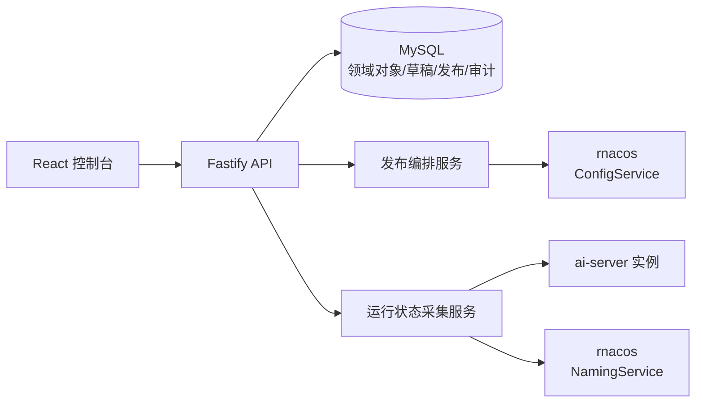

# Fiber AI Server Console 详细需求

## 1. 文档信息

| 项目       | 内容                                                                  |
| ---------- | --------------------------------------------------------------------- |
| 产品       | Fiber AI Server Console                                               |
| 文档状态   | 需求基线，供产品、设计、前端、后端、ai-server、测试、SRE 和安全评审   |
| 编写日期   | 2026-08-02                                                            |
| 上游基线   | `fiber-gateway-cpp` commit `fdd8f122394757231713416e3d9a281dd1e14def` |
| 管理对象   | `fiber-gateway-cpp/apps/ai-server`                                    |
| 动态配置组 | 固定为 `LLM-SERVER`                                                   |
| 需求关键词 | “必须”是上线前必需；“应”是默认实现；“可”是后续增强                    |

本文是本项目的产品与系统需求基线。它描述控制台应解决的问题、用户角色、页面、
领域模型、接口、发布流程、非功能要求和验收标准，不代表这些功能已经实现。

## 2. 依据与可追溯性

需求以当前 ai-server 实现为准，而不是以通用 Nacos 控制台或其他 LLM 网关的行为为准。
关键结论对应的上游路径如下：

| 需求主题                                   | 上游依据                                                                        |
| ------------------------------------------ | ------------------------------------------------------------------------------- |
| 路由、启动方式、请求限制、可观测性         | `apps/ai-server/README.md`                                                      |
| 请求流水线、重试、fallback、限流、关闭语义 | `apps/ai-server/docs/architecture.md`                                           |
| 动态配置字段、默认值、名称与引用校验       | `apps/ai-server/src/config/LlmConfigCodec.cpp`                                  |
| Data ID、group、快照领域类型               | `apps/ai-server/src/config/LlmConfigSnapshot.h`                                 |
| 动态订阅、候选配置、旧快照保留、失败信息   | `apps/ai-server/src/config/LlmConfigManager.{h,cpp}`                            |
| HTTP 路由、`/health`、`/ready`、指标入口   | `apps/ai-server/src/AiServer.cpp`                                               |
| Provider 地址合法性                        | `apps/ai-server/src/provider/ProviderEndpoint.{h,cpp}`                          |
| Provider/token 选择与协议过滤              | `apps/ai-server/src/provider/ExecutionPlan.cpp`                                 |
| 认证与模型授权                             | `apps/ai-server/src/auth/`、`apps/ai-server/src/routing/ModelAuthorization.cpp` |
| token 限流和集群成员环                     | `apps/ai-server/src/limit/`                                                     |
| 指标、CAT 与对话审计                       | `apps/ai-server/src/observability/`、`apps/ai-server/src/audit/`                |
| 配置控制台原始设计输入                     | `apps/ai-server/docs/config-console-requirements.md`                            |

上游更新后，如字段、默认值、协议或就绪语义发生变化，必须先更新本文及契约测试，再
修改控制台实现。文档中的产品策略若严于 ai-server codec，以本文为准；若两者冲突并会
造成 ai-server 拒绝配置，则必须以 ai-server 为准并修订本文。

## 3. 产品定义

### 3.1 产品定位

本项目是 ai-server 的管理控制台，面向平台管理员、配置维护者、发布者、SRE 和审计人员。
它把 ai-server 文档、结构化配置、草稿、审批、发布、运行状态和审计整合在一个安全入口。

控制台不承载用户的 LLM 请求，也不成为 ai-server 的流量代理。浏览器只能访问本项目
后端；前端不得直连 rnacos、ai-server 内部接口或 Provider。

### 3.2 产品目标

- 用户无需编辑原始 JSON，即可管理模型、Provider、用户组和 BT1 密钥。
- 在发布前完成字段、资源关系和全环境依赖图三层校验。
- 让用户始终能区分“草稿已保存”“rnacos 已发布”和“ai-server 已生效”。
- 通过审批、不可变发布记录、逐资源执行结果和回滚降低配置变更风险。
- secret 全生命周期只写、脱敏、可轮换，不通过查询、日志、差异或审计泄漏。
- 聚合实例健康、配置接受状态、服务发现和漂移，让 SRE 能定位发布未生效原因。
- 对存量 rnacos 配置提供可审计的导入和接管流程。

### 3.3 非目标

- 不建设通用 rnacos/Nacos 管理控制台，不允许任意 group 或 Data ID。
- 不提供终端用户聊天、Prompt 管理、对话检索、模型计费或套餐售卖。
- 不实现 OpenAI 与 Anthropic 协议互转；ai-server 只调用与入站协议相同的 Provider 协议。
- 不代理用户的在线 LLM 请求，也不保存 prompt、模型回复或 Provider attempts 原文；
  `docs/llm-call-audit-requirements.md` 定义了 ai-server 审计 HTTP 上报后的最小调用元数据投影，
  ai-server 审计文件本身仍不由 console 管理。
- 不编辑 NamingService 实例；`service://` 实例由服务注册与发现系统维护。
- 不把 `openai-embedding` 宣称为可调用能力。ai-server 能解析该 Provider 协议，但当前
  没有 embedding 入站路由。
- 不把启动配置修改描述为热更新。dotenv 和日志 JSON 需要重启或滚动部署。

## 4. ai-server 能力与控制台责任

ai-server 当前提供以下外部或内部接口：

| 接口                         | ai-server 行为                         | 控制台责任                               |
| ---------------------------- | -------------------------------------- | ---------------------------------------- |
| `POST /v1/chat/completions`  | OpenAI Chat Completions，BT1 认证      | 只做文档说明，不转发用户流量             |
| `POST /v1/messages`          | Anthropic Messages，BT1 认证           | 同上                                     |
| `POST /v1/message`           | Anthropic 兼容别名                     | 同上                                     |
| `GET /health`                | 进程存活，正常时返回 200               | 聚合实例存活状态                         |
| `GET /ready`                 | 完整配置快照且限流成员环非空时返回 200 | 聚合就绪状态，不推断具体配置 MD5         |
| `GET /metrics`               | Prometheus 指标                        | 可读取必要固定指标，不提供通用指标浏览器 |
| `GET /_metric_prometheus`    | 指标兼容别名                           | 默认使用 `/metrics`                      |
| `/internal/llm/rate-limit/*` | 集群限流内部协议，无应用层认证         | 不调用；必须保持网络隔离                 |

ai-server 请求链路为：BT1 认证、请求约束、JSON 抽取、模型授权、route key、token
限流、执行计划、Provider 调用、usage 结算。控制台应据此解释模型授权、路由、重试和
限流配置，但不得承诺某次请求一定命中某个 Provider、token 或服务实例。

### 4.1 控制台必须准确说明的运行约束

| 主题              | 当前 ai-server 契约                                                  |
| ----------------- | -------------------------------------------------------------------- |
| 认证              | 优先读取 `Authorization: Bearer <BT1>`；缺失或空值时兼容 `x-api-key` |
| 请求正文          | 最大 4 MiB                                                           |
| 同步成功响应      | 最大 32 MiB                                                          |
| Provider 错误正文 | 最大 4 MiB                                                           |
| Provider 整体调用 | 上限 300 秒                                                          |
| 协议              | Provider 只执行与入站相同的协议，不做 OpenAI/Anthropic 隐式转换      |
| 重试前提          | 只在响应未开始且客户端 response channel 仍可用时切换后续 attempt     |
| 重试来源          | 401、403、429、配置的 retryable status 和传输错误可触发后续尝试      |
| SSE               | 成功响应 header 发出后不再切换 token、Provider 或 fallback           |
| 客户端断开        | 不再切换 attempt；已开始的 SSE 上游会继续读取以提取 usage 并结算     |
| 限流              | 执行前 check fail closed；执行后的 settle 是 tracked best effort     |
| 配置刷新          | 每个请求 pin 住进入时的不可变快照，不跨刷新混用认证、授权和路由      |

这些约束用于文档、表单帮助、风险提示和故障定位。控制台不得把它们实现为另一套 LLM
代理逻辑，也不得提供可修改 ai-server 固定限制的虚假配置项。

## 5. 核心状态模型

### 5.1 三类事实必须分离

| 状态层   | 含义                                            | 唯一事实来源                                    |
| -------- | ----------------------------------------------- | ----------------------------------------------- |
| 草稿状态 | 用户修改已保存，但未发布                        | MySQL 草稿、修订与校验结果                      |
| 发布状态 | 内容已按发布单写入 rnacos                       | 不可变发布记录、逐 Data ID 写入结果、rnacos MD5 |
| 生效状态 | 指定 ai-server 实例已接受目标内容并安装完整快照 | 实例状态接口或等价的受保护上报                  |

以下文案具有严格含义：

- “已保存”只能表示草稿已写入 MySQL。
- “已发布”只能表示目标 rnacos 资源写入完成且回读 MD5 一致。
- “已生效”必须存在目标实例对目标配置版本/MD5 的证据。
- `/ready = 200` 只证明实例存在一个完整快照和非空限流成员环，不证明它接受了本次发布。
- 在实例状态能力完成前，发布后的运行状态必须显示“生效未知”，不得显示“已生效”。

### 5.2 发布状态机

```text
draft
→ pending_approval
→ approved
→ publishing
→ nacos_published
→ verifying
→ effective | partially_effective | failed | activation_unknown
→ rolling_back
→ rolled_back | rollback_failed
```

发布中每个资源还必须单独记录 `pending`、`writing`、`published`、`failed`、`skipped`；
每个实例单独记录 `waiting`、`accepted`、`rejected`、`old_version`、`offline`、`unknown`。

多个 Data ID 不构成事务。整体发布失败时，页面必须保留哪些资源已经写入、哪些尚未写入，
不能用一个“发布失败”覆盖部分成功事实。

## 6. 用户、角色与权限

权限按环境授予，同一用户可在不同环境拥有不同角色。

| 能力                         | 只读者 | 编辑者 | 发布者 | 管理员 | 审计员 |
| ---------------------------- | ------ | ------ | ------ | ------ | ------ |
| 查看脱敏配置、依赖和运行状态 | 是     | 是     | 是     | 是     | 是     |
| 创建、修改、转交和废弃草稿   | 否     | 是     | 是     | 是     | 否     |
| 新增或替换 secret            | 否     | 是     | 是     | 是     | 否     |
| 提交发布申请                 | 否     | 是     | 是     | 是     | 否     |
| 审批、执行发布和回滚         | 否     | 否     | 是     | 是     | 否     |
| 管理环境、策略和启动模板     | 否     | 否     | 否     | 是     | 否     |
| 查看完整操作审计             | 否     | 否     | 否     | 是     | 是     |

安全策略：

- 生产环境默认要求审批，且草稿作者不能审批自己的发布单。
- 所有权限在 API 端校验，前端隐藏按钮不构成授权控制。
- secret 查看权限也只允许看到是否配置、指纹后缀和更新时间，任何角色都不能回读明文。
- 替换 BT1 同一 `kid` 的 secret、删除 key、删除最后一个 Provider token、清空被引用用户组、
  额度设为 0、扩大模型访问范围属于高风险操作，必须展示影响并要求填写原因。
- 生产发布、回滚和包含 secret 的导出应支持 MFA 或二次认证。

## 7. 信息架构

```text
环境选择器
├── 概览
├── 文档中心
│   ├── ai-server 能力与请求链路
│   ├── 接入协议与错误
│   └── 配置与运维指南
├── 模型
├── Provider
├── 用户组
├── BT1 密钥
├── 发布中心
│   ├── 草稿
│   ├── 待审批
│   └── 发布历史
├── 运行状态
│   ├── 实例
│   ├── 配置生效矩阵
│   └── 服务发现
├── 启动配置
└── 审计日志
```

顶栏必须展示当前环境、环境等级、用户角色和整体状态。环境切换时，如有未保存修改，
必须阻止直接离开并给出保存、放弃或取消选项。生产环境必须同时使用文字、图标和颜色标识。

## 8. 全局交互要求

### 8.1 列表与详情

- 列表提供关键词、状态与引用筛选，服务端排序，cursor 分页，并把查询状态写入 URL。
- 资源行进入详情；编辑是详情页主操作，低频操作放入行菜单。
- 详情同时展示已发布内容、当前草稿、依赖关系、版本、rnacos 状态和实例状态。
- 列表和详情均提供加载、空数据、无权限、失败重试、漂移和生效未知状态。
- 同一资源存在他人草稿时必须显示作者和更新时间，不能静默覆盖。

### 8.2 编辑与并发控制

- 进入编辑时基于当前已发布修订或当前工作区修订创建草稿。
- 浏览器离开、刷新、切换环境或关闭编辑区域时提供未保存变更保护。
- 保存请求携带 `revision`/`ETag`；冲突返回 409/412 和基线、服务器版本、用户版本的差异。
- 一个环境级草稿工作区可包含多个资源，以支持联合校验和发布。
- 草稿保存不要求 rnacos 或 ai-server 在线；提交发布必须重新检查外部依赖。

### 8.3 三层校验

1. 字段级：输入格式、类型、范围、重复、必填和 secret 动作。
2. 资源级：Provider 协议唯一性、模型 fallback 关系、key ring 至少一个 key 等。
3. 环境图级：所有引用存在、协议覆盖可执行、secret 完整、漂移与发布策略通过。

错误响应必须包含稳定 `code`、字段 `path`、规则、用户可读消息、`retryable` 和
`correlationId`。前端在字段旁显示错误，顶部摘要只负责导航到错误位置。

### 8.4 状态与危险操作

- 状态不能只靠颜色表达，必须同时有文字和图标。
- 危险操作弹窗展示对象、依赖、业务影响、当前与目标状态，并要求输入原因。
- 删除或高风险替换可要求输入资源名二次确认。
- Toast 只反馈请求接收或草稿保存，不代替发布详情和生效状态。

## 9. 概览与文档中心

### 9.1 概览页

用户进入环境后应在 10 秒内回答：集群是否可服务、是否有未发布/未生效变更、是否有
配置风险、最近一次发布由谁完成以及结果如何。

概览包含：

- 实例总数、存活数、就绪数和运行状态数据新鲜度。
- 配置 generation 的最小值和最大值；不一致时展示区间，不只展示最大值。
- 模型、Provider、用户组、BT1 key 数量及引用异常数量。
- 草稿数、待审批数、发布中数量、rnacos 漂移数量。
- 最近发布的逐资源与逐实例进度。
- 高风险卡片：无协议候选、空服务实例、实例拒绝、secret 待轮换、部分生效等。
- 运行状态尚未接入时明确显示“运行状态未接入”，不得推断为健康。

### 9.2 文档中心

文档中心面向接入方、配置维护者和 SRE，至少包含：

- 产品定位、支持的 OpenAI/Anthropic 路由、认证 header 和请求大小限制。
- BT1 认证、模型授权、route key、Provider/token 选择、fallback 和限流的请求链路。
- 同步与 SSE 行为，尤其是响应开始后不再重试、客户端断开后的上游 drain 与 usage 结算。
- 四类动态配置的字段、默认值、规范 JSON 和依赖关系。
- `/health`、`/ready`、`/metrics` 的准确含义与生产网络隔离要求。
- 启动配置、日志、CAT、审计数据敏感性和优雅停机说明。
- 稳定错误码、常见故障定位和“已发布但未生效”的排查步骤。

内容要求：

- 每项实现事实标注适用的 ai-server 版本/上游 commit 和源码路径。
- 清楚区分“ai-server 已实现”“控制台已实现”“规划中”，不能把需求文档当成上线能力说明。
- 可提供带占位符的 curl/JSON 示例，但禁止填入真实 BT1、Provider token 或业务正文。
- 不提供会让控制台后端代发用户 LLM 请求的在线 Playground。
- 上游行为变化时，文档、表单帮助文本、校验器和契约测试必须在同一变更中更新。

## 10. 动态配置领域需求

所有动态配置固定使用 group `LLM-SERVER`。Data ID 由后台根据资源类型和名称生成，
API 不接受客户端传入完整 Data ID 或 group。

### 10.1 配置包络与版本

rnacos JSON 统一使用：

```json
{
  "version": 1,
  "data": {}
}
```

- ai-server 接受 int32 `version` 且不要求递增；控制台必须为每个 Data ID 生成单调递增
  的正 int32 版本。
- 版本不是并发锁。数据库使用 revision/ETag，rnacos 使用 MD5/CAS。
- 达到 int32 上限前必须迁移，禁止回绕或复用历史版本。
- 导入兼容字段后，控制台保存时输出规范字段；只发生拼写规范化时标注但不列为业务风险。

### 10.2 BT1 密钥环

| 属性     | 配置字段                     | 规则                                                          |
| -------- | ---------------------------- | ------------------------------------------------------------- |
| Data ID  | `ploto.ai-llm.auth.bt1.keys` | 固定，不可编辑                                                |
| 时钟偏差 | `data.clockSkewSec`          | 整数 `0..300`，默认 0                                         |
| Key ID   | `data.keys[].kid`            | 1..16 字节，`[A-Za-z0-9_-]`，不可重复                         |
| Secret   | `data.keys[].secret`         | 非空；默认生成 32 字节随机值并以 `base64:` + 标准 Base64 保存 |

需求：

- key ring 至少保留一个 key。
- 新增 secret 只展示一次；用户离开后不能再次获取。
- 已存在项只显示 `已配置 · 指纹后 6 位`，修改其他字段默认 `keep`。
- 推荐轮换为“新增新 key → 发布并全部生效 → 迁移调用方 → 删除旧 key → 再次发布”。
- 替换同一 `kid` 会立即使旧 secret 签发的 token 认证失败，生产环境默认禁止。

### 10.3 用户组

| 属性    | 配置字段                         | 规则                                       |
| ------- | -------------------------------- | ------------------------------------------ |
| Data ID | `ploto.ai-llm.user-group.<name>` | 后台生成                                   |
| 组名    | Data ID 后缀、`data.name`        | 1..64 字节，`[A-Za-z0-9_-]`，两者必须一致  |
| 用户    | `data.users`                     | 字符串精确匹配、区分大小写；忽略空串并去重 |

用户组页必须支持单个添加、多行粘贴、单列 CSV 导入、搜索、虚拟滚动和脱敏导出。
保存前展示输入行数、空行、重复项和最终人数。空用户数组表示组存在但无人命中。

被模型引用的用户组可以清空但属于高风险操作；不能直接删除。删除流程必须先发布模型
取消引用，再在单独清理发布中删除 Data ID。组名不能原地重命名。

### 10.4 Provider

| 属性      | 配置字段                       | 规则                                                      |
| --------- | ------------------------------ | --------------------------------------------------------- |
| Data ID   | `ploto.ai-llm.provider.<name>` | 后台生成                                                  |
| 名称      | `data.provider`                | 1..128 字节，`[A-Za-z0-9_-]`，与 Data ID 后缀一致         |
| 地址      | `data.baseurl`                 | `http://`、`https://` 或 `service://`；保存时移除尾部 `/` |
| API token | `data.api-tokens[]`            | `name` 在 Provider 内唯一；`token` 非空且只写             |
| 协议      | `data.protocol[]`              | 至少一个；同一 `type` 只能一项                            |

地址规则：

- HTTP/HTTPS 必须包含合法主机，端口为 `1..65535`；IPv6 literal 使用方括号。
- 不允许用户信息、query、fragment 或反斜杠。
- `service://` 后是 1..1024 字节服务名，不允许空白、`/`、`?`、`#`。
- `service://` 固定从 NamingService group `DEFAULT_GROUP` 发现实例，并按 HTTP 连接；当前
  不通过该 scheme 配置 TLS。
- 名称创建后不可原地修改；重命名使用新建、迁移模型引用、发布、清理旧资源的流程。

API token 需求：

- token 列表允许为空，表示调用上游时不发送 Authorization。
- 已保存值永不回显；编辑其他内容时必须保留原值。
- 写请求显式使用 `secretAction: keep|replace|delete`，不能用空字符串隐式表示删除。
- 差异只显示新增、替换、删除和指纹变化，不显示值。
- 删除最后一个 token 必须提示无凭证调用风险。
- 轮换应允许新旧 token 名并存，确认新 token 生效后再删除旧 token。

协议字段：

| 协议类型                  | 入站可用性                       | `path`          | `model`        |
| ------------------------- | -------------------------------- | --------------- | -------------- |
| `openai-chat-completions` | 可通过 OpenAI 入口使用           | 必须以 `/` 开头 | 非空上游模型名 |
| `anthropic-messages`      | 可通过 Anthropic 入口使用        | 必须以 `/` 开头 | 非空上游模型名 |
| `openai-embedding`        | 仅配置可解析，当前不可从入口调用 | 必须以 `/` 开头 | 非空上游模型名 |

Provider 详情展示引用模型、协议覆盖、草稿与发布差异、rnacos MD5、实例接受状态。对
`service://` Provider 还展示服务名、更新时间、总实例、可用实例、过滤实例和过滤原因。

### 10.5 模型

模型集合固定写入 `ploto.ai-llm.models`，`data` 是模型数组。

| 属性        | 配置字段            | 规则与语义                                         |
| ----------- | ------------------- | -------------------------------------------------- |
| 模型名      | `model-name`        | 1..128 字节，`[A-Za-z0-9_.-]`，环境内唯一          |
| 主 Provider | `providers`         | 可为空，但必须有 fallback；名称不可重复且引用存在  |
| Fallback    | `fallback-provider` | 可选；不能与主 Provider 重复且引用存在             |
| 访问组      | `allow-user-groups` | 缺失或空数组表示所有认证用户；非空时任一组命中即可 |
| 负载均衡    | `load-balance`      | 可选，使用下表默认值                               |
| token 限流  | `rate-limit`        | 可选；缺失表示不限流                               |

负载均衡字段：

| UI 字段          | 配置字段               | 默认值             | 规则                                |
| ---------------- | ---------------------- | ------------------ | ----------------------------------- |
| Provider 策略    | `policy`               | `rendezvous-hash`  | 当前只提供只读选项                  |
| route key 来源   | `hash-source`          | `prompt-prefix`    | 当前只提供只读选项                  |
| Prompt 前缀上限  | `prefix-max-bytes`     | 2048               | UI 只生成 `1..2147483647`           |
| 主 Provider 上限 | `max-primary-attempts` | 0                  | 0 表示不限制不同主 Provider 数      |
| Fallback 开关    | `fallback-enabled`     | true               | 无 fallback 时不可产生实际 fallback |
| 可重试状态       | `retryable-status`     | 429、502、503、504 | UI 只接受 `100..599`，去重并升序    |

说明：ai-server 对不支持的 `policy` 和 `hash-source` 会归一为唯一实现，控制台不提供
虚假的选择项。旧字段 `service-instance-policy` 只兼容 weighted rendezvous 值，控制台
规范输出不再写该字段。

token 限流字段：

| UI 字段    | 配置字段                 | 规则                                            |
| ---------- | ------------------------ | ----------------------------------------------- |
| 启用限流   | 是否存在 `rate-limit`    | 关闭表示删除规则，不是额度设为 0                |
| 窗口时长   | `window-duration-millis` | 正 int64；UI 可用秒/分钟/小时输入并显示精确毫秒 |
| 最大 token | `max-tokens-per-window`  | 非负 int64；0 表示所有请求从首次 check 起被拒绝 |

限流 key 是 `username + model`，额度按用户和逻辑模型分别计算。请求执行前 check 必须
fail closed；执行后的 usage settle 为 best effort，不应改变已经得到的业务响应。

模型页面必须实时计算 OpenAI 和 Anthropic 两种入口的静态协议覆盖：有哪些 Provider
可执行、哪些缺少对应协议、fallback 是否可用。无任何可执行协议的草稿可以保存，但
默认禁止发布。执行候选预览只表示静态最大集合；运行时还会过滤熔断 Provider、暂停 token
和无可用实例的服务，实际顺序由 route key 的确定性选择决定。

模型名不能原地修改。删除模型是从模型总表中移除并通过发布单生效；确认页必须说明新请求
将无法获得该模型，且不会即时删除历史记录。

### 10.6 规范输出字段

| 语义           | 兼容输入                                | 控制台输出          |
| -------------- | --------------------------------------- | ------------------- |
| Base URL       | `baseurl`、`baseUrl`                    | `baseurl`           |
| Provider token | `api-tokens`、`apiTokens`               | `api-tokens`        |
| Provider 协议  | `protocol`、`protocols`                 | `protocol`          |
| 模型名         | `model-name`、`modelName`               | `model-name`        |
| Fallback       | `fallback-provider`、`fallbackProvider` | `fallback-provider` |
| 用户组         | `allow-user-groups`、`allowUserGroups`  | `allow-user-groups` |
| 负载均衡       | `load-balance`、`loadBalance`           | `load-balance`      |
| 限流           | `rate-limit`、`rateLimit`               | `rate-limit`        |
| 负载均衡子字段 | kebab-case 或 camelCase 别名            | kebab-case          |

## 11. 草稿、审批、发布与回滚

### 11.1 草稿工作区

- 草稿是环境级工作区，可包含多个新增、修改和删除动作。
- 草稿记录基线发布 ID、资源 revision 和 rnacos MD5。
- 用户可命名、说明、转交、复制和废弃草稿。
- 草稿中的图校验必须基于应用全部草稿动作后的完整环境，而不是当前已发布环境。
- 删除使用显式 tombstone 动作，不立即删除规范化资源或历史记录。

### 11.2 差异

提交前展示：

1. 业务差异：字段级可读描述与风险等级。
2. 依赖差异：新增/删除引用、协议覆盖变化、受影响模型。
3. 规范 JSON：只读且所有 secret 脱敏。

数组按稳定业务 key 比较：模型按 `model-name`，Provider token 按 `name`，协议按 `type`，
BT1 key 按 `kid`，用户组成员按集合。secret 仅展示动作和指纹变化。

### 11.3 提交与审批

提交发布单时填写标题、原因、工单、计划时间、生效超时、生效策略和审批人。后台重新执行：

- 所有字段 codec 兼容校验。
- 资源级与全图校验。
- 固定 Data ID/group 检查。
- secret 完整性与危险动作策略。
- 草稿基线、数据库 revision 和 rnacos 当前 MD5 检查。
- rnacos 可达性和目标实例集合获取。
- 环境发布窗口、审批和冻结策略。

审批后发布内容不可编辑；需要修改时驳回或关闭并创建新发布单。审批、驳回、取消均要求
原因并记录审计。

### 11.4 发布执行

新增依赖的推荐顺序：

1. 冻结发布开始时的目标实例集合，再读 rnacos 当前内容与 MD5。
2. 创建不可变 release 和逐资源执行步骤，之后才允许写 rnacos。
3. 写入新增或修改的 BT1 key、用户组和 Provider。
4. `service://` Provider 等待至少一次 NamingService 初始化结果；结果可以是空列表。
5. 写入模型总表。
6. 回读每个 Data ID，核对目标 MD5。
7. 等待每个目标实例报告接受目标配置。
8. 不再被引用的 Provider/用户组在独立清理发布中删除。

修改已被当前模型引用的 Provider 可能在写入 Provider Data ID 后立即影响在线请求，不能
等到模型总表写入才算开始生效。发布确认页必须明确展示这种非事务风险。

每个写步骤使用幂等 key。相同环境同一时间最多有一个 `publishing` 或 `verifying` 任务。
worker 崩溃后必须从持久化步骤恢复；重试不得生成新版本或重复 release。取消只停止尚未
执行的步骤，不承诺撤销已完成写入。

### 11.5 生效确认

发布页按资源展示目标 version/MD5、rnacos 写入和回读结果；按实例展示当前 generation、
各资源 MD5、接受/拒绝、最后错误和上报时间。

环境策略定义目标实例、全部生效或最小比例、超时、新增实例和下线实例的处理。生产默认
要求发布开始时在线目标实例全部接受。超时默认标记失败或部分生效，不自动回滚。

### 11.6 回滚

回滚必须创建新发布单，不能改写数据库历史：

- 选择历史 release，展示当前到目标的完整脱敏差异。
- 验证历史引用、协议和 secret 是否仍可用；不可恢复的 secret 要求重新输入。
- 为每个 Data ID 分配新版本，记录 `rollbackOf`。
- 经过正常校验、审批、发布和生效确认。
- 多 Data ID 回滚仍非事务，不默认承诺自动恢复。

## 12. rnacos 漂移与导入

后台定期读取所有受管 Data ID 并比较 MD5：

| 状态        | 含义                        | 处理                         |
| ----------- | --------------------------- | ---------------------------- |
| `in_sync`   | rnacos 与最近发布一致       | 正常                         |
| `drifted`   | rnacos 被控制台外部修改     | 冻结旧基线发布，要求人工处理 |
| `missing`   | 应存在的 Data ID 缺失       | 告警，禁止依赖它的发布       |
| `unmanaged` | rnacos 有内容但数据库未接管 | 允许管理员导入或明确忽略     |

管理员可选择“导入外部变更”或“以控制台期望状态重新发布”。两者都必须展示差异、重新
校验并生成审计；后台不得自动覆盖外部修改。

首次导入由后端读取固定 group 和允许的 Data ID，使用 ai-server 兼容 codec 解析后写入
规范化模型。导入 secret 时立即加密托管，只向浏览器返回指纹元数据。无效配置进入隔离
报告，不能伪装为已管理的有效资源。

## 13. 运行状态

### 13.1 实例页

实例列表至少包含实例地址、服务名、cluster、`/health`、`/ready`、配置 generation、
限流成员数、最后上报时间和状态数据新鲜度。离线实例在保留期内继续显示最后状态。

发布开始时冻结目标实例集合。发布中新增实例是否影响成功由环境策略决定；新增实例必须
安装目标版本后才能计为就绪。下线实例显示“已离线”，不能直接从分母消失。

### 13.2 配置生效矩阵

矩阵按资源为行、实例为列，单元格展示目标/实际 MD5、已接受、等待、拒绝、旧版本或未上报。
支持按发布单筛选和导出脱敏诊断信息。实例拒绝时展示 Data ID、错误 code、字段 path、
候选 MD5、首次/最后发生时间和计数。

### 13.3 实例状态能力缺口

ai-server 当前没有可证明指定 Data ID/MD5 已安装的 HTTP 接口。P1 必须增加受保护的内部
状态接口或等价主动上报，至少返回：

- 实例标识、ready、snapshot generation 和上报时间。
- 当前 active BT1、models、Provider、用户组的 Data ID、version 和 MD5。
- pending candidate 的 metadata。
- 最近一次配置拒绝的 Data ID、MD5、code、字段、消息、时间和计数。
- 限流成员环摘要和服务发现 generation；不得返回 secret 或完整用户列表。

该接口只能在内部网络、服务网格或双向认证下访问，不能沿用当前无应用层认证的限流接口
作为安全依据。在完成该能力前，控制台只能报告 rnacos 已发布、实例健康/就绪和
`activation_unknown`。

### 13.4 服务发现

按 `service://` 服务名展示固定 group `DEFAULT_GROUP`、订阅实例、可用实例、过滤原因、
generation、引用 Provider 和模型。ai-server 只选择 enabled、healthy、正权重且 IP/port
有效的实例，并使用带 Nacos 权重的 Rendezvous Hash。

服务实例变更不是配置发布，不创建 release；它应进入运行事件审计。空可用实例必须显示
风险，但不能篡改其 Provider 配置状态。

## 14. 启动配置

启动配置页面用于维护部署模板、校验、脱敏展示和导出；它不进入动态配置 release。未接入
部署平台时只允许保存模板和导出，不显示“已发布”或“已生效”。

### 14.1 HTTP、注册与 Nacos

| 参数                                  | 默认值                | 规则                                              |
| ------------------------------------- | --------------------- | ------------------------------------------------- |
| `AI_SERVER_LISTEN_ADDRESS`            | `0.0.0.0`             | IP literal                                        |
| `AI_SERVER_LISTEN_PORT`               | `8080`                | `0..65535`；0 仅推荐测试                          |
| `AI_SERVER_ADVERTISE_ADDRESS`         | 自动                  | 可选单播 IPv4；无值时按 ai-server 规则选择        |
| `AI_SERVER_SERVICE_NAME`              | `fiber-ai-server`     | 1..255 字节                                       |
| `AI_SERVER_SERVICE_GROUP`             | `DEFAULT_GROUP`       | 1..255 字节                                       |
| `AI_SERVER_ZONE`                      | `daily1`              | 1..255 字节                                       |
| `AI_SERVER_CLUSTER`                   | `dev`                 | 与 zone 组合的 `<zone>-<cluster>` 不超过 255 字节 |
| `AI_SERVER_INITIAL_CONFIG_TIMEOUT_MS` | `60000`               | 非负；0 表示无限等待                              |
| `NACOS_SERVER_ADDRESSES`              | 无                    | 必填，逗号分隔 IPv4/IPv6 literal，不接受域名      |
| `NACOS_HTTP_PORT`                     | `8848`                | `1..65535`                                        |
| `NACOS_GRPC_PORT`                     | `9848`                | `1..65535`                                        |
| `NACOS_NAMESPACE_ID`                  | `public`              | Naming namespace                                  |
| `NACOS_TENANT`                        | 空                    | ConfigService tenant                              |
| `NACOS_USERNAME/PASSWORD`             | 空                    | 必须同时为空或同时配置，password 只写             |
| `NACOS_CLIENT_VERSION`                | `fiber-ai-server/1.0` | 非空文本                                          |

注册地址优先级是显式 advertise address、具体 IPv4 listen address、自动选择 UP 且非
loopback/link-local 的 IPv4。找不到地址时启动失败。Nacos 认证路径固定，页面不提供
context path 配置。

### 14.2 日志与审计文件

`AI_SERVER_LOG_CONFIG_PATH` 必填，最多 4096 字节。日志 JSON 只在启动时加载、最大 1 MiB、
版本固定为 1。控制台应把它作为独立部署制品维护并按上游严格 schema 校验：队列容量、
appenders、root logger、允许的 category logger 和 audit 配置。

控制台不得提供违反 ai-server 安全不变量的选项：常规 console 只能写 stderr；审计 logger
固定隔离；审计文件固定 `0600`、no-follow、普通文件、NDJSON、记录边界轮转；队列满策略
固定 `DropNewest`。修改日志配置必须显示“需要重启/滚动部署”。

### 14.3 CAT

CAT 默认关闭。开启时 `CAT_APP_KEY`、`CAT_HOSTNAME` 必填，router 或 collector 至少一类
非空；endpoint 只接受 `IPv4:port` 或 `[IPv6]:port`。`CAT_IP` 可覆盖实例地址。CAT 身份在
进程生命周期内不变化，修改同样需要重启。

### 14.4 导出

- 可导出 dotenv、Kubernetes ConfigMap/Secret 输入或部署平台参数。
- 默认导出脱敏占位符；包含 secret 需要高权限、二次认证和审计。
- dotenv 一行一个唯一 key，正确引用和转义，不产生未知 key。
- 下载响应禁止浏览器和中间代理缓存，文件名包含环境和生成时间。

## 15. 后端架构与数据需求

### 15.1 服务边界



- MySQL 是环境、规范化资源、草稿、审批、release、步骤和审计的事实来源。
- rnacos 客户端、ai-server 状态客户端和 secret 服务必须位于 typed service 后，不得放在
  Fastify route handler 中。
- Fastify 应用构造不能依赖外部服务在线；连接在显式 lifecycle 中建立和关闭。
- 控制台后端只管理配置和观察健康，不转发用户 LLM 流量。

### 15.2 建议数据实体

| 实体                  | 关键字段                                          | 约束                            |
| --------------------- | ------------------------------------------------- | ------------------------------- |
| `environments`        | stage、namespace、tenant、cluster、release policy | group/Data ID 策略由后端固定    |
| `environment_members` | user、environment、role                           | 唯一环境成员关系                |
| `resources`           | kind、name、revision、normalized spec             | 环境 + kind + name 唯一，软删除 |
| `secrets`             | owner、kind、ciphertext/ref、fingerprint          | 不保存可查询明文                |
| `drafts`              | base release、status、owner、revision             | 环境级工作区                    |
| `draft_changes`       | resource、action、base revision、spec             | secret 使用动作引用             |
| `releases`            | immutable snapshot、status、policy、rollbackOf    | 执行后不可修改                  |
| `release_resources`   | data ID、old/new MD5、content ref、result         | 逐 Data ID 记录                 |
| `release_instances`   | instance、target/actual metadata、result          | 逐实例记录                      |
| `release_events`      | sequence、type、payload、time                     | 单调序号，支持断线补读          |
| `runtime_instances`   | health、ready、generation、last seen              | 带 TTL 的观测缓存               |
| `audit_events`        | actor、action、target、diff、correlation          | 追加写、不可业务修改            |

迁移必须确定性、可审查；历史 release 和审计不可通过普通业务删除。时间使用 UTC 存储。

### 15.3 Secret 存储

- Provider token、BT1 secret、MySQL 密码、rnacos 凭据使用 KMS envelope encryption 或仅保存
  secret manager 引用。
- API 查询只返回 `configured`、`fingerprintSuffix`、`updatedAt`，写入后主动清理内存副本。
- 应用日志、Trace、队列、异常、审计和差异禁止记录值；禁止记录请求体。
- 发布时因 ai-server 当前协议限制必须向 rnacos 物化 secret，必须用 ACL、专用账号、固定
  namespace/group/Data ID 前缀和网络隔离保护。
- 控制台浏览器不能从 rnacos 回读 secret。

## 16. API 需求

建议首版资源：

```text
GET    /api/environments
GET    /api/environments/:env/overview

GET    /api/environments/:env/models
POST   /api/environments/:env/models
GET    /api/environments/:env/models/:name
PATCH  /api/environments/:env/models/:name
DELETE /api/environments/:env/models/:name

GET    /api/environments/:env/providers
POST   /api/environments/:env/providers
GET    /api/environments/:env/providers/:name
PATCH  /api/environments/:env/providers/:name
DELETE /api/environments/:env/providers/:name

GET    /api/environments/:env/user-groups
POST   /api/environments/:env/user-groups
GET    /api/environments/:env/user-groups/:name
PATCH  /api/environments/:env/user-groups/:name
DELETE /api/environments/:env/user-groups/:name

GET    /api/environments/:env/bt1-keys
PATCH  /api/environments/:env/bt1-keys

POST   /api/environments/:env/validate
GET    /api/environments/:env/drafts
POST   /api/environments/:env/drafts
GET    /api/environments/:env/drafts/:id/diff
POST   /api/environments/:env/drafts/:id/submit

GET    /api/environments/:env/releases
GET    /api/environments/:env/releases/:id
POST   /api/environments/:env/releases/:id/approve
POST   /api/environments/:env/releases/:id/reject
POST   /api/environments/:env/releases/:id/execute
POST   /api/environments/:env/releases/:id/cancel
POST   /api/environments/:env/releases/:id/rollback
GET    /api/environments/:env/releases/:id/events

GET    /api/environments/:env/runtime/instances
GET    /api/environments/:env/runtime/config-matrix
GET    /api/environments/:env/runtime/services
GET    /api/environments/:env/audit-events
```

接口规范：

- 路由全部位于 `/api`，请求和响应具有显式 TypeScript 类型与 Fastify JSON schema。
- 列表统一 cursor 分页；排序和过滤字段使用白名单。
- 创建、secret 写入和所有动作接口要求 `Idempotency-Key`。
- 更新、删除、提交要求 `If-Match`；并发冲突返回 412。
- 异步发布返回 `202`、`operationId` 和状态 URL。
- 发布事件使用 SSE；支持 `Last-Event-ID` 补读，事件 ID 在 release 内单调递增。
- 时间使用 RFC 3339 UTC；前端按用户时区显示并同时可查看原始 UTC。
- 错误格式稳定，验证错误携带 JSON Pointer 风格字段路径。
- 响应头返回 correlation ID；secret 接口和导出接口使用禁止缓存头。
- 资源名在 URL 中正确编码，后台仍按原始字符串和大小写精确匹配。

## 17. 审计需求

以下动作必须审计：登录与权限失败、环境与策略变更、草稿创建/修改/转交/废弃、secret
动作、提交、审批、驳回、执行、取消、回滚、漂移处理、导入、导出和运行状态采集异常。

每条审计至少包含：actor、角色、来源 IP、User-Agent、环境、动作、资源、原因、工单、
前后 revision、脱敏差异、关联草稿/release、旧新 MD5、逐步骤结果、实例摘要、correlation
ID 和 UTC 时间。secret 只记录动作与指纹变化。

审计为追加写；普通管理员不能修改或删除。保留期、归档和访问范围由合规策略配置，导出
本身也必须产生审计事件。

## 18. 非功能需求

### 18.1 安全

- 全站 TLS、企业 SSO、短会话、CSRF 防护、严格 CSP 和安全响应头。
- 后端到 rnacos 使用最小权限专用账号，只允许目标 namespace、固定 group 和 Data ID 前缀。
- 后端到 ai-server 状态接口使用内部网络和服务身份认证。
- secret 页面禁用埋点、回放、前端错误正文采集和不必要的自动填充。
- 所有导出默认脱敏；日志不记录请求体、响应体、Authorization 或连接凭据。
- 内部限流与 metrics 接口无应用层认证，部署必须通过防火墙、sidecar 或服务网格隔离。

### 18.2 可用性与一致性

- rnacos 不可用时仍可浏览和保存草稿，但禁止发布。
- rnacos 写入后后台故障，恢复后能从步骤记录继续回读和验证。
- 所有异步任务可重入，页面刷新和 SSE 重连不丢发布事实。
- 发布事实只来自后端持久化状态，不能由浏览器本地状态推断。
- 外部配置更新非法时，ai-server 会保留旧完整快照；控制台必须显示期望与实际不一致。
- rnacos NotFound 不保证 ai-server 立即清除旧值，删除不能作为紧急失效手段。

### 18.3 性能与容量

- 普通列表和详情在目标容量内 P95 小于 2 秒。
- 本地表单反馈小于 100 ms；后台完整图校验异步执行并显示进度。
- 用户组支持至少 10,000 名成员的搜索、导入、编辑和差异查看。
- 大差异分段加载；发布事件重连后从最后事件继续。
- 后台为单 Data ID 内容设置经压测确认的硬上限，UI 实时显示预计字节数。
- 容量超限不得静默截断；返回明确字段路径和限制。

### 18.4 可访问性与响应式

- 键盘可完成列表、表单、对话框、审批和发布操作。
- 错误、风险和状态不只用颜色表达；提供文本、图标和屏幕阅读器标签。
- 拖拽排序提供按钮式替代操作，焦点在弹窗关闭后返回触发元素。
- 桌面完整展示矩阵；窄屏使用卡片/横向滚动且保留关键状态与操作。
- 尊重 `prefers-reduced-motion`。

### 18.5 可测试性

- Fastify 应用可独立构造，单元测试不依赖真实 MySQL、rnacos、ai-server、时钟或公网。
- rnacos、ai-server、secret manager 和时钟通过接口注入。
- 维护与 C++ `LlmConfigCodec` 对齐的共享 fixtures/golden cases。
- 后端使用 Node test runner 和 Fastify injection；基础设施适配器另建显式集成测试。
- 引入复杂表单和状态转换前补充前端测试工具；在此之前保留人工验收清单。

## 19. 分阶段交付

### 19.1 MVP：安全配置与发布

- 环境、SSO/RBAC 和生产风险标识。
- 模型、Provider、用户组和 BT1 key 结构化管理。
- MySQL 规范化资源、secret 只写、环境级草稿与三层校验。
- 脱敏差异、审批、不可变 release、rnacos 逐资源写入和手动回滚。
- 漂移检测、导入接管、发布历史和审计。
- `/health`、`/ready`、generation 的基础聚合。
- 在没有实例证据时显示 `activation_unknown`。

### 19.2 P1：可证明生效

- ai-server 受保护的配置状态接口或主动上报。
- 实例生效矩阵、逐实例拒绝原因和发布事件流。
- 服务发现页、协议覆盖与静态执行计划预览。
- BT1 key 轮换向导和用户组批量工具。

### 19.3 P2：高级治理

- 部署平台联动启动配置与滚动发布。
- 受控 Provider 地址/协议测试。
- 定时发布、发布窗口、变更冻结和策略自动化。
- 配置变更与运行指标关联分析。
- 若业务需要，设计单 bundle 或 active pointer 协议实现跨资源原子激活。

## 20. 验收标准

### 20.1 产品与前端

- 用户不编辑 JSON 就能完成全部受支持的动态配置。
- 模型页清楚展示协议覆盖、授权范围、限流、主 Provider 和 fallback。
- 保存、发布、生效三类状态使用不同文案和证据来源。
- secret 创建后不回显，列表、详情、差异、错误和审计均不泄漏。
- 并发编辑不会静默覆盖，未保存变更不会因导航无提示丢失。
- 危险操作展示依赖和业务影响并要求确认原因。
- 页面刷新后草稿、审批和发布进度可恢复。
- 空、加载、失败、无权限、漂移、部分写入、部分生效和生效未知均有明确状态。

### 20.2 后端

- 客户端不能改变 group 或完整 Data ID。
- 最终 JSON 通过与当前 ai-server codec 对齐的契约测试。
- 发布前执行字段、资源和环境图三层校验。
- revision/ETag、rnacos MD5/CAS 和幂等 key 均生效。
- 创建不可变 release 后才开始 rnacos 写入，并保存逐资源、逐实例结果。
- 发布任务可恢复、历史不可修改、回滚产生新 release。
- 漂移不会被自动覆盖；secret 全链路脱敏。
- 没有实例证据时 API 不返回 `effective`。

### 20.3 必测业务场景

1. 空环境创建 key、Provider、用户组和模型，按依赖顺序完成首次发布。
2. 草稿引用未创建资源时可保存，但提交发布被图校验阻止并定位字段。
3. `service://` Provider 未收到首次发现结果时，发布不能宣称完全生效。
4. Provider 非法更新被实例拒绝，实例继续使用旧快照，页面展示期望/实际差异。
5. 多 Data ID 发布中途失败，详情保留已写、未写、失败和可恢复步骤。
6. 绕过控制台修改 rnacos 后检测漂移并冻结基于旧 MD5 的发布。
7. 两人编辑同一 Provider，后保存者收到冲突差异而非覆盖。
8. 新增 BT1 key、确认全部实例接受、迁移调用方、删除旧 key 的完整轮换。
9. 删除最后一个 Provider token 时展示无凭证调用风险。
10. 将额度设为 0 时展示“全部拒绝”并完成高风险确认。
11. 将访问范围从指定用户组切到全部认证用户时提示权限扩大。
12. 部分实例仍在旧 generation 时，release 不能显示 `effective`。
13. 回滚历史内容缺少可用 secret 时要求重新输入，不能发布空值。
14. 修改启动配置只产生模板或部署变更，不进入动态配置发布。
15. rnacos 写入成功但实例状态接口未接入时，只显示“已发布，生效未知”。

## 21. 待决策项

以下策略不应由实现人员自行假定，进入对应阶段前由产品、架构、安全和 SRE 联合确认：

- 生产是否必须双人审批，以及紧急变更的 break-glass 流程。
- 发布成功要求全部实例还是允许比例，扩缩容实例如何计入。
- 生效超时、离线保留期和运行状态 TTL。
- 是否允许以豁免方式发布协议覆盖不足的模型。
- 是否永久禁止生产环境替换同一 BT1 `kid`。
- Provider token 长度、用户组规模、模型数和单文档大小硬上限。
- KMS/secret manager 选型及 rnacos secret 风险接受方案。
- Provider 测试探测器的网络位置、权限、超时和审计策略。
- 启动配置对接的部署平台。
- 是否启用自动回滚；默认建议关闭。
- 是否需要改变 ai-server 配置协议以实现跨 Data ID 原子激活。

## 附录 A：规范动态配置示例

示例中的 secret 仅是脱敏占位符，不是可用凭据。

### A.1 BT1 key ring

```json
{
  "version": 12,
  "data": {
    "clockSkewSec": 60,
    "keys": [
      {
        "kid": "key-2026",
        "secret": "base64:REDACTED"
      }
    ]
  }
}
```

### A.2 用户组

```json
{
  "version": 4,
  "data": {
    "name": "research",
    "users": ["alice", "bob"]
  }
}
```

### A.3 Provider

```json
{
  "version": 8,
  "data": {
    "provider": "internal-llm",
    "baseurl": "service://llm-provider.internal",
    "api-tokens": [],
    "protocol": [
      {
        "type": "openai-chat-completions",
        "path": "/v1/chat/completions",
        "model": "internal-chat"
      },
      {
        "type": "anthropic-messages",
        "path": "/v1/messages",
        "model": "internal-chat"
      }
    ]
  }
}
```

### A.4 模型总表

```json
{
  "version": 31,
  "data": [
    {
      "model-name": "company-chat.1",
      "providers": ["internal-llm", "openai-a"],
      "fallback-provider": "openai-fallback",
      "allow-user-groups": ["research"],
      "load-balance": {
        "policy": "rendezvous-hash",
        "hash-source": "prompt-prefix",
        "prefix-max-bytes": 2048,
        "max-primary-attempts": 2,
        "fallback-enabled": true,
        "retryable-status": [429, 502, 503, 504]
      },
      "rate-limit": {
        "window-duration-millis": 60000,
        "max-tokens-per-window": 100000
      }
    }
  ]
}
```

## 附录 B：统一错误示例

```json
{
  "code": "VALIDATION_FAILED",
  "message": "配置校验失败",
  "retryable": false,
  "correlationId": "01J4EXAMPLE",
  "errors": [
    {
      "path": "/models/company-chat/providers/1",
      "rule": "REFERENCE_NOT_FOUND",
      "message": "Provider openai-b 不存在"
    }
  ]
}
```
