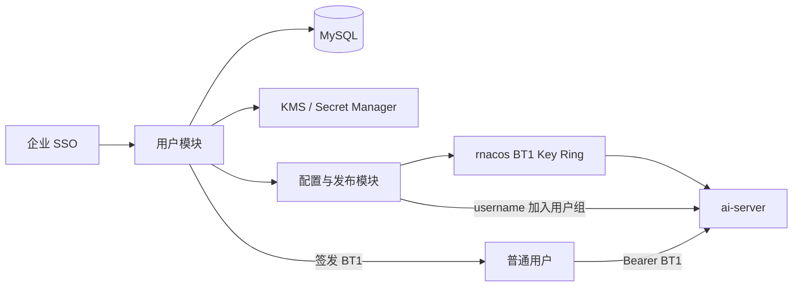
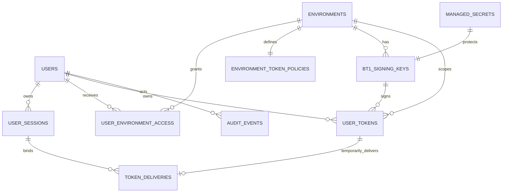

# 用户模块详细设计

## 1. 文档信息

| 项目           | 内容                                                                  |
| -------------- | --------------------------------------------------------------------- |
| 所属产品       | Fiber AI Server Console                                               |
| 上位需求       | `docs/product-requirements.md`                                        |
| 模块           | 用户、控制台认证、用户 BT1 Token                                      |
| 文档状态       | 详细设计基线                                                          |
| 编写日期       | 2026-08-02                                                            |
| ai-server 基线 | `fiber-gateway-cpp` commit `fdd8f122394757231713416e3d9a281dd1e14def` |
| 数据库         | MySQL 8.0+、InnoDB、`utf8mb4`                                         |

本文将上位需求中的用户与权限能力收敛为两种系统角色：普通用户和管理员用户，并设计
面向 ai-server 的 BT1 Token 自助生成功能。本文中的 Token 指调用 ai-server LLM 接口的
BT1 Token；控制台登录 Session 是另一种凭据，两者不能混用。

## 2. 设计依据

关键运行契约来自以下上游实现：

| 契约                                    | 上游路径                                              |
| --------------------------------------- | ----------------------------------------------------- |
| BT1 六段格式、字段长度、HMAC 和过期判断 | `apps/ai-server/src/auth/Bt1TokenVerifier.{h,cpp}`    |
| `Authorization` 与 `x-api-key` 读取规则 | `apps/ai-server/src/auth/LlmRequestAuthenticator.cpp` |
| BT1 key ring 配置与 `clockSkewSec`      | `apps/ai-server/src/config/LlmConfigCodec.cpp`        |
| 用户名与用户组精确匹配、模型授权        | `apps/ai-server/src/routing/ModelAuthorization.cpp`   |
| BT1 golden vector 和 key 轮换行为       | `apps/ai-server/tests/Bt1AuthenticationTest.cpp`      |

### 2.1 关键设计结论

1. 控制台系统角色只有 `USER` 和 `ADMIN`，角色只影响控制台权限，不写入 BT1 Token。
2. BT1 Token 的身份是不可变 `username`；模型访问范围由目标环境的 ai-server 用户组配置
   决定，不由控制台角色或 Token scope 决定。
3. 一个 Token 只属于一个用户和一个环境。各环境必须使用不同的 BT1 key，禁止跨环境复用
   key secret。
4. 原始 Token 只在生成后的短暂交付窗口返回，正常数据库记录不保存明文。
5. 当前 ai-server 没有单 Token 撤销列表、用户禁用查询或重放检测。控制台中的“停用 Token”
   只能阻止再次展示和标记风险，不能使已签发 Token 立即失效。
6. 生产环境只有在签名 key 已被目标 ai-server 实例证明生效后，才允许自助签发 Token。
7. 当前 ai-server 对用户名 `zhangwang` 存在绕过用户组授权的特殊逻辑。该 username 必须在
   用户模块中保留并禁止创建，直至上游删除该逻辑并完成安全评审。

## 3. 模块边界

### 3.1 模块职责

- 对接企业 SSO，维护控制台用户、角色、状态和登录 Session。
- 管理普通用户可访问的控制台环境和自助 Token 策略。
- 为普通用户或管理员代指定用户生成与 ai-server 兼容的 BT1 Token。
- 只保存 Token 元数据、指纹和短期加密交付副本。
- 记录用户、角色、Session、Token 和管理员代操作的审计事件。
- 向配置模块提供稳定 username，用于用户组成员管理和授权影响分析。
- 向前端提供当前用户、环境授权、Token 元数据和安全提示。

### 3.2 不负责的能力

- 不处理用户的 LLM 请求，也不验证线上 BT1 Token。
- 不把普通用户角色映射为模型权限；模型权限属于用户组和模型配置模块。
- 不保存或展示 ai-server 对话审计正文。
- 不提供密码登录作为默认方式；首版使用企业 SSO。
- 不直接发布 BT1 key ring；签名 key 的新增、轮换和发布由配置与发布模块负责。
- 不承诺单 Token 或单用户即时运行时撤销，除非 ai-server 增加对应协议。

### 3.3 与其他模块的关系



## 4. 用户角色与权限

### 4.1 普通用户 `USER`

普通用户面向自助接入，不具备配置发布能力。

- 登录、退出和查看自己的基本资料。
- 查看管理员分配给自己的环境、文档和脱敏运行状态。
- 查看自己在环境中的用户组和可访问模型摘要；数据只读。
- 在环境策略允许时生成自己的 BT1 Token。
- 查看自己 Token 的名称、环境、`kid`、指纹、签发时间、过期时间和管理状态。
- 提前清除 Token 的短期交付密文，或把 Token 标记为泄露/停止使用。
- 查看自己的 Token 安全操作记录。
- 不能修改 username、角色、账号状态、环境授权、用户组、模型或发布配置。
- 不能查看任何已经签发的 Token 明文，也不能查看其他用户信息或 Token。

### 4.2 管理员用户 `ADMIN`

管理员拥有普通用户全部能力，并负责控制台治理。

- 创建、邀请、激活、暂停、恢复和软删除用户。
- 设置普通用户或管理员角色，但不能删除、暂停或降级最后一个有效管理员。
- 分配用户可访问的环境和 Token 自助策略。
- 查看全部用户和 Token 元数据，但不能查看历史 Token 明文。
- 在获得额外确认并填写原因后，为指定用户代签 Token。
- 标记任意用户 Token 为泄露/停止使用，并查看可能仍有效到何时。
- 管理模型、Provider、用户组、BT1 key、草稿、审批、发布、回滚和审计。
- 将用户加入/移出 ai-server 用户组时，必须走配置草稿与发布流程。
- 生产发布需要审批时，草稿作者与审批者必须是两个不同的管理员账号。

### 4.3 权限矩阵

| 功能                   | 普通用户   | 管理员用户               |
| ---------------------- | ---------- | ------------------------ |
| 查看本人资料           | 是         | 是                       |
| 修改本人展示名称       | 是         | 是                       |
| 修改本人 username/角色 | 否         | 否；角色由其他管理员修改 |
| 查看已分配环境         | 是         | 是                       |
| 生成本人 Token         | 按环境策略 | 是                       |
| 查看本人 Token 元数据  | 是         | 是                       |
| 查看其他用户           | 否         | 是                       |
| 代用户生成 Token       | 否         | 是，需要原因和二次确认   |
| 管理用户状态/环境授权  | 否         | 是                       |
| 管理用户组和模型权限   | 否         | 是，经草稿/发布生效      |
| 管理 BT1 签名 key      | 否         | 是，经草稿/审批/发布生效 |
| 查看全局审计           | 否         | 是                       |

### 4.4 与上位需求角色的关系

上位需求曾列出只读者、编辑者、发布者、管理员和审计员等能力角色。本设计的首版把它们
收敛为两种系统角色：

- 普通用户只拥有本人接入和 Token 自助能力。
- 管理员拥有所有配置治理能力。
- 审批职责分离通过“不能审批自己的发布单”实现，不新增第三种角色。

数据库保留独立的环境访问表，未来如需重新拆分环境级角色，可新增权限字段或权限表，
不需要改变用户主表和 BT1 username。

## 5. 用户身份与生命周期

### 5.1 用户标识

每个用户有三个不同标识：

| 标识              | 用途                                        | 是否可变                   |
| ----------------- | ------------------------------------------- | -------------------------- |
| `id`              | 数据库内部 UUID，API 中返回规范 UUID 字符串 | 否                         |
| `externalSubject` | 企业 SSO 的 issuer + subject                | SSO 迁移时由管理员受控变更 |
| `username`        | BT1 principal 和 ai-server 用户组精确匹配值 | 创建后不可变               |

`username` 必须是合法 UTF-8，编码后为 1..64 字节，区分大小写。控制台禁止首尾空白、
控制字符和保留名 `zhangwang`。用户名不从显示名称或邮箱动态派生，避免人员改名后 Token
身份和用户组配置失配。

### 5.2 用户状态

```text
PENDING → ACTIVE ↔ SUSPENDED → DELETED
```

| 状态        | 登录                | 新签 Token | 已签 BT1 Token | 说明                       |
| ----------- | ------------------- | ---------- | -------------- | -------------------------- |
| `PENDING`   | 首次 SSO 激活时允许 | 否         | 无             | 已创建但未完成首次登录     |
| `ACTIVE`    | 是                  | 按策略     | 到期前有效     | 正常状态                   |
| `SUSPENDED` | 否                  | 否         | 可能仍有效     | 立即撤销控制台 Session     |
| `DELETED`   | 否                  | 否         | 可能仍有效     | 软删除，保留审计和历史引用 |

暂停或删除用户时，系统必须：

1. 在同一数据库事务中更新用户状态并撤销其全部控制台 Session。
2. 禁止新的 BT1 Token 签发和短期 Token 密文读取。
3. 列出其尚未过期的 BT1 Token、最晚接受时间和当前用户组引用。
4. 提示管理员创建用户组移除草稿并发布；如果模型允许所有认证用户，则移出用户组也不能
   阻止访问。
5. 明确显示“现有 BT1 Token 不会因账号暂停而立即失效”。

紧急阻断只能通过 ai-server 后续的单用户/单 Token 撤销能力，或删除当前 `kid` 使该 key
签发的所有用户 Token 一起失效。删除 `kid` 影响面很大，必须作为紧急发布单处理。

### 5.3 用户操作规则

- 用户创建由管理员或受控 SSO 同步触发；首版不开放匿名注册。
- JIT 自动注册默认关闭，避免未经授权的 SSO 主体获得控制台账号。
- username 创建后永不复用，即使用户已软删除。
- 删除前展示环境授权、用户组、未过期 Token 和审计保留影响。
- 角色、状态、username 和环境授权的变更全部审计。
- 管理员不能修改自己的角色；必须由另一管理员执行。
- 最后一个有效管理员不能被降级、暂停或删除。

## 6. 控制台登录与 Session

### 6.1 SSO 登录流程

1. 浏览器请求 `/api/auth/login`，后端生成 OIDC state、nonce 和 PKCE verifier。
2. state/nonce/verifier 仅保存在短期、一次性的服务器端登录事务中；可以使用 MySQL 临时记录，
   或使用服务器认证加密且 HttpOnly 的短期事务 Cookie，多实例之间不能依赖进程内内存。
3. SSO 回调后，后端校验 issuer、audience、state、nonce、PKCE、签名和时间。
4. 使用 `(auth_provider, external_subject)` 精确查找用户。
5. `PENDING` 用户完成首次登录后变为 `ACTIVE`；暂停或删除用户拒绝登录。
6. 创建高熵 opaque Session，只把原始 Session ID 写入 Secure、HttpOnly Cookie；数据库只
   保存 SHA-256 hash。
7. 登录、失败原因和 Session 创建写入审计，禁止记录 OIDC Token。

### 6.2 Session 策略

- Cookie 使用 `Secure`、`HttpOnly`、`SameSite=Lax`，Path 为 `/`。
- Session 默认空闲 30 分钟、绝对有效期 8 小时；管理员可按安全策略缩短。
- 修改密码不适用 SSO；用户角色、状态或 SSO subject 变化时撤销全部 Session。
- 高风险操作要求最近 10 分钟内完成 SSO/MFA 二次认证。
- 所有修改接口使用 CSRF Token；CSRF secret 同样只存 hash。
- Session ID、OIDC access/id/refresh token 不写入应用日志或审计。
- 退出登录和管理员暂停用户时立即标记 Session `revoked_at`。

## 7. 用户 BT1 Token 功能设计

### 7.1 Token 与权限关系

BT1 Token 只包含 username、签名 key ID、过期时间和随机数，不包含以下信息：

- 控制台角色；
- 环境 ID；
- 模型列表或 scope；
- Token 数据库 ID；
- 用户启用/暂停状态。

环境归属由签名 key 决定。模型授权由该环境当前模型和用户组配置决定。因此：

- 普通用户变成管理员不会改变已签 BT1 Token 的模型权限。
- 管理员降级为普通用户也不会改变已签 BT1 Token 的模型权限。
- 用户组变更会影响该 username 的全部 Token，而不是单个 Token。
- 空 `allow-user-groups` 的模型允许任何有效 BT1 用户访问。
- 需要单 Token scope 时必须扩展 ai-server 协议，不能只在控制台数据库中增加字段。

### 7.2 BT1 格式

```text
BT1.<kid>.<user>.<exp>.<rnd>.<mac>
```

| 段     | 生成规则                                                     |
| ------ | ------------------------------------------------------------ |
| `BT1`  | 固定版本字符串                                               |
| `kid`  | 当前环境唯一启用签发的 key；1..16 个 `[A-Za-z0-9_-]` 字符    |
| `user` | username UTF-8 字节的无填充 Base64URL；解码后 1..64 字节     |
| `exp`  | Unix 秒级过期时间，无前导零的非负十进制整数                  |
| `rnd`  | CSPRNG 生成 16 字节，编码为 22 字符无填充 Base64URL          |
| `mac`  | 前五段原文的完整 HMAC-SHA256，编码为 43 字符无填充 Base64URL |

签名输入不包含最后一个点：

```text
BT1.<kid>.<user>.<exp>.<rnd>
```

最终 Token 必须不超过 512 个字符。签名 secret 使用 key ring 中 `base64:` 解码后的原始
字节；数据库和 KMS 中也保存原始 secret，不保存带前缀的展示字符串。

ai-server 的逻辑过期条件为当前时间大于 `exp + clockSkewSec`。页面必须同时显示：

- 逻辑过期时间：`exp`；
- 最晚可能接受时间：`exp + clockSkewSec`。

客户端应优先使用：

```http
Authorization: Bearer <BT1 Token>
```

只有 `Authorization` 缺失或为空时，ai-server 才回退读取 `x-api-key`。如果
`Authorization` 存在但不是 Bearer 格式，当前 C++ 实现会直接返回认证错误，不会尝试
`x-api-key`。

### 7.3 Token 策略

系统硬限制与环境默认值：

| 策略                   | 系统硬限制     | 生产默认                  | 非生产默认             |
| ---------------------- | -------------- | ------------------------- | ---------------------- |
| 最短 TTL               | 5 分钟         | 5 分钟                    | 5 分钟                 |
| 默认 TTL               | 不超过环境上限 | 1 小时                    | 24 小时                |
| 最大 TTL               | 30 天          | 7 天                      | 30 天                  |
| 每用户每环境活跃 Token | 最大 20        | 5                         | 10                     |
| 自助签发               | 可按环境关闭   | 开启前要求 key 已证明生效 | 可按策略允许已发布 key |
| 交付密文保留           | 最大 10 分钟   | 5 分钟                    | 5 分钟                 |

用户环境授权可以设置更严格的 TTL 和数量，但不能放宽环境或系统上限。Token 过期时间还
必须早于签名 key 的计划退役时间减去 `clockSkewSec`。

### 7.4 签发前置条件

普通用户签发 Token 必须同时满足：

- 用户为 `ACTIVE`。
- 用户拥有目标环境的有效访问记录，且 `can_issue_tokens = true`。
- 环境开启自助签发。
- 目标环境恰好有一个 `issuance_enabled = true` 的 BT1 key。
- 生产环境 key 状态为 `ACTIVE`，并有全部目标实例接受该 key ring release 的证据。
- 非生产环境可按策略允许 `PUBLISHED_UNVERIFIED`，但响应必须返回风险提示。
- 申请 TTL 和活跃 Token 数未超过有效策略。
- username 满足当前 BT1 编码限制，且不等于保留用户名。
- key 计划退役时间允许覆盖 Token 的最晚接受时间。

管理员代签还必须提供目标用户 ID、原因和最近二次认证。管理员不能为暂停或删除用户代签。

### 7.5 签发算法

```text
now = floor(clock.nowMillis / 1000)
exp = now + effectiveTtlSeconds
user = base64urlNoPad(utf8(username))
rnd = base64urlNoPad(csprng(16))
input = "BT1." + kid + "." + user + "." + exp + "." + rnd
mac = base64urlNoPad(HMAC-SHA256(secretBytes, input))
token = input + "." + mac
fingerprint = SHA-256(token UTF-8 bytes)
```

实现要求：

- 使用 Node.js `crypto.randomBytes(16)` 或等价操作系统 CSPRNG。
- 使用完整 32 字节 HMAC-SHA256，不截断。
- Base64URL 不带 `=` padding。
- 时间来自可注入 Clock，生产使用 UTC；单元测试使用固定 Clock。
- KMS 解密的 key secret 只在最小作用域内存在，使用后尽力覆盖缓冲区。
- 签发前后不记录输入、签名、原始 Token、secret 或 delivery ciphertext。
- 插入 Token 元数据和审计失败时不得向客户端返回 Token。

### 7.6 幂等与并发签发

Token 创建要求 `Idempotency-Key`。同一登录 Session、接口和请求体在 24 小时内使用相同
key 时，不得签发第二个 Token。

签发事务：

1. 在事务外读取 key metadata，并从 KMS 解密 secret。
2. 生成候选 Token，但暂不返回。
3. 开启事务，锁定 `user_environment_access`、`environment_token_policies` 和目标
   `bt1_signing_keys` 行。
4. 重新检查用户、策略、key 状态、release 证据和幂等记录。
5. 在同一锁下统计该用户环境中尚未过期且未停用的 Token，执行数量限制。
6. 插入 `user_tokens`、短期交付密文和审计事件。
7. 提交成功后清除内存中的 secret，再返回 Token。

锁定用户环境访问行可串行化同一用户在同一环境的并发签发，避免两个请求同时越过配额。
key 轮换服务必须锁定同一 key 行，避免使用已经切换状态的 key 完成签发。

### 7.7 一次性交付

正常 `user_tokens` 表永不保存原始 Token。为解决创建响应网络中断后的幂等重试，系统允许
将 Token 用独立一次性数据密钥加密后保存最多 5 分钟：

- delivery 只绑定创建它的 Session、用户和 Idempotency-Key。
- 只有同一 Session 重放完全相同的创建请求时可以再次得到相同 Token。
- 前端离开成功页或用户点击“我已保存”时立即清除 delivery ciphertext。
- 到期清理任务必须物理置空 ciphertext、wrapped DEK 和 nonce，而不只是标记删除。
- 管理员代签的 delivery 绑定管理员 Session；系统不会把 Token 通过邮件或站内通知发送给
  目标用户。
- Token 列表、详情、管理员查询和审计接口永远不关联返回 delivery ciphertext。

创建响应使用 `Cache-Control: no-store, private`、`Pragma: no-cache` 和
`Referrer-Policy: no-referrer`。前端只把原始 Token 放在内存状态，不写 URL、localStorage、
sessionStorage、日志、埋点、错误上报或剪贴板历史追踪。

### 7.8 Token 列表和状态

列表字段：Token 名称、环境、`kid`、指纹前 12 位、签发者、签发时间、逻辑过期时间、
最晚接受时间、状态、最后使用时间和来源说明。

状态计算：

| UI 状态           | 条件                         | 运行时含义                              |
| ----------------- | ---------------------------- | --------------------------------------- |
| `有效`            | 未停用且当前时间不晚于 `exp` | key 仍有效时可被 ai-server 接受         |
| `宽限期`          | `exp < now <= exp + skew`    | ai-server 仍可能接受                    |
| `已过期`          | `now > exp + skew`           | ai-server 应拒绝为 expired              |
| `已标记停用`      | `disabled_at` 非空           | 控制台不再使用，但 ai-server 可能仍接受 |
| `签名 key 已退役` | key 不在实例 active ring     | 只有实例状态证据才能确认失效            |
| `状态未知`        | 无实例状态证据               | 不推断运行时有效性                      |

`last_used_at` 只有在可信 ai-server 审计/上报接入后才更新。没有数据时显示“未接入”，不能
显示“从未使用”。

### 7.9 停用、泄露与撤销限制

普通用户可把自己的 Token 标记为“停止使用”或“疑似泄露”；管理员可对任意 Token 执行。
该操作会：

- 立即清除短期 delivery ciphertext。
- 写入 `disabled_at`、原因和操作者。
- 禁止控制台把该 Token 计入可继续使用列表。
- 生成高风险审计事件。
- 返回 `runtimeEnforced: false` 和最晚可能接受时间。

该操作不会改变 Token 的 HMAC 有效性。UI 和 API 禁止使用“已撤销且立即失效”的文案。
真正的即时撤销有两种方案：

1. 当前紧急方案：发布删除 `kid`，撤销该 key 签发的全部 Token。
2. 后续方案：ai-server 订阅 Token/user revocation generation，并按 Token fingerprint、nonce
   或 user generation 在认证后检查。

后续方案落地前，生产环境应使用短 TTL，并优先通过用户组发布移除模型权限。

### 7.10 Key 轮换与 Token 签发

签名 key 状态：

```text
DRAFT → PUBLISHED_UNVERIFIED → ACTIVE → RETIRING → RETIRED
```

- `issuance_enabled` 在一个环境中最多只能有一个 true。
- 只有 `ACTIVE` key 可用于生产签发。
- 新 key 发布并被全部实例接受后，先切换 issuer，再停止用旧 key 签发。
- 旧 key 保持 `RETIRING`，直到其签发 Token 的最大 `accepted_until` 已过去。
- 删除旧 key 通过新的 BT1 key ring release 完成；实例接受后标记 `RETIRED`。
- 替换同一 `kid` 的 secret 禁止用于常规轮换，因为会立即破坏该 `kid` 的全部旧 Token。

## 8. 页面与交互设计

### 8.1 普通用户页面

```text
我的账号
├── 基本资料
├── 我的环境
│   └── 可访问模型 / 用户组摘要
├── 我的 Token
│   ├── Token 列表
│   ├── 生成 Token
│   └── Token 安全记录
└── 登录 Session
```

生成 Token 表单包含：环境、Token 名称、有效期、当前授权摘要和安全说明。username、`kid`、
签名算法只读。提交前明确提示 Token 只展示于短期交付窗口，用户需安全保存。

成功页展示原始 Token、复制按钮、逻辑过期时间、最晚接受时间、调用 header 示例和
“我已保存并清除页面副本”按钮。复制动作不写审计正文，只记录可选的 `token.copied` 事件。

### 8.2 管理员页面

用户列表字段：username、显示名称、邮箱、角色、状态、环境数、未过期 Token 数、最后登录、
更新时间。提供角色、状态、环境筛选和精确 username 搜索。

用户详情包含：

- 资料、SSO identity、角色、状态和 revision。
- 环境访问和 Token 策略覆盖。
- 用户组及静态可访问模型摘要。
- Token 元数据；永不显示明文。
- 登录 Session、最近登录和安全操作。
- 角色、状态、环境、Token 和代操作审计。

管理员代签必须先选择用户和环境，再填写原因并二次认证。确认页必须说明管理员会看到一次
原始 Token，目标用户不会自动收到它。

### 8.3 危险操作

暂停/删除用户、降级管理员、代签 Token、标记 Token 泄露和切换 issuer key 均使用危险
确认。确认内容包含影响对象、未过期 Token 数、用户组引用、最晚接受时间和是否能在运行时
立即生效。

## 9. 领域模型



## 10. 数据库详细设计

### 10.1 通用约定

- 主键使用应用生成的 UUID，MySQL 存为 `BINARY(16)`；API 转为规范 UUID 字符串。
- 时间统一 `DATETIME(6)` UTC，由服务层的可注入 Clock 赋值。
- 金额无关，本模块不使用浮点数；TTL 使用整数秒。
- 可变业务表带 `revision BIGINT UNSIGNED`，更新使用 `If-Match` 乐观锁。
- 用户和 Token 历史不硬删除；敏感 delivery ciphertext 到期后物理清除。
- 所有表使用 InnoDB。DDL 中的 CHECK 要求 MySQL 8.0.16 以上。
- `environments`、`releases` 和全局发布表由其他模块创建，本文只引用外键。

### 10.2 `users`

```sql
CREATE TABLE users (
  id BINARY(16) NOT NULL,
  username VARCHAR(64) CHARACTER SET utf8mb4 COLLATE utf8mb4_0900_bin NOT NULL,
  display_name VARCHAR(128) NOT NULL,
  email VARCHAR(254) NULL,
  system_role VARCHAR(16) CHARACTER SET ascii COLLATE ascii_bin NOT NULL,
  status VARCHAR(16) CHARACTER SET ascii COLLATE ascii_bin NOT NULL,
  auth_provider VARCHAR(32) CHARACTER SET ascii COLLATE ascii_bin NOT NULL,
  external_subject VARBINARY(255) NOT NULL,
  revision BIGINT UNSIGNED NOT NULL DEFAULT 1,
  last_login_at DATETIME(6) NULL,
  created_by BINARY(16) NULL,
  updated_by BINARY(16) NULL,
  created_at DATETIME(6) NOT NULL,
  updated_at DATETIME(6) NOT NULL,
  deleted_at DATETIME(6) NULL,
  PRIMARY KEY (id),
  UNIQUE KEY uq_users_username (username),
  UNIQUE KEY uq_users_auth_subject (auth_provider, external_subject),
  KEY idx_users_status_role (status, system_role, updated_at),
  KEY idx_users_email (email),
  CONSTRAINT chk_users_role CHECK (system_role IN ('USER', 'ADMIN')),
  CONSTRAINT chk_users_status CHECK (status IN ('PENDING', 'ACTIVE', 'SUSPENDED', 'DELETED')),
  CONSTRAINT chk_users_username_bytes CHECK (OCTET_LENGTH(username) BETWEEN 1 AND 64),
  CONSTRAINT fk_users_created_by FOREIGN KEY (created_by) REFERENCES users (id),
  CONSTRAINT fk_users_updated_by FOREIGN KEY (updated_by) REFERENCES users (id)
) ENGINE = InnoDB DEFAULT CHARSET = utf8mb4;
```

username 的首尾空白、控制字符、UTF-8 合法性和保留名在服务层校验。数据库唯一索引保证
大小写敏感唯一；软删除后仍不允许复用。

### 10.3 `user_environment_access`

```sql
CREATE TABLE user_environment_access (
  user_id BINARY(16) NOT NULL,
  environment_id BINARY(16) NOT NULL,
  can_issue_tokens BOOLEAN NOT NULL DEFAULT TRUE,
  max_token_ttl_seconds INT UNSIGNED NULL,
  max_active_tokens SMALLINT UNSIGNED NULL,
  revision BIGINT UNSIGNED NOT NULL DEFAULT 1,
  granted_by BINARY(16) NOT NULL,
  created_at DATETIME(6) NOT NULL,
  updated_at DATETIME(6) NOT NULL,
  revoked_at DATETIME(6) NULL,
  PRIMARY KEY (user_id, environment_id),
  KEY idx_user_env_environment (environment_id, revoked_at, user_id),
  CONSTRAINT chk_user_env_ttl CHECK (
    max_token_ttl_seconds IS NULL OR max_token_ttl_seconds BETWEEN 300 AND 2592000
  ),
  CONSTRAINT chk_user_env_count CHECK (
    max_active_tokens IS NULL OR max_active_tokens BETWEEN 0 AND 20
  ),
  CONSTRAINT fk_user_env_user FOREIGN KEY (user_id) REFERENCES users (id),
  CONSTRAINT fk_user_env_environment FOREIGN KEY (environment_id) REFERENCES environments (id),
  CONSTRAINT fk_user_env_granted_by FOREIGN KEY (granted_by) REFERENCES users (id)
) ENGINE = InnoDB DEFAULT CHARSET = utf8mb4;
```

`NULL` 策略值表示继承环境策略。用户覆盖只能更严格，由服务层校验。移除环境访问使用
`revoked_at`，保留历史关系和审计。

### 10.4 `environment_token_policies`

```sql
CREATE TABLE environment_token_policies (
  environment_id BINARY(16) NOT NULL,
  self_service_enabled BOOLEAN NOT NULL DEFAULT FALSE,
  min_ttl_seconds INT UNSIGNED NOT NULL DEFAULT 300,
  default_ttl_seconds INT UNSIGNED NOT NULL DEFAULT 3600,
  max_ttl_seconds INT UNSIGNED NOT NULL DEFAULT 604800,
  max_active_tokens_per_user SMALLINT UNSIGNED NOT NULL DEFAULT 5,
  require_effective_key BOOLEAN NOT NULL DEFAULT TRUE,
  delivery_ttl_seconds SMALLINT UNSIGNED NOT NULL DEFAULT 300,
  revision BIGINT UNSIGNED NOT NULL DEFAULT 1,
  updated_by BINARY(16) NOT NULL,
  created_at DATETIME(6) NOT NULL,
  updated_at DATETIME(6) NOT NULL,
  PRIMARY KEY (environment_id),
  CONSTRAINT chk_token_policy_ttl CHECK (
    min_ttl_seconds >= 300
    AND min_ttl_seconds <= default_ttl_seconds
    AND default_ttl_seconds <= max_ttl_seconds
    AND max_ttl_seconds <= 2592000
  ),
  CONSTRAINT chk_token_policy_count CHECK (max_active_tokens_per_user BETWEEN 0 AND 20),
  CONSTRAINT chk_token_delivery_ttl CHECK (delivery_ttl_seconds BETWEEN 60 AND 600),
  CONSTRAINT fk_token_policy_environment
    FOREIGN KEY (environment_id) REFERENCES environments (id),
  CONSTRAINT fk_token_policy_updated_by FOREIGN KEY (updated_by) REFERENCES users (id)
) ENGINE = InnoDB DEFAULT CHARSET = utf8mb4;
```

### 10.5 `user_sessions`

```sql
CREATE TABLE user_sessions (
  id BINARY(16) NOT NULL,
  user_id BINARY(16) NOT NULL,
  session_token_hash BINARY(32) NOT NULL,
  csrf_token_hash BINARY(32) NOT NULL,
  auth_time DATETIME(6) NOT NULL,
  mfa_time DATETIME(6) NULL,
  created_at DATETIME(6) NOT NULL,
  last_seen_at DATETIME(6) NOT NULL,
  idle_expires_at DATETIME(6) NOT NULL,
  absolute_expires_at DATETIME(6) NOT NULL,
  revoked_at DATETIME(6) NULL,
  revoke_reason VARCHAR(255) NULL,
  ip_hash BINARY(32) NULL,
  user_agent_hash BINARY(32) NULL,
  PRIMARY KEY (id),
  UNIQUE KEY uq_user_sessions_token_hash (session_token_hash),
  KEY idx_user_sessions_user_active (user_id, revoked_at, absolute_expires_at),
  KEY idx_user_sessions_expiry (absolute_expires_at, revoked_at),
  CONSTRAINT fk_user_sessions_user FOREIGN KEY (user_id) REFERENCES users (id)
) ENGINE = InnoDB DEFAULT CHARSET = utf8mb4;
```

原始 Session 和 CSRF Token 只存在于 Cookie/页面内存，不落库。IP 和 User-Agent 默认只
保存带部署专用 pepper 的 HMAC-SHA256，以支持异常会话关联且减少个人信息暴露。

### 10.6 `managed_secrets`

```sql
CREATE TABLE managed_secrets (
  id BINARY(16) NOT NULL,
  secret_kind VARCHAR(32) CHARACTER SET ascii COLLATE ascii_bin NOT NULL,
  ciphertext MEDIUMBLOB NOT NULL,
  wrapped_dek VARBINARY(1024) NOT NULL,
  nonce VARBINARY(24) NOT NULL,
  encryption_algorithm VARCHAR(32) CHARACTER SET ascii COLLATE ascii_bin NOT NULL,
  kms_key_reference VARCHAR(255) NOT NULL,
  fingerprint BINARY(32) NOT NULL,
  revision BIGINT UNSIGNED NOT NULL DEFAULT 1,
  created_by BINARY(16) NOT NULL,
  updated_by BINARY(16) NOT NULL,
  created_at DATETIME(6) NOT NULL,
  updated_at DATETIME(6) NOT NULL,
  destroyed_at DATETIME(6) NULL,
  PRIMARY KEY (id),
  KEY idx_managed_secrets_kind (secret_kind, destroyed_at),
  CONSTRAINT chk_managed_secret_kind CHECK (
    secret_kind IN ('BT1_SIGNING_KEY', 'PROVIDER_TOKEN', 'RNACOS_CREDENTIAL')
  ),
  CONSTRAINT fk_managed_secrets_created_by FOREIGN KEY (created_by) REFERENCES users (id),
  CONSTRAINT fk_managed_secrets_updated_by FOREIGN KEY (updated_by) REFERENCES users (id)
) ENGINE = InnoDB DEFAULT CHARSET = utf8mb4;
```

建议使用 AES-256-GCM envelope encryption，`ciphertext` 包含认证 tag，AAD 绑定 secret ID、
kind 和环境 ID。`fingerprint` 是对原始 secret 使用部署专用 pepper 的 HMAC，不是可离线
验证的普通 SHA-256。

### 10.7 `bt1_signing_keys`

```sql
CREATE TABLE bt1_signing_keys (
  id BINARY(16) NOT NULL,
  environment_id BINARY(16) NOT NULL,
  kid VARCHAR(16) CHARACTER SET ascii COLLATE ascii_bin NOT NULL,
  secret_id BINARY(16) NOT NULL,
  key_state VARCHAR(32) CHARACTER SET ascii COLLATE ascii_bin NOT NULL,
  issuance_enabled BOOLEAN NOT NULL DEFAULT FALSE,
  issuer_slot TINYINT GENERATED ALWAYS AS (
    CASE WHEN issuance_enabled = TRUE THEN 1 ELSE NULL END
  ) STORED,
  published_release_id BINARY(16) NULL,
  effective_release_id BINARY(16) NULL,
  activated_at DATETIME(6) NULL,
  retire_after DATETIME(6) NULL,
  retired_at DATETIME(6) NULL,
  revision BIGINT UNSIGNED NOT NULL DEFAULT 1,
  created_by BINARY(16) NOT NULL,
  updated_by BINARY(16) NOT NULL,
  created_at DATETIME(6) NOT NULL,
  updated_at DATETIME(6) NOT NULL,
  PRIMARY KEY (id),
  UNIQUE KEY uq_bt1_key_kid (environment_id, kid),
  UNIQUE KEY uq_bt1_key_single_issuer (environment_id, issuer_slot),
  KEY idx_bt1_key_state (environment_id, key_state, updated_at),
  CONSTRAINT chk_bt1_key_state CHECK (
    key_state IN ('DRAFT', 'PUBLISHED_UNVERIFIED', 'ACTIVE', 'RETIRING', 'RETIRED')
  ),
  CONSTRAINT fk_bt1_key_environment FOREIGN KEY (environment_id) REFERENCES environments (id),
  CONSTRAINT fk_bt1_key_secret FOREIGN KEY (secret_id) REFERENCES managed_secrets (id),
  CONSTRAINT fk_bt1_key_published_release
    FOREIGN KEY (published_release_id) REFERENCES releases (id),
  CONSTRAINT fk_bt1_key_effective_release
    FOREIGN KEY (effective_release_id) REFERENCES releases (id),
  CONSTRAINT fk_bt1_key_created_by FOREIGN KEY (created_by) REFERENCES users (id),
  CONSTRAINT fk_bt1_key_updated_by FOREIGN KEY (updated_by) REFERENCES users (id)
) ENGINE = InnoDB DEFAULT CHARSET = utf8mb4;
```

生成列加唯一索引保证每个环境最多一个 issuer。`kid` 的字符集、issuer 状态和 release
证据由服务层校验，因为数据库 CHECK 不适合表达正则兼容性和跨行、跨表规则。

### 10.8 `user_tokens`

```sql
CREATE TABLE user_tokens (
  id BINARY(16) NOT NULL,
  user_id BINARY(16) NOT NULL,
  environment_id BINARY(16) NOT NULL,
  signing_key_id BINARY(16) NOT NULL,
  token_name VARCHAR(64) NOT NULL,
  token_fingerprint BINARY(32) NOT NULL,
  token_nonce VARCHAR(22) CHARACTER SET ascii COLLATE ascii_bin NOT NULL,
  bt1_version VARCHAR(8) CHARACTER SET ascii COLLATE ascii_bin NOT NULL DEFAULT 'BT1',
  kid VARCHAR(16) CHARACTER SET ascii COLLATE ascii_bin NOT NULL,
  clock_skew_seconds SMALLINT UNSIGNED NOT NULL,
  issued_by BINARY(16) NOT NULL,
  issued_for_reason VARCHAR(500) NULL,
  issued_at DATETIME(6) NOT NULL,
  expires_at DATETIME(6) NOT NULL,
  accepted_until DATETIME(6) NOT NULL,
  disabled_at DATETIME(6) NULL,
  disabled_by BINARY(16) NULL,
  disable_reason VARCHAR(500) NULL,
  compromise_suspected BOOLEAN NOT NULL DEFAULT FALSE,
  last_used_at DATETIME(6) NULL,
  last_used_source VARCHAR(32) CHARACTER SET ascii COLLATE ascii_bin NULL,
  created_at DATETIME(6) NOT NULL,
  updated_at DATETIME(6) NOT NULL,
  PRIMARY KEY (id),
  UNIQUE KEY uq_user_token_fingerprint (token_fingerprint),
  UNIQUE KEY uq_user_token_nonce (environment_id, kid, token_nonce),
  UNIQUE KEY uq_user_token_name (user_id, environment_id, token_name),
  KEY idx_user_tokens_owner (user_id, environment_id, expires_at),
  KEY idx_user_tokens_environment_expiry (environment_id, accepted_until, disabled_at),
  KEY idx_user_tokens_signing_key (signing_key_id, accepted_until),
  CONSTRAINT chk_user_token_skew CHECK (clock_skew_seconds BETWEEN 0 AND 300),
  CONSTRAINT chk_user_token_time CHECK (
    issued_at < expires_at AND expires_at <= accepted_until
  ),
  CONSTRAINT chk_user_token_disable CHECK (
    (disabled_at IS NULL AND disabled_by IS NULL AND disable_reason IS NULL)
    OR (disabled_at IS NOT NULL AND disabled_by IS NOT NULL AND disable_reason IS NOT NULL)
  ),
  CONSTRAINT fk_user_tokens_access
    FOREIGN KEY (user_id, environment_id)
    REFERENCES user_environment_access (user_id, environment_id),
  CONSTRAINT fk_user_tokens_signing_key FOREIGN KEY (signing_key_id) REFERENCES bt1_signing_keys (id),
  CONSTRAINT fk_user_tokens_issued_by FOREIGN KEY (issued_by) REFERENCES users (id),
  CONSTRAINT fk_user_tokens_disabled_by FOREIGN KEY (disabled_by) REFERENCES users (id)
) ENGINE = InnoDB DEFAULT CHARSET = utf8mb4;
```

`token_fingerprint = SHA-256(raw token)`，仅用于唯一性和展示前 12 位，不用于验证线上请求。
`token_nonce` 不是 secret，用于审计关联和未来撤销协议。Token 名在同一用户和环境中永久
唯一，避免历史记录混淆。

### 10.9 `token_deliveries`

```sql
CREATE TABLE token_deliveries (
  token_id BINARY(16) NOT NULL,
  session_id BINARY(16) NOT NULL,
  idempotency_key_hash BINARY(32) NOT NULL,
  request_hash BINARY(32) NOT NULL,
  ciphertext VARBINARY(2048) NULL,
  wrapped_dek VARBINARY(1024) NULL,
  nonce VARBINARY(24) NULL,
  kms_key_reference VARCHAR(255) NULL,
  created_at DATETIME(6) NOT NULL,
  expires_at DATETIME(6) NOT NULL,
  purged_at DATETIME(6) NULL,
  PRIMARY KEY (token_id),
  UNIQUE KEY uq_token_delivery_idempotency (session_id, idempotency_key_hash),
  KEY idx_token_delivery_expiry (expires_at, purged_at),
  CONSTRAINT chk_token_delivery_ciphertext CHECK (
    (purged_at IS NULL AND ciphertext IS NOT NULL AND wrapped_dek IS NOT NULL AND nonce IS NOT NULL)
    OR (purged_at IS NOT NULL AND ciphertext IS NULL AND wrapped_dek IS NULL AND nonce IS NULL)
  ),
  CONSTRAINT fk_token_delivery_token FOREIGN KEY (token_id) REFERENCES user_tokens (id),
  CONSTRAINT fk_token_delivery_session FOREIGN KEY (session_id) REFERENCES user_sessions (id)
) ENGINE = InnoDB DEFAULT CHARSET = utf8mb4;
```

清理任务使用小批量 `SELECT ... FOR UPDATE SKIP LOCKED`，过期后将所有密码材料置 NULL 并写
`purged_at`。不删除行，以便保留幂等和审计关系。

### 10.10 `audit_events` 用户模块字段

用户模块复用全局追加写审计表，不另建可修改的操作日志。最小结构：

```sql
CREATE TABLE audit_events (
  id BINARY(16) NOT NULL,
  sequence_no BIGINT UNSIGNED NOT NULL AUTO_INCREMENT,
  actor_user_id BINARY(16) NULL,
  actor_role VARCHAR(16) CHARACTER SET ascii COLLATE ascii_bin NULL,
  event_type VARCHAR(64) CHARACTER SET ascii COLLATE ascii_bin NOT NULL,
  target_type VARCHAR(32) CHARACTER SET ascii COLLATE ascii_bin NOT NULL,
  target_id BINARY(16) NULL,
  environment_id BINARY(16) NULL,
  correlation_id VARCHAR(64) CHARACTER SET ascii COLLATE ascii_bin NOT NULL,
  reason VARCHAR(500) NULL,
  payload JSON NOT NULL,
  ip_hash BINARY(32) NULL,
  user_agent_hash BINARY(32) NULL,
  occurred_at DATETIME(6) NOT NULL,
  PRIMARY KEY (id),
  UNIQUE KEY uq_audit_sequence (sequence_no),
  KEY idx_audit_actor_time (actor_user_id, occurred_at),
  KEY idx_audit_target_time (target_type, target_id, occurred_at),
  KEY idx_audit_environment_time (environment_id, occurred_at),
  CONSTRAINT fk_audit_actor FOREIGN KEY (actor_user_id) REFERENCES users (id)
) ENGINE = InnoDB DEFAULT CHARSET = utf8mb4;
```

Token 审计 payload 只允许 token ID、名称、环境、`kid`、指纹前缀、TTL、结果和
`runtimeEnforced`，禁止原始 Token、mac、完整 fingerprint、secret 或 delivery ciphertext。

### 10.11 `security_invariants`

管理员角色和状态变更需要一个稳定的串行化锁点，避免两个并发事务分别看到“还有另一个
管理员”，最后同时移除全部管理员。

```sql
CREATE TABLE security_invariants (
  lock_name VARCHAR(64) CHARACTER SET ascii COLLATE ascii_bin NOT NULL,
  revision BIGINT UNSIGNED NOT NULL DEFAULT 1,
  updated_at DATETIME(6) NOT NULL,
  PRIMARY KEY (lock_name)
) ENGINE = InnoDB DEFAULT CHARSET = utf8mb4;

INSERT INTO security_invariants (lock_name, revision, updated_at)
VALUES ('ACTIVE_ADMIN_GUARD', 1, '1970-01-01 00:00:00.000000');
```

管理员降级、暂停或删除事务必须先 `SELECT ... FOR UPDATE` 锁定该行，再统计有效管理员、
执行修改并写审计。

### 10.12 数据库无法单独保证的规则

以下规则必须由领域服务在事务和行锁中保证：

- 不存在零个有效管理员，也不能并发降级两个管理员导致最后管理员消失。
- 用户 Token 策略覆盖不能比环境策略更宽松。
- 每个用户环境的活跃 Token 数量限制。
- issuer key 必须属于目标环境、状态允许且 release 证据满足策略。
- Token 最晚接受时间不得超过 key 的计划退役时间。
- 普通用户只能操作自己的 Token，管理员代操作必须有 reason 和新鲜 MFA。
- 用户状态变更与 Session 撤销必须原子提交。
- delivery 只能由绑定 Session 和完全相同请求 hash 读取。

## 11. API 设计

### 11.1 当前用户与 Session

```text
GET  /api/me
GET  /api/me/environments
GET  /api/me/sessions
POST /api/me/sessions/:id/revoke
POST /api/auth/login
GET  /api/auth/callback
POST /api/auth/logout
POST /api/auth/reauthenticate
```

### 11.2 普通用户 Token

```text
GET  /api/me/tokens
POST /api/me/tokens
GET  /api/me/tokens/:id
POST /api/me/tokens/:id/disable
POST /api/me/tokens/:id/purge-delivery
GET  /api/me/token-events
```

创建请求：

```http
POST /api/me/tokens
Idempotency-Key: 4a7262ca-...
If-Match: "user-env-revision-7"
Content-Type: application/json
```

```json
{
  "environmentId": "7b40d8ea-8db3-4ea2-86fe-fb788a2db37c",
  "name": "local-development",
  "ttlSeconds": 3600
}
```

创建响应：

```json
{
  "id": "f54af75e-68d1-4d9e-a0e0-ad5aa7b47bd7",
  "name": "local-development",
  "environmentId": "7b40d8ea-8db3-4ea2-86fe-fb788a2db37c",
  "username": "alice",
  "kid": "key-2026",
  "fingerprint": "8f4c12a06e23",
  "token": "BT1.key-2026.<one-time-value>",
  "issuedAt": "2026-08-02T08:00:00.000Z",
  "expiresAt": "2026-08-02T09:00:00.000Z",
  "acceptedUntil": "2026-08-02T09:01:00.000Z",
  "deliveryExpiresAt": "2026-08-02T08:05:00.000Z",
  "runtimeState": "KEY_EFFECTIVE"
}
```

列表和详情响应不包含 `token` 或 delivery 字段，只返回安全元数据。

停用请求：

```json
{
  "reason": "疑似复制到不安全终端",
  "compromiseSuspected": true
}
```

停用响应必须包含：

```json
{
  "managementState": "DISABLED",
  "runtimeEnforced": false,
  "acceptedUntil": "2026-08-02T09:01:00.000Z",
  "message": "ai-server 当前不支持单 Token 撤销，该 Token 到期前仍可能有效"
}
```

### 11.3 管理员用户管理

```text
GET    /api/admin/users
POST   /api/admin/users
GET    /api/admin/users/:id
PATCH  /api/admin/users/:id
POST   /api/admin/users/:id/suspend
POST   /api/admin/users/:id/activate
DELETE /api/admin/users/:id

GET    /api/admin/users/:id/environments
PUT    /api/admin/users/:id/environments/:environmentId
DELETE /api/admin/users/:id/environments/:environmentId

GET    /api/admin/users/:id/tokens
POST   /api/admin/users/:id/tokens
POST   /api/admin/users/:userId/tokens/:tokenId/disable
GET    /api/admin/users/:id/audit-events
```

管理员代签请求除普通字段外必须包含 `reason`，并要求 `X-Reauthentication-Token` 或等价的
短期二次认证凭据。

### 11.4 API 通用要求

- 查询和动作端点均使用 Fastify JSON schema 和显式 TypeScript 类型。
- 资源更新要求 `If-Match`；冲突返回 412。
- 创建和动作接口要求 `Idempotency-Key`。
- 权限失败统一 403，不通过错误暴露其他用户或 Token 是否存在。
- 用户和 Token ID 使用不透明 UUID，不接受 username 代替 ID 执行写操作。
- Token 创建/交付响应禁止缓存，且后端日志排除请求和响应 body。
- 列表使用 cursor 分页；默认按创建时间倒序，再按 ID 稳定排序。
- 时间使用 RFC 3339 UTC；TTL 输入只接受整数秒。
- 所有响应包含 correlation ID。

### 11.5 稳定错误码

| code                        | HTTP | 场景                           |
| --------------------------- | ---- | ------------------------------ |
| `USER_NOT_FOUND`            | 404  | 管理员查询不存在用户           |
| `USER_NOT_ACTIVE`           | 409  | 暂停/删除用户尝试签发          |
| `USERNAME_RESERVED`         | 422  | 使用保留 username              |
| `LAST_ADMIN_REQUIRED`       | 409  | 尝试移除最后管理员             |
| `ENVIRONMENT_ACCESS_DENIED` | 403  | 普通用户未获环境访问           |
| `TOKEN_ISSUANCE_DISABLED`   | 409  | 环境或用户关闭自助签发         |
| `TOKEN_POLICY_VIOLATION`    | 422  | TTL 或数量超过策略             |
| `SIGNING_KEY_UNAVAILABLE`   | 503  | 没有唯一可用 issuer key        |
| `SIGNING_KEY_NOT_EFFECTIVE` | 409  | 策略要求实例生效证据但尚未满足 |
| `TOKEN_DELIVERY_EXPIRED`    | 410  | 短期交付密文已清除             |
| `TOKEN_ALREADY_DISABLED`    | 409  | 重复停用且请求不幂等           |
| `REAUTHENTICATION_REQUIRED` | 401  | 高风险操作缺少新鲜二次认证     |
| `REVISION_CONFLICT`         | 412  | `If-Match` 过期                |
| `IDEMPOTENCY_CONFLICT`      | 409  | 同一幂等 key 对应不同请求 body |

## 12. 后端模块设计

建议目录：

```text
server/src/modules/users/
├── routes.ts
├── schemas.ts
├── user-service.ts
├── user-repository.ts
├── session-service.ts
├── session-repository.ts
├── token-service.ts
├── token-repository.ts
├── bt1-issuer.ts
├── policy-service.ts
├── types.ts
└── *.test.ts

server/src/modules/auth/
├── oidc-client.ts
├── auth-routes.ts
├── authorization.ts
└── csrf.ts

server/src/modules/secrets/
├── secret-service.ts
├── kms-client.ts
└── secret-repository.ts
```

职责边界：

- route 只处理 schema、身份上下文、HTTP 状态和调用 service。
- `UserService` 管理生命周期、角色、最后管理员和环境授权。
- `SessionService` 管理 SSO Session、CSRF、撤销和二次认证。
- `TokenService` 负责策略、事务、审计和一次性交付编排。
- `Bt1Issuer` 是纯函数式加密边界，只接收 username、key、TTL、Clock 和 RNG。
- `PolicyService` 合并系统、环境和用户环境三层策略。
- repository 只处理 SQL 和事务，不包含 BT1 编码或权限判断。
- KMS、Clock、RNG、SSO 和审计 writer 都通过接口注入，单元测试不访问外部服务。

## 13. 审计事件

至少记录：

| 事件                                 | 关键安全字段                                      |
| ------------------------------------ | ------------------------------------------------- |
| `user.created`                       | user ID、username、role、创建者                   |
| `user.role_changed`                  | old/new role、reason                              |
| `user.suspended/reactivated/deleted` | 活跃 Token 数、最晚接受时间、reason               |
| `user.environment_granted/revoked`   | environment、策略覆盖                             |
| `session.created/revoked/rejected`   | session ID、原因、哈希后的来源信息                |
| `token.issued`                       | token ID、环境、kid、指纹前缀、TTL、是否代签      |
| `token.delivery_purged`              | token ID、主动/到期清理                           |
| `token.disabled`                     | token ID、疑似泄露、runtimeEnforced=false、reason |
| `token.issuance_rejected`            | 稳定错误码，不记录敏感输入                        |
| `bt1.issuer_changed`                 | old/new kid、对应 release、实例证据               |

签发成功和审计写入必须在同一事务提交。审计写入失败时 Token 不得返回。SSO 失败等无用户
事务场景也应写安全事件，但不得保存 SSO assertion 或 Token。

## 14. 安全设计

### 14.1 威胁与控制

| 威胁                 | 控制                                                              |
| -------------------- | ----------------------------------------------------------------- |
| 数据库泄露后伪造 BT1 | signing secret 使用 KMS envelope encryption，应用账号不能直接解密 |
| 日志泄露 Token       | 禁止请求/响应 body 日志，统一敏感字段过滤                         |
| 管理员越权代签       | ADMIN + 新鲜 MFA + reason + 审计                                  |
| 普通用户横向读取     | 所有 `/api/me` 查询强制使用 Session user ID，不接受请求体 user ID |
| Token 创建重放       | Session 绑定的 Idempotency-Key 和 request hash                    |
| 并发越过配额         | 锁定 user/environment access 行后统计和插入                       |
| Token 长期泄露       | 短 TTL、一次性交付、密文到期物理清除                              |
| 跨环境使用           | 环境独立 key，禁止 secret fingerprint 跨环境重复                  |
| 用户停用后继续访问   | UI 明示限制、短 TTL、用户组发布；长期增加运行时撤销协议           |
| 特殊用户名绕过授权   | 保留并禁止 `zhangwang`，推动上游删除硬编码                        |
| CSRF/Session 劫持    | Secure HttpOnly Cookie、CSRF、Session 轮换、MFA、CSP              |

### 14.2 密钥权限

- Web route 和普通 repository 不能直接读取 signing secret。
- `TokenService` 通过窄接口请求某个已验证 key 的短期解密结果。
- KMS policy 只允许服务身份解密 `BT1_SIGNING_KEY`，不允许浏览器或管理员账号直接调用。
- signing secret 不进入错误对象、Trace、heap dump、审计或消息队列。
- 同一 secret fingerprint 不能绑定到两个环境；发现重复时阻止启用 issuer。
- key 轮换删除旧 secret 前必须确认 rnacos release、实例生效和全部 Token 接受期限均结束。

## 15. 可观测性

仅使用低基数指标：

- Token 签发成功/失败计数，label 为环境等级和稳定结果码，不使用 username/token ID。
- Token 策略拒绝数。
- signing key 不可用/未生效计数。
- delivery 待清理数、清理延迟和清理失败数。
- 活跃 Session 数、登录成功/失败数。
- 用户暂停时存在未过期 Token 的事件数。

日志只记录 correlation ID、动作、稳定结果码和内部对象 UUID；不记录 username 以外的高敏
身份字段时仍应遵循隐私策略。Token、secret、mac、delivery ciphertext 永不进入日志。

## 16. 测试设计

### 16.1 单元测试

- BT1 golden vector 与上游 C++ 测试一致。
- 1、64 字节 username 成功；空、65 字节、非法 UTF-8 和保留用户名失败。
- `kid` 字符集和长度边界。
- 16 字节随机数编码为 22 字符；完整 HMAC 编码为 43 字符。
- exp 无前导零，Token 总长度不超过 512。
- `now = exp + skew` 仍处于宽限期，下一秒过期。
- 生产/非生产环境策略合并和用户覆盖只能收紧。
- 普通用户不能为他人签发，管理员代签缺少 reason/MFA 时失败。
- 暂停、删除和保留 username 不允许签发。
- 最后管理员不能降级、暂停或删除。
- 同一 Idempotency-Key 同请求返回相同 Token；不同请求返回冲突。
- delivery 到期或主动清除后所有密码材料为 NULL。
- 停用响应明确 `runtimeEnforced=false`。

### 16.2 Repository 与事务测试

- username、SSO subject、Token 指纹、nonce、Token 名唯一约束。
- 每环境只能有一个 `issuance_enabled` key。
- 并发签发不会超过 Token 数量上限。
- key 切换与签发并发时不会使用已失效 issuer。
- 用户暂停与 Session 创建并发时最终不存在有效 Session。
- 两个管理员并发降级时至少保留一个有效管理员。
- 审计失败回滚 Token 插入，Token 不可交付。
- 清理 worker 可重入并支持 `SKIP LOCKED` 多实例并发。

### 16.3 HTTP 测试

- Fastify injection 覆盖 USER/ADMIN 权限矩阵。
- Token 创建响应和错误均不被 logger 捕获 body。
- Token 列表永不含 `token`、ciphertext、wrapped DEK 或完整 fingerprint。
- 404/403 不泄露其他用户 Token 是否存在。
- `If-Match`、Idempotency-Key、CSRF 和 reauthentication 行为。
- Cache-Control、Pragma、Referrer-Policy 和 correlation ID 响应头。

### 16.4 联调测试

1. 发布新 BT1 key，全部 ai-server 实例接受后启用 issuer，生成 Token 并调用两个协议入口。
2. username 加入允许用户组后可访问模型，移除并生效后得到 403。
3. 空 `allow-user-groups` 模型对任意有效 Token 可访问。
4. Token 在 `exp` 后、skew 内仍成功，超过 `acceptedUntil` 后得到 `expired_token`。
5. 标记 Token 停用后验证 ai-server 仍可能接受，并确认 UI 不误报即时撤销。
6. 旧/new key 轮换期间两个 Token 均有效，旧 key 删除生效后旧 Token 失败。
7. 某些实例未接受新 key 时生产签发被阻止。

## 17. 验收标准

### 17.1 用户与角色

- 系统只产生普通用户和管理员用户两种角色。
- 普通用户只能访问本人资料、授权环境和本人 Token。
- 管理员可治理用户，但不能查看任何历史 Token 明文。
- 最后管理员保护和自我降级限制在并发场景下仍成立。
- username 与 BT1 principal、用户组匹配完全一致且创建后不可变。

### 17.2 Token

- 生成值能通过当前 ai-server BT1 verifier 和 golden vector 契约测试。
- 生产只使用已经被目标实例证明接受的 signing key。
- 原始 Token 仅在短期、Session 绑定的交付窗口可获得，过期后不可恢复。
- 正常 Token 表、列表、详情、日志和审计均不保存/返回明文。
- TTL、数量、环境访问、用户状态和 key 退役约束全部由后端强制。
- 停用操作准确表达当前无单 Token 运行时撤销能力。

### 17.3 数据与安全

- 所有表、索引、唯一约束和外键可通过确定性 migration 创建。
- 所有写操作有 revision/ETag、幂等或事务锁保护。
- signing secret 使用 KMS 加密且仅 Token issuer 服务可解密。
- 用户、角色、Session、Token、key 切换和管理员代操作都有无敏感值的审计记录。
- 暂停用户时控制台 Session 立即失效，并展示仍可能有效的 BT1 Token 风险。

## 18. 分阶段实现

### 18.1 MVP

- SSO、普通用户/管理员、用户生命周期和环境授权。
- Session、CSRF、角色检查和全量审计。
- BT1 Token 生成、元数据列表、短期加密交付和策略限制。
- 生产环境在无实例 key 生效证据时关闭自助签发。
- Token 停用明确标为管理状态，不宣称运行时撤销。

### 18.2 P1

- 接入 ai-server 配置状态接口，自动判定 signing key 是否全部实例生效。
- 接入可信 Token 使用上报，填充 `last_used_at`。
- key 轮换向导根据最大 `accepted_until` 计算安全删除时间。
- 用户组和可访问模型摘要与发布状态联动。

### 18.3 P2

- 为 ai-server 增加 Token/user revocation generation 或等价撤销协议。
- 支持即时单 Token、单用户撤销和实例生效矩阵。
- 如业务需要，扩展带 audience/scope 的新 Token 版本；不能在不改变 ai-server verifier 的
  情况下只改控制台格式。

## 19. 待确认策略

- 企业 SSO/OIDC 提供方、issuer 和 subject 映射规则。
- 生产和非生产环境最终 TTL、活跃 Token 数和交付窗口。
- 管理员是否允许为他人代签，或只允许目标用户自助生成。
- 用户暂停时是否自动创建用户组移除草稿，默认仅提示、不自动发布。
- 是否允许管理员查看普通用户的可访问模型摘要。
- KMS/Secret Manager 选型、加密算法和 delivery 密文清理 SLA。
- ai-server 单 Token/用户撤销协议的优先级。
- 上游 `zhangwang` 特殊授权逻辑的删除计划；删除前禁止该 username 上线。
